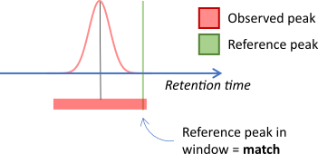
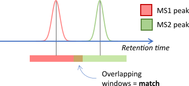

# Using MetMashR

\

## Introduction

*[MetMashR](https://bioconductor.org/packages/3.24/MetMashR)* is an R
package designed to facilitate the cleaning, filtering and combining of
annotations from different sources.
*[MetMashR](https://bioconductor.org/packages/3.24/MetMashR)* defines
an”annotation source” as a piece of software, proprietary or otherwise,
that takes the raw input of an analytical instrument and attempts to
assign molecule names to the peaks in the data, usually by comparison to
a library. *[MetMashR](https://bioconductor.org/packages/3.24/MetMashR)*
was primarily designed for use with metabolomics data measured by LCMS
(hence “metabolite” in the package name) but could be extended to
include other platforms (e.g. NMR, DIMS etc.), or other analytical
approaches.

In this vignette we describe commonly used annotation workflow steps and
show how to use them in detail.

\

## Statistics in R using Class Templates (struct)

All of the objects defined in
*[MetMashR](https://bioconductor.org/packages/3.24/MetMashR)* use or
extend the class templates defined by the
*[struct](https://bioconductor.org/packages/3.24/struct)* package.
Although originally intended for statistics applications, the templates
in the *[struct](https://bioconductor.org/packages/3.24/struct)* package
have proven to be adaptable to many different scenarios and types of
analysis/workflow step.

The use of *[struct](https://bioconductor.org/packages/3.24/struct)*
templates allows workflow steps to be applied in sequence and
intermediate outputs to be retained for further analysis if required.
The templates include ontology definitions for both the object and its
input/output parameters. This makes the workflows more “FAIR” which is
critical alongside FAIR data to making workflows repeatable, transparent
and reproducible.

A general summary of extending
*[struct](https://bioconductor.org/packages/3.24/struct)* templates is
provided in the [package
vignette](https://www.bioconductor.org/packages/release/bioc/vignettes/struct/inst/doc/struct_templates_and_helper_functions.html).

\

## Getting Started

The latest versions of
*[struct](https://bioconductor.org/packages/3.24/struct)* and
*[MetMashR](https://bioconductor.org/packages/3.24/MetMashR)* that are
compatible with your current R version can be installed using
BiocManager.

\
`# install BiocManager if not present`\
`if`` ``(``!`[`requireNamespace`](https://rdrr.io/r/base/ns-load.html)`(``"BiocManager"``, quietly ``=`` ``TRUE``)``)`` ``{`\
`    `[`install.packages`](https://rdrr.io/r/utils/install.packages.html)`(``"BiocManager"``)`\
`}`\
\
`# install MetMashR and dependencies`\
`BiocManager``::`[`install`](https://bioconductor.github.io/BiocManager/reference/install.html)`(``"MetMashR"``)`

Once installed you can activate the packages in the usual way:

\
`# load the packages`\
[`library`](https://rdrr.io/r/base/library.html)`(``struct``)`\
[`library`](https://rdrr.io/r/base/library.html)`(`[`MetMashR`](https://computational-metabolomics.github.io/MetMashR/)`)`\
[`library`](https://rdrr.io/r/base/library.html)`(``metabolomicsWorkbenchR``)`\
[`library`](https://rdrr.io/r/base/library.html)`(`[`ggplot2`](https://ggplot2.tidyverse.org)`)`

\

## Annotation Sources

`annotation_source` objects are the dataset used by all
*[MetMashR](https://bioconductor.org/packages/3.24/MetMashR)* workflow
steps. If you have used our
*[structToolbox](https://bioconductor.org/packages/3.24/structToolbox)*
package before, then annotation sources used equivalently to
`DatasetExperiment` objects, except that they hold a single `data.frame`
of metabolite annotation data.

The `annotation_source` object is not very specific, and not intended
for general use. Instead we have extended them to two main types of
source:

- `annotation_table`
- `annotation_database`

Although all `annotation_sources` contain a single a data.frame, the
intended use of `annotation_table` and `annotation_database` is
different.

\

### Annotation Tables

A `annotation_table` is defined by us as a `data.frame` of metabolite
annotations for experimentally collected data. For example, we have
provided `lcms_table` objects which ensure that both m/z and retention
time data is included in the data.frame for LCMS data. Usually this
table of annotations is acquired after the application software to
generate annotations for an experimental data set.

**Note:**\
It is not the aim of
*[MetMashR](https://bioconductor.org/packages/3.24/MetMashR)* to
generate these annotations. Instead we aim to provide tools to process,
filter, clean and otherwise “mash” this table of annotations generated
elsewhere.

\

`annotation_table` objects should have a `read_source` method specific
to the source. For example the `read_source` method for `ls_source`
object reads in the exported data file from LipidSearch by stripping the
header and parsing the rest of the file into a table.

\
`# prepare source object`\
`AT`` ``<-`` `[`ls_source`](https://computational-metabolomics.github.io/MetMashR/reference/ls_source.md)`(`\
`    source ``=`` `[`system.file`](https://rdrr.io/r/base/system.file.html)`(`\
`        `[`paste0`](https://rdrr.io/r/base/paste.html)`(``"extdata/MTox/LS/MTox_2023_HILIC_POS.txt"``)``,`\
`        package ``=`` ``"MetMashR"`\
`    ``)`\
`)`\
\
`# read source`\
`AT`` ``<-`` `[`read_source`](https://computational-metabolomics.github.io/MetMashR/reference/read_source.md)`(``AT``)`\
\
`# show info`\
`AT`\
`#> A "ls_source" object`\
`#> --------------------`\
`#> name:          LCMS table`\
`` #> description:   An LCMS table extends [`annotation_table()`] to represent annotation data for an LCMS ``\
`#>                  experiment. Columns representing m/z and retention time are required for an`\
`` #>                  `lcms_table`. ``\
`#> input params:  mz_column, rt_column `\
`#> annotations:   62 rows x 12 columns`

The imported `annotation_table` object is compatible with MetMashR
workflow steps.

\

### Annotation Databases

An `annotation_database` is a table of additional metabolite meta data.
For example it might contain identifiers and/or InChIKeys for different
metabolites. Usually (but not always) this table is used in a read-only
fashion and is used to augment an `annotation_table` with additional
information.

Like other sources, `annotation_database` objects have a `read_source`
method specific to the database.

\
`# prepare source object`\
`MT`` ``<-`` `[`MTox700plus_database`](https://computational-metabolomics.github.io/MetMashR/reference/MTox700plus_database.md)`(``)`\
\
`# read`\
`MT`` ``<-`` `[`read_source`](https://computational-metabolomics.github.io/MetMashR/reference/read_source.md)`(``MT``)`\
\
`# show`\
`MT`\
`#> A "MTox700plus_database" object`\
`#> -------------------------------`\
`#> name:          MTox700plus_database`\
`#> description:   Imports the MTox700+ database, which is made available under the ODC Attribution License.`\
`#>                  MTox700+ is a list of toxicologically relevant metabolites derived from`\
`#>                  publications, public databases and relevant toxicological assays.`\
`#> input params:  version `\
`#> annotations:   722 rows x 15 columns`

`annotation_database` objects also have a `read_database` method to read
the table directly to a data.frame.

\
`# prepare source object`\
`MT`` ``<-`` `[`MTox700plus_database`](https://computational-metabolomics.github.io/MetMashR/reference/MTox700plus_database.md)`(``)`\
\
`# read to data.frame`\
`df`` ``<-`` `[`read_database`](https://computational-metabolomics.github.io/MetMashR/reference/read_database.md)`(``MT``)`\
\
`# show`\
`.DT``(``df``)`

Some `annotation_database` objects also have a `write_database` method,
that allows you to update the table on disk. For example, in
*[MetMashR](https://bioconductor.org/packages/3.24/MetMashR)* the
`rds_database` has a `write_database` method. It is useful in
combination with `rest_api` objects to cache results and reduce the
number of requests to the api.

\

### Cached databases

An `annotation_database` class has been included that uses functionality
provided by `BiocFileCache`. Although not used directly, many of the
`annotation_database` objects provided by `MetMashR` extend the
`BiocFileCache_database` object so that the web resources they retrieve
are cached locally.

\

## Annotation Mashing

We define annotation mashing as the importing, cleaning, filtering and
combining of multiple annotation sources. This is useful for
metabolomics datasets where there might be several assays and/or sources
of information/annotations.

\

### Importing sources

Although `annotation_sources` all have a `read_source` method, it is
convenient to be able to read in a source as part of a workflow.

The `import_source` model (workflow step) allows you to do this. Note
that using this object will replace the existing `annotation_source` and
is really intended to be used as the first step in a workflow.

\
`# prepare source object`\
`AT`` ``<-`` `[`ls_source`](https://computational-metabolomics.github.io/MetMashR/reference/ls_source.md)`(`\
`    source ``=`` `[`system.file`](https://rdrr.io/r/base/system.file.html)`(`\
`        `[`paste0`](https://rdrr.io/r/base/paste.html)`(``"extdata/MTox/LS/MTox_2023_HILIC_POS.txt"``)``,`\
`        package ``=`` ``"MetMashR"`\
`    ``)`\
`)`\
\
`# prepare workflow`\
`WF`` ``<-`` `[`import_source`](https://computational-metabolomics.github.io/MetMashR/reference/import_source.md)`(``)`\
\
`# apply workflow to annotation source`\
`WF`` ``<-`` `[`model_apply`](https://computational-metabolomics.github.io/MetMashR/reference/model_apply.md)`(``WF``, ``AT``)`\
\
`# show`\
[`predicted`](https://rdrr.io/pkg/struct/man/predicted.html)`(``WF``)`\
`#> A "ls_source" object`\
`#> --------------------`\
`#> name:          LCMS table`\
`` #> description:   An LCMS table extends [`annotation_table()`] to represent annotation data for an LCMS ``\
`#>                  experiment. Columns representing m/z and retention time are required for an`\
`` #>                  `lcms_table`. ``\
`#> input params:  mz_column, rt_column `\
`#> annotations:   62 rows x 12 columns`

\

### Filtering / Cleaning

`MetMashR` provides a number of commonly used workflow steps to filter,
clean and process annotation sources. Some of these steps, such as
`filter_range` are applicable to any annotation source, while others are
specific to a source. For example `mz_rt_match` is only applicable to an
`lcms_table` as it requires that both an m/z and a retention time column
are present. This property is only enforced for `lcms_table` objects.

Workflow steps use the `model` class from `struct`. We can build up a
workflow by “adding” steps together to form a model sequence
(`model_seq`). See the vignettes for `struct` for more details.

Both models and model sequences can be applied to an `annotation_source`
objects using the `model_apply` method. In this example we import the
source, and then apply a filtering step to remove records with a lower
Grading.

\
`# prepare source object`\
`AT`` ``<-`` `[`ls_source`](https://computational-metabolomics.github.io/MetMashR/reference/ls_source.md)`(`\
`    source ``=`` `[`system.file`](https://rdrr.io/r/base/system.file.html)`(`\
`        `[`paste0`](https://rdrr.io/r/base/paste.html)`(``"extdata/MTox/LS/MTox_2023_HILIC_POS.txt"``)``,`\
`        package ``=`` ``"MetMashR"`\
`    ``)`\
`)`\
\
`# prepare workflow`\
`WF`` ``<-`\
`    ``# step 1 import source from file`\
`    `[`import_source`](https://computational-metabolomics.github.io/MetMashR/reference/import_source.md)`(``)`` ``+`\
`    ``# step 2 filter the "Grade" column to only include "A" and "B"`\
`    `[`filter_labels`](https://computational-metabolomics.github.io/MetMashR/reference/filter_labels.md)`(`\
`        column_name ``=`` ``"Grade"``,`\
`        labels ``=`` `[`c`](https://rdrr.io/r/base/c.html)`(``"A"``, ``"B"``)``,`\
`        mode ``=`` ``"include"`\
`    ``)`\
\
`# apply workflow to annotation source`\
`WF`` ``<-`` `[`model_apply`](https://computational-metabolomics.github.io/MetMashR/reference/model_apply.md)`(``WF``, ``AT``)`\
\
`# show`\
[`predicted`](https://rdrr.io/pkg/struct/man/predicted.html)`(``WF``)`\
`#> A "ls_source" object`\
`#> --------------------`\
`#> name:          LCMS table`\
`` #> description:   An LCMS table extends [`annotation_table()`] to represent annotation data for an LCMS ``\
`#>                  experiment. Columns representing m/z and retention time are required for an`\
`` #>                  `lcms_table`. ``\
`#> input params:  mz_column, rt_column `\
`#> annotations:   29 rows x 12 columns`

The `predicted` method returns the processed `annotation_source` after
applying all steps of the workflow.

Indexing can also be used with a model sequence to extract the processed
annotation source after that step in the workflow.

\
`# source after import and before filtering`\
[`predicted`](https://rdrr.io/pkg/struct/man/predicted.html)`(``WF``[``1``]``)`\
`#> A "ls_source" object`\
`#> --------------------`\
`#> name:          LCMS table`\
`` #> description:   An LCMS table extends [`annotation_table()`] to represent annotation data for an LCMS ``\
`#>                  experiment. Columns representing m/z and retention time are required for an`\
`` #>                  `lcms_table`. ``\
`#> input params:  mz_column, rt_column `\
`#> annotations:   62 rows x 12 columns`

\

### LCMS peak matching

The following methods are restricted to `lcms_table` sources:

- `mz_match`
- `rt_match`
- `mz_rt_match`
- `calc_ppm_diff`
- `calc_rt_diff`

The `_match` objects align features and annotations by comparing m/z
and/or retention time values between two sources. If the values fall
within a window then this is considered to be a match.

Often times one of the sources will be a library or database of
reference m/z and/or retention time values, and the other will be a
table of peaks from an experiment. In this case the reference database
might be considered as the gold standard, while the experimentally
determined values will have some degree of uncertainty. In this case you
may want to only consider a window applied to the experimental data. The
diagram below illustrates this for retention time matching.\
\

\
In other cases both sources might be obtained experimentally. For
example when matching MS2 peaks to MS1 peaks. In this case a window can
be applied to *both* sources, reflecting the uncertainty in the values
for both sources.\
\

\

## REST APIs

`MetMashR` provides a `rest_api` object that implements some base
methods to query an api and return a data.frame of results.

The template has been extended to include api lookup objects for the
following:

- ClassyFire
- HMDB
- KEGG
- LipidMaps
- Metabolmics Workbench
- OPSIN
- PubChem

Note these are not necessarily a complete wrapper for all functionality
provided by the api; we have only implemented simple wrappers for the
most useful parts e.g. querying for molecular identifiers.

The `rest_api` template object includes the ability to cache results
locally, in order to reduce the number of api queries. This means a
`rest_api` object can be included in a workflow and updated as more
results are collected over time.

\
`# prepare source object`\
`AT`` ``<-`` `[`ls_source`](https://computational-metabolomics.github.io/MetMashR/reference/ls_source.md)`(`\
`    source ``=`` `[`system.file`](https://rdrr.io/r/base/system.file.html)`(`\
`        `[`paste0`](https://rdrr.io/r/base/paste.html)`(``"extdata/MTox/LS/MTox_2023_HILIC_POS.txt"``)``,`\
`        package ``=`` ``"MetMashR"`\
`    ``)`\
`)`\
\
`# prepare cache`\
`TF`` ``<-`` `[`rds_database`](https://computational-metabolomics.github.io/MetMashR/reference/rds_database.md)`(`\
`    source ``=`` `[`tempfile`](https://rdrr.io/r/base/tempfile.html)`(``)`\
`)`\
\
`# prepare workflow`\
`WF`` ``<-`\
`    ``# step 1 import source from file`\
`    `[`import_source`](https://computational-metabolomics.github.io/MetMashR/reference/import_source.md)`(``)`` ``+`\
`    ``# step 2 filter the "Grade" column to only include "A" and "B"`\
`    `[`filter_labels`](https://computational-metabolomics.github.io/MetMashR/reference/filter_labels.md)`(`\
`        column_name ``=`` ``"Grade"``,`\
`        labels ``=`` `[`c`](https://rdrr.io/r/base/c.html)`(``"A"``, ``"B"``)``,`\
`        mode ``=`` ``"include"`\
`    ``)`` ``+`\
`    ``# step 3 query lipidmaps api for inchikey`\
`    `[`lipidmaps_lookup`](https://computational-metabolomics.github.io/MetMashR/reference/lipidmaps_lookup.md)`(`\
`        query_column ``=`` ``"LipidName"``,`\
`        context ``=`` ``"compound"``,`\
`        context_item ``=`` ``"abbrev"``,`\
`        output_item ``=`` ``"inchi_key"``,`\
`        cache ``=`` ``TF``,`\
`        suffix ``=`` ``""``,`\
`        delay ``=`` ``2`\
`    ``)`\
\
`# apply workflow to annotation source`\
`WF`` ``<-`` `[`model_apply`](https://computational-metabolomics.github.io/MetMashR/reference/model_apply.md)`(``WF``, ``AT``)`\
\
`# show`\
[`predicted`](https://rdrr.io/pkg/struct/man/predicted.html)`(``WF``)`\
`#> A "ls_source" object`\
`#> --------------------`\
`#> name:          LCMS table`\
`` #> description:   An LCMS table extends [`annotation_table()`] to represent annotation data for an LCMS ``\
`#>                  experiment. Columns representing m/z and retention time are required for an`\
`` #>                  `lcms_table`. ``\
`#> input params:  mz_column, rt_column `\
`#> annotations:   39 rows x 14 columns`

Note that the cache is stored as an `annotation_database` object, and
can be used in workflows like any other `annotation_source`.

\
`# retrieve cache`\
`TF`` ``<-`` `[`read_source`](https://computational-metabolomics.github.io/MetMashR/reference/read_source.md)`(``TF``)`\
\
`# filter records with no inchikey`\
`FI`` ``<-`\
`    `[`filter_na`](https://computational-metabolomics.github.io/MetMashR/reference/filter_na.md)`(`\
`        column_name ``=`` ``"inchi_key"`\
`    ``)`\
\
`# apply`\
`FI`` ``<-`` `[`model_apply`](https://computational-metabolomics.github.io/MetMashR/reference/model_apply.md)`(``FI``, ``TF``)`\
\
`# show`\
`.DT``(`[`predicted`](https://rdrr.io/pkg/struct/man/predicted.html)`(``FI``)``$``data``)`

An alternative to using `rest_api` objects in every workflow is to
create separate workflow to generate a local database of relevant data.
This database can then be used in other workflows without needing to
query the api every time the workflow is run.

\

## Dictionaries

The `normalise_strings` object uses a special list format, referred to
as a “dictionary”, to provide conversion between string patterns. In
`MetMashR` workflows we use it to e.g. convert adducts into a
standardised format across sources, and to tidy/clean strings before
using them as search terms in rest api queries. `MetMashR` currently
provides the following dictionaries:

- Greek character dictionary (`greek_dictionary`) to convert greek
  characters to their romanised name.
- Racemic notation dictionary (`racemic_dictionary`) to remove certain
  types of racemic notation from molecule names (e.g. “(+/-)”).
- A tripeptide dictionary (`tripeptide_dictionary`) to convert
  three-letter tripeptide abbreviations into a format more commonly used
  as a synonym on PubChem e.g. “ACD” becomes “Ala-Cys-Asp”.

A custom dictionary can be created on the fly as a list where each
element has the following fields:

- `pattern`: used as input to `[grepl()]` to detect matches to the input
  pattern
- `replace`: a string, or a function that returns a string, to replace
  the pattern with in the matching string.

Additional fields in the list item can be any of the additional inputs
to [`grepl()`](https://rdrr.io/r/base/grep.html), such as
`fixed = TRUE`.

For example here we create a dictionary to convert some of the lipid
abbreviations to the LipidMaps standard, and replace underscores with
forward slashes:

\
`custom_dict`` ``<-`` `[`list`](https://rdrr.io/r/base/list.html)`(`\
`    `[`list`](https://rdrr.io/r/base/list.html)`(`\
`        pattern ``=`` ``"AcCa"``,`\
`        replace ``=`` ``"CAR"``,`\
`        fixed ``=`` ``TRUE`\
`    ``)``,`\
`    `[`list`](https://rdrr.io/r/base/list.html)`(`\
`        pattern ``=`` ``"AEA"``,`\
`        replace ``=`` ``"NAE"``,`\
`        fixed ``=`` ``TRUE`\
`    ``)``,`\
`    `[`list`](https://rdrr.io/r/base/list.html)`(`\
`        pattern ``=`` ``"_"``,`\
`        replace ``=`` ``"/"``,`\
`        fixed ``=`` ``TRUE`\
`    ``)`\
`)`

We can now use this dictionary in a workflow to create a new column of
“normalised” lipid names and (hopefully) get fewer NA when querying
LipidMaps:

\
`# prepare workflow`\
`WF`` ``<-`\
`    ``# step 1 import source from file`\
`    `[`import_source`](https://computational-metabolomics.github.io/MetMashR/reference/import_source.md)`(``)`` ``+`\
`    ``# step 2 filter the "Grade" column to only include "A" and "B"`\
`    `[`filter_labels`](https://computational-metabolomics.github.io/MetMashR/reference/filter_labels.md)`(`\
`        column_name ``=`` ``"Grade"``,`\
`        labels ``=`` `[`c`](https://rdrr.io/r/base/c.html)`(``"A"``, ``"B"``)``,`\
`        mode ``=`` ``"include"`\
`    ``)`` ``+`\
`    ``# step 3 normalise lipid names using the custom dictionary:`\
`    `[`normalise_strings`](https://computational-metabolomics.github.io/MetMashR/reference/normalise_strings.md)`(`\
`        search_column ``=`` ``"LipidName"``,`\
`        output_column ``=`` ``"normalised_name"``,`\
`        dictionary ``=`` ``custom_dict`\
`    ``)`` ``+`\
`    ``# step 4 query lipidmaps api for inchikey using the names provided by`\
`    ``# LipidSearch`\
`    `[`lipidmaps_lookup`](https://computational-metabolomics.github.io/MetMashR/reference/lipidmaps_lookup.md)`(`\
`        query_column ``=`` ``"LipidName"``,`\
`        context ``=`` ``"compound"``,`\
`        context_item ``=`` ``"abbrev"``,`\
`        output_item ``=`` ``"inchi_key"``,`\
`        suffix ``=`` ``"_LipidName"``,`\
`        cache ``=`` ``TF`\
`    ``)`` ``+`\
`    ``# step 5 query lipidmaps api for inchikey using the names provided by`\
`    ``# LipidSearch`\
`    `[`lipidmaps_lookup`](https://computational-metabolomics.github.io/MetMashR/reference/lipidmaps_lookup.md)`(`\
`        query_column ``=`` ``"normalised_name"``,`\
`        context ``=`` ``"compound"``,`\
`        context_item ``=`` ``"abbrev"``,`\
`        output_item ``=`` ``"inchi_key"``,`\
`        suffix ``=`` ``"_normalised"`\
`    ``)`\
\
`# apply workflow to annotation source`\
`WF`` ``<-`` `[`model_apply`](https://computational-metabolomics.github.io/MetMashR/reference/model_apply.md)`(``WF``, ``AT``)`\
\
`#  show result table for relevant columns`\
`.DT``(`[`predicted`](https://rdrr.io/pkg/struct/man/predicted.html)`(``WF``)``$``data``[``, `[`c`](https://rdrr.io/r/base/c.html)`(`\
`    ``"LipidName"``, ``"normalised_name"``,`\
`    ``"inchi_key_LipidName"``, ``"inchi_key_normalised"`\
`)``]``)`

You can see that we obtained inchikey for more of the Lipids after
normalising the lipid names.

`MetMashR` also provides an interface to the `rgoslin` package to assist
with Lipid annotations.

\

## Combining Records

In the previous output LipidMaps returned multiple matches to the same
lipid. This is because Lipid names can be ambiguous regarding the
location of double bonds, for example.

Sometimes it is useful to collapse multiple entries (records) into a
single record. `MetMashR` provides the `combine_records` object and a
number of helper functions to facilitate this.

The combine records object is a wrapper around
[`dplyr::reframe`](https://dplyr.tidyverse.org/reference/reframe.html)
(formally
[`dplyr::summarise`](https://dplyr.tidyverse.org/reference/summarise.html)).
You can provide a default function to apply to all columns, and then
specify transformations for individual columns by name.

For the Lipids example above, we collapse multiple records for the same
LipidName into a single record, and collapse e.g. multiple inchikeys
into a single string separated by semi colons.

\
`# prepare workflow`\
`CR`` ``<-`` `[`combine_records`](https://computational-metabolomics.github.io/MetMashR/reference/combine_records.md)`(`\
`    group_by ``=`` ``"LipidName"``,`\
`    default_fcn ``=`` `[`fuse_unique`](https://computational-metabolomics.github.io/MetMashR/reference/combine_records_helper_functions.md)`(``separator ``=`` ``"; "``)``,`\
`    fcns ``=`` `[`list`](https://rdrr.io/r/base/list.html)`(`\
`        count ``=`` `[`count_records`](https://computational-metabolomics.github.io/MetMashR/reference/combine_records_helper_functions.md)`(``)`\
`    ``)`\
`)`\
\
`# apply to previous output`\
`CR`` ``<-`` `[`model_apply`](https://computational-metabolomics.github.io/MetMashR/reference/model_apply.md)`(``CR``, `[`predicted`](https://rdrr.io/pkg/struct/man/predicted.html)`(``WF``)``)`\
\
`# show output for relevant columns`\
`.DT``(`[`predicted`](https://rdrr.io/pkg/struct/man/predicted.html)`(``CR``)``$``data``[``, `[`c`](https://rdrr.io/r/base/c.html)`(`\
`    ``"LipidName"``, ``"normalised_name"``,`\
`    ``"inchi_key_normalised"``, ``"count"`\
`)``]``)`

You can see that there is now a single record (row) for each LipidName,
and that the multiple inchikeys associated with that LipidName have been
collapsed into a single entry separated by semicolons.

The helper function `fuse_unique` ensures that each inchikey only
appears once in the collapsed string, and is applied as default to all
columns.

The `add_count` helper function adds a new column of counts for each
LipidName. Note that AcCa(20:4) has 8 counts but only 4 inchikey. This
means that AcCa(20:4) appeared twice in the original table, each time
with the same 4 inchikey.

There are a number of other helper functions to suit different
requirements see
[`?combine_records_helper_functions`](https://computational-metabolomics.github.io/MetMashR/reference/combine_records_helper_functions.md)
for a complete list.

## Session Info

\
[`sessionInfo`](https://rdrr.io/r/utils/sessionInfo.html)`(``)`\
`#> R version 4.6.1 (2026-06-24)`\
`#> Platform: x86_64-pc-linux-gnu`\
`#> Running under: Ubuntu 24.04.4 LTS`\
`#> `\
`#> Matrix products: default`\
`#> BLAS:   /usr/lib/x86_64-linux-gnu/openblas-pthread/libblas.so.3 `\
`#> LAPACK: /usr/lib/x86_64-linux-gnu/openblas-pthread/libopenblasp-r0.3.26.so;  LAPACK version 3.12.0`\
`#> `\
`#> locale:`\
`#>  [1] LC_CTYPE=en_US.UTF-8       LC_NUMERIC=C              `\
`#>  [3] LC_TIME=en_US.UTF-8        LC_COLLATE=en_US.UTF-8    `\
`#>  [5] LC_MONETARY=en_US.UTF-8    LC_MESSAGES=en_US.UTF-8   `\
`#>  [7] LC_PAPER=en_US.UTF-8       LC_NAME=C                 `\
`#>  [9] LC_ADDRESS=C               LC_TELEPHONE=C            `\
`#> [11] LC_MEASUREMENT=en_US.UTF-8 LC_IDENTIFICATION=C       `\
`#> `\
`#> time zone: UTC`\
`#> tzcode source: system (glibc)`\
`#> `\
`#> attached base packages:`\
`#> [1] stats     graphics  grDevices utils     datasets  methods   base     `\
`#> `\
`#> other attached packages:`\
`#> [1] DT_0.34.0            dplyr_1.2.1          structToolbox_1.25.0`\
`#> [4] ggplot2_4.0.3        MetMashR_1.7.2       struct_1.25.0       `\
`#> [7] BiocStyle_2.41.0    `\
`#> `\
`#> loaded via a namespace (and not attached):`\
`#>  [1] SummarizedExperiment_1.43.0 gtable_0.3.6               `\
`#>  [3] xfun_0.61                   bslib_0.12.0               `\
`#>  [5] httr2_1.3.0                 htmlwidgets_1.6.4          `\
`#>  [7] Biobase_2.73.2              lattice_0.23-1             `\
`#>  [9] crosstalk_1.2.2             vctrs_0.7.3                `\
`#> [11] tools_4.6.1                 generics_0.1.4             `\
`#> [13] curl_8.0.0                  stats4_4.6.1               `\
`#> [15] RSQLite_3.53.3              tibble_3.3.1               `\
`#> [17] blob_1.3.0                  pkgconfig_2.0.3            `\
`#> [19] Matrix_1.7-6                dbplyr_2.6.0               `\
`#> [21] RColorBrewer_1.1-3          S7_0.2.2                   `\
`#> [23] desc_1.4.3                  S4Vectors_0.51.10          `\
`#> [25] lifecycle_1.0.5             compiler_4.6.1             `\
`#> [27] farver_2.1.2                stringr_1.6.0              `\
`#> [29] textshaping_1.0.5           Seqinfo_1.3.2              `\
`#> [31] htmltools_0.5.9             sass_0.4.10                `\
`#> [33] yaml_2.3.12                 pkgdown_2.2.1.9000         `\
`#> [35] pillar_1.11.1               jquerylib_0.1.4            `\
`#> [37] DelayedArray_0.39.8         cachem_1.1.0               `\
`#> [39] abind_1.4-8                 tidyselect_1.2.1           `\
`#> [41] digest_0.6.39               stringi_1.8.9              `\
`#> [43] purrr_1.2.2                 bookdown_0.48              `\
`#> [45] ggthemes_6.0.0              fastmap_1.2.0              `\
`#> [47] grid_4.6.1                  cli_3.6.6                  `\
`#> [49] SparseArray_1.13.4          magrittr_2.0.5             `\
`#> [51] S4Arrays_1.13.2             withr_3.0.3                `\
`#> [53] filelock_1.0.3              scales_1.4.0               `\
`#> [55] bit64_4.8.6                 sp_2.2-3                   `\
`#> [57] rmarkdown_2.32              XVector_0.53.0             `\
`#> [59] httr_1.4.9                  matrixStats_1.5.0          `\
`#> [61] bit_4.6.0                   otel_0.2.0                 `\
`#> [63] gridExtra_2.3.1             ragg_1.5.2                 `\
`#> [65] memoise_2.0.1               evaluate_1.0.5             `\
`#> [67] knitr_1.52                  GenomicRanges_1.65.4       `\
`#> [69] IRanges_2.47.5              BiocFileCache_3.3.0        `\
`#> [71] rlang_1.3.0                 Rcpp_1.1.2                 `\
`#> [73] DBI_1.3.0                   glue_1.8.1                 `\
`#> [75] xml2_1.6.0                  BiocManager_1.30.27        `\
`#> [77] BiocGenerics_0.59.12        jsonlite_2.0.0             `\
`#> [79] R6_2.6.1                    plyr_1.8.9                 `\
`#> [81] MatrixGenerics_1.25.0       systemfonts_1.3.2          `\
`#> [83] fs_2.1.0`
