# Annotation of mixtures of standards

\

## Getting Started

The latest versions of
*[struct](https://bioconductor.org/packages/3.24/struct)* and `MetMashR`
that are compatible with your current R version can be installed using
BiocManager.

\
`# install BiocManager if not present`\
`if`` ``(``!`[`requireNamespace`](https://rdrr.io/r/base/ns-load.html)`(``"BiocManager"``, quietly ``=`` ``TRUE``)``)`` ``{`\
`    `[`install.packages`](https://rdrr.io/r/utils/install.packages.html)`(``"BiocManager"``)`\
`}`\
\
`# install MetMashR and dependencies`\
`BiocManager``::`[`install`](https://bioconductor.github.io/BiocManager/reference/install.html)`(``"MetMashR"``)`

Once installed you can activate the packages in the usual way:

\
`# load the packages`\
[`library`](https://rdrr.io/r/base/library.html)`(`[`MetMashR`](https://computational-metabolomics.github.io/MetMashR/)`)`\
[`library`](https://rdrr.io/r/base/library.html)`(`[`ggplot2`](https://ggplot2.tidyverse.org)`)`\
[`library`](https://rdrr.io/r/base/library.html)`(`[`structToolbox`](https://github.com/computational-metabolomics/structToolbox)`)`\
[`library`](https://rdrr.io/r/base/library.html)`(`[`dplyr`](https://dplyr.tidyverse.org)`)`\
[`library`](https://rdrr.io/r/base/library.html)`(`[`DT`](https://github.com/rstudio/DT)`)`\
[`library`](https://rdrr.io/r/base/library.html)`(`[`ggplotify`](https://github.com/GuangchuangYu/ggplotify)`)`

\

## Introduction

Mixtures of standards can be used to build annotation libraries. In LCMS
these libraries can be collected using the same chromatography and
instrument as the samples. Such a library allows high-confidence (MSI
level 1) detection/annotation of MTox metabolites, in comparison to
external databases/sources that rely on m/z only or in-silico
predictions.

In this vignette we will explore the annotations generated using
Compound Discoverer (CD) and LipidSearch (LS) for several mixtures of
standards.

As the content of the standard mixtures is known, we can assess the
ability of CD and LS to annotate these metabolites.

\

## Input data

The data collected corresponds to mixtures of high-purity standards
measured using LCMS, with the intention of building an internally
measured library including m/z and retention times for each standard.

Analysis of the standard mixtures resulted in four data tables:
HILIC_NEG, HILIC_POS, LIPIDS_POS and LIPIDS_NEG. We will loosely refer
to these as “assays”.

All four assays were used as input to both Compound Discoverer (CD) and
LipidSearch (LS) software, which are software tools commonly used to
annotation LCMS datasets.

\

## Importing the annotations

`MetMashR` includes `cd_source` and `ls_source` objects. These objects
read the output files from CD and LS and parse them into an
`annotation_table` object.

Importing the annotation tables isn’t always enough; sometimes they need
to be cleaned or processed further. We therefore define two `MetMashR`
workflows, one for CD and one for LS, in which we import the tables and
then apply source-specific cleaning.

\

### Importing Compound Discoverer annotations

The CD file format expected by `cd_source` is Excel format; see \[TODO\]
for details on how to generate this format from CD.

For the CD `MetMashR` workflow we would like to:

1.  Import CD annotations and convert to `annotation_table` format
2.  Filter to only include “Full match” annotations
3.  Resolve duplicates

When we import the annotations, we add a column indicating which assay
the annotations are associated with, include a `tag` for each row
indicating both the source and the assay. This will be useful later when
processing the combined tables.

The resolution of duplicates is needed because CD might assign the same
metabolite + adduct to multiple peaks. Here we choose the match with
highest mzcloud score using the `select_max` helper function with the
combine_records\` object. This object is a wrapper for
\[dplyr::reframe()\].

\
`# prepare workflow`\
`M`` ``<-`` `[`import_source`](https://computational-metabolomics.github.io/MetMashR/dev/reference/import_source.md)`(``)`` ``+`\
`    `[`add_labels`](https://computational-metabolomics.github.io/MetMashR/dev/reference/add_labels.md)`(`\
`        labels ``=`` `[`c`](https://rdrr.io/r/base/c.html)`(`\
`            assay ``=`` ``"placeholder"``, ``# will be replaced later`\
`            source_name ``=`` ``"CD"`\
`        ``)`\
`    ``)`` ``+`\
`    `[`filter_labels`](https://computational-metabolomics.github.io/MetMashR/dev/reference/filter_labels.md)`(`\
`        column_name ``=`` ``"compound_match"``,`\
`        labels ``=`` ``"Full match"``,`\
`        mode ``=`` ``"include"`\
`    ``)`` ``+`\
`    `[`filter_labels`](https://computational-metabolomics.github.io/MetMashR/dev/reference/filter_labels.md)`(`\
`        column_name ``=`` ``"compound_match"``,`\
`        labels ``=`` ``"Full match"``,`\
`        mode ``=`` ``"include"`\
`    ``)`` ``+`\
`    `[`filter_range`](https://computational-metabolomics.github.io/MetMashR/dev/reference/filter_range.md)`(`\
`        column_name ``=`` ``"library_ppm_diff"``,`\
`        upper_limit ``=`` ``2``,`\
`        lower_limit ``=`` ``-``2``,`\
`        equal_to ``=`` ``FALSE`\
`    ``)`` ``+`\
`    `[`combine_records`](https://computational-metabolomics.github.io/MetMashR/dev/reference/combine_records.md)`(`\
`        group_by ``=`` `[`c`](https://rdrr.io/r/base/c.html)`(``"compound"``, ``"ion"``)``,`\
`        default_fcn ``=`` `[`select_max`](https://computational-metabolomics.github.io/MetMashR/dev/reference/combine_records_helper_functions.md)`(`\
`            max_col ``=`` ``"mzcloud_score"``,`\
`            keep_NA ``=`` ``FALSE``,`\
`            use_abs ``=`` ``TRUE`\
`        ``)`\
`    ``)`\
\
`# place to store results`\
`CD`` ``<-`` `[`list`](https://rdrr.io/r/base/list.html)`(``)`\
`for`` ``(``assay`` ``in`` `[`c`](https://rdrr.io/r/base/c.html)`(``"HILIC_NEG"``, ``"HILIC_POS"``, ``"LIPIDS_NEG"``, ``"LIPIDS_POS"``)``)`` ``{`\
`    ``# prepare source`\
`    ``AT`` ``<-`` `[`cd_source`](https://computational-metabolomics.github.io/MetMashR/dev/reference/cd_source.md)`(`\
`        source ``=`` `[`c`](https://rdrr.io/r/base/c.html)`(`\
`            `[`system.file`](https://rdrr.io/r/base/system.file.html)`(`\
`                `[`paste0`](https://rdrr.io/r/base/paste.html)`(``"extdata/MTox/CD/"``, ``assay``, ``".xlsx"``)``,`\
`                package ``=`` ``"MetMashR"`\
`            ``)``,`\
`            `[`system.file`](https://rdrr.io/r/base/system.file.html)`(`\
`                `[`paste0`](https://rdrr.io/r/base/paste.html)`(``"extdata/MTox/CD/"``, ``assay``, ``"_comp.xlsx"``)``,`\
`                package ``=`` ``"MetMashR"`\
`            ``)`\
`        ``)``,`\
`        tag ``=`` `[`paste0`](https://rdrr.io/r/base/paste.html)`(``"CD_"``, ``assay``)`\
`    ``)`\
\
`    ``# update labels in workflow`\
`    ``M``[``2``]``$``labels``$``assay`` ``<-`` ``assay`\
\
`    ``# apply workflow to source`\
`    ``CD``[[``assay``]``]`` ``<-`` `[`model_apply`](https://computational-metabolomics.github.io/MetMashR/dev/reference/model_apply.md)`(``M``, ``AT``)`\
`}`

The `CD` variable is now a list containing the workflow for each assay.

The default output of each workflow is a processed `lcms_table`, which
is an extension of `annotation_table` that requires both an m/z and a
retention time column to be defined.

A summary of the table for e.g. the HILIC_NEG assay can be displayed on
the console:

\
[`predicted`](https://rdrr.io/pkg/struct/man/predicted.html)`(``CD``$``HILIC_NEG``)`\
`#> A "cd_source" object`\
`#> --------------------`\
`#> name:          LCMS table`\
`` #> description:   An LCMS table extends [`annotation_table()`] to represent annotation data for an LCMS ``\
`#>                  experiment. Columns representing m/z and retention time are required for an`\
`` #>                  `lcms_table`. ``\
`#> input params:  sheets `\
`#> annotations:   219 rows x 21 columns`

The HILIC_NEG table is shown below.

`MetMashR` workflows store the output after each step. We can use this
to explore the impact of different workflow steps. For example, we can
display the different compound matched present before and after
filtering as pie charts.

First, we create the pie chart object and specify some parameters.

\
`C`` ``<-`` `[`annotation_pie_chart`](https://computational-metabolomics.github.io/MetMashR/dev/reference/annotation_pie_chart.md)`(`\
`    factor_name ``=`` ``"compound_match"``,`\
`    label_rotation ``=`` ``FALSE``,`\
`    label_location ``=`` ``"outside"``,`\
`    legend ``=`` ``TRUE``,`\
`    label_type ``=`` ``"percent"``,`\
`    centre_radius ``=`` ``0.5``,`\
`    centre_label ``=`` ``".total"`\
`)`

Now we create the plots using `chart_plot` and add some additional
settings using `ggplot2`, and arrange the plots using `cowplot`.

Note that we use square brackets to index the step of the workflow we
want to access e.g. `HILIC_NEG[3]`.

\
`# plot individual charts`\
`g1`` ``<-`` `[`chart_plot`](https://computational-metabolomics.github.io/MetMashR/dev/reference/chart_plot.md)`(``C``, `[`predicted`](https://rdrr.io/pkg/struct/man/predicted.html)`(``CD``$``HILIC_NEG``[``3``]``)``)`` ``+`\
`    `[`ggtitle`](https://ggplot2.tidyverse.org/reference/labs.html)`(``"Compound matches\nafter filtering"``)`` ``+`\
`    `[`theme`](https://ggplot2.tidyverse.org/reference/theme.html)`(``plot.title ``=`` `[`element_text`](https://ggplot2.tidyverse.org/reference/element.html)`(``hjust ``=`` ``0.5``)``)`\
\
\
`g2`` ``<-`` `[`chart_plot`](https://computational-metabolomics.github.io/MetMashR/dev/reference/chart_plot.md)`(``C``, `[`predicted`](https://rdrr.io/pkg/struct/man/predicted.html)`(``CD``$``HILIC_NEG``[``2``]``)``)`` ``+`\
`    `[`ggtitle`](https://ggplot2.tidyverse.org/reference/labs.html)`(``"Compound matches\nbefore filtering"``)`` ``+`\
`    `[`theme`](https://ggplot2.tidyverse.org/reference/theme.html)`(``plot.title ``=`` `[`element_text`](https://ggplot2.tidyverse.org/reference/element.html)`(``hjust ``=`` ``0.5``)``)`\
\
\
`# get legend`\
`leg`` ``<-`` ``cowplot``::`[`get_legend`](https://wilkelab.org/cowplot/reference/get_legend.html)`(``g2``)`\
\
`# layout`\
`cowplot``::`[`plot_grid`](https://wilkelab.org/cowplot/reference/plot_grid.html)`(`\
`    ``g2`` ``+`` `[`theme`](https://ggplot2.tidyverse.org/reference/theme.html)`(``legend.position ``=`` ``"none"``)``,`\
`    ``g1`` ``+`` `[`theme`](https://ggplot2.tidyverse.org/reference/theme.html)`(``legend.position ``=`` ``"none"``)``,`\
`    ``leg``,`\
`    nrow ``=`` ``1``,`\
`    rel_widths ``=`` `[`c`](https://rdrr.io/r/base/c.html)`(``1``, ``1``, ``0.5``)`\
`)`

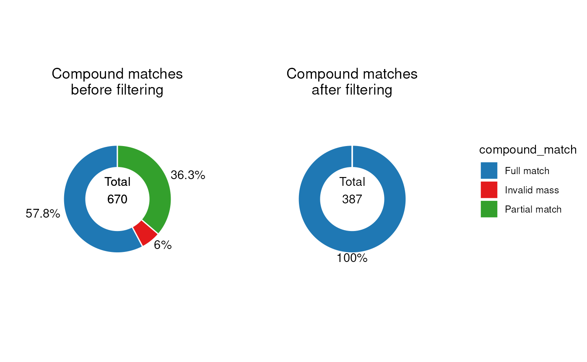

It is clear from these plots that the filter has removed all annotations
without a “full match”.

\

We can assess the quality of the annotations be examining the histogram
of ppm errors between the MS2 peaks and the library.

If there is a wide distribution then this may indicate false positives.
If the distribution is offset from zero then this indicates some m/z
drift is present.

\
`C`` ``<-`` `[`annotation_histogram`](https://computational-metabolomics.github.io/MetMashR/dev/reference/annotation_histogram.md)`(`\
`    factor_name ``=`` ``"library_ppm_diff"``, vline ``=`` `[`c`](https://rdrr.io/r/base/c.html)`(``-``2``, ``2``)`\
`)`\
`G`` ``<-`` `[`list`](https://rdrr.io/r/base/list.html)`(``)`\
`G``$``HILIC_NEG`` ``<-`` `[`chart_plot`](https://computational-metabolomics.github.io/MetMashR/dev/reference/chart_plot.md)`(``C``, `[`predicted`](https://rdrr.io/pkg/struct/man/predicted.html)`(``CD``$``HILIC_NEG``[``2``]``)``)`\
`G``$``HILIC_POS`` ``<-`` `[`chart_plot`](https://computational-metabolomics.github.io/MetMashR/dev/reference/chart_plot.md)`(``C``, `[`predicted`](https://rdrr.io/pkg/struct/man/predicted.html)`(``CD``$``HILIC_POS``[``3``]``)``)`\
\
`cowplot``::`[`plot_grid`](https://wilkelab.org/cowplot/reference/plot_grid.html)`(``plotlist ``=`` ``G``, labels ``=`` `[`c`](https://rdrr.io/r/base/c.html)`(``"HILIC_NEG"``, ``"HILIC_POS"``)``)`

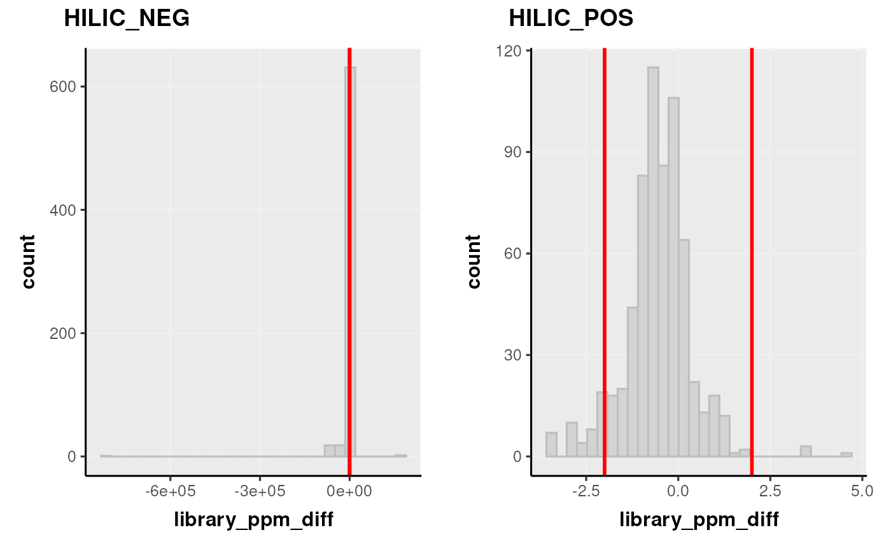

Note that we plotted the distribution based on the step before filtering
by range, and set the vertical red lines equal to the range filter so
that we can see which parts of the histogram are affected by the range
filter.

### Importing LipidSearch annotations

The file format expected by `ls_source` is a `.csv` file. See \[TODO\]
for details on how to generate this format from LS.

For the `MetMashR` workflow we would like to:

1.  Import the LS annotations and convert to `annotation_table` format
2.  Filter the annotations to only include grades A and B
3.  Resolve duplicates

When we import the annotations, we add a column indicating which assay
and source the annotations are associated with. We also include a `tag`
for the table. This will be useful later when processing the combined
tables.

For LS we resolve duplicates by selecting the annotation with the
smallest ppm error. We use the `combine_records` object with the
`select_min` helper function to do this.

\
`# prepare workflow`\
`M`` ``<-`` `[`import_source`](https://computational-metabolomics.github.io/MetMashR/dev/reference/import_source.md)`(``)`` ``+`\
`    `[`add_labels`](https://computational-metabolomics.github.io/MetMashR/dev/reference/add_labels.md)`(`\
`        labels ``=`` `[`c`](https://rdrr.io/r/base/c.html)`(`\
`            assay ``=`` ``"placeholder"``, ``# will be replaced later`\
`            source_name ``=`` ``"LS"`\
`        ``)`\
`    ``)`` ``+`\
`    `[`filter_labels`](https://computational-metabolomics.github.io/MetMashR/dev/reference/filter_labels.md)`(`\
`        column_name ``=`` ``"Grade"``,`\
`        labels ``=`` `[`c`](https://rdrr.io/r/base/c.html)`(``"A"``, ``"B"``)``,`\
`        mode ``=`` ``"include"`\
`    ``)`` ``+`\
`    `[`filter_labels`](https://computational-metabolomics.github.io/MetMashR/dev/reference/filter_labels.md)`(`\
`        column_name ``=`` ``"Grade"``,`\
`        labels ``=`` `[`c`](https://rdrr.io/r/base/c.html)`(``"A"``, ``"B"``)``,`\
`        mode ``=`` ``"include"`\
`    ``)`` ``+`\
`    `[`combine_records`](https://computational-metabolomics.github.io/MetMashR/dev/reference/combine_records.md)`(`\
`        group_by ``=`` `[`c`](https://rdrr.io/r/base/c.html)`(``"LipidIon"``)``,`\
`        default_fcn ``=`` `[`select_min`](https://computational-metabolomics.github.io/MetMashR/dev/reference/combine_records_helper_functions.md)`(`\
`            min_col ``=`` ``"library_ppm_diff"``,`\
`            keep_NA ``=`` ``FALSE``,`\
`            use_abs ``=`` ``TRUE`\
`        ``)`\
`    ``)`\
\
`# place to store results`\
`LS`` ``<-`` `[`list`](https://rdrr.io/r/base/list.html)`(``)`\
`for`` ``(``assay`` ``in`` `[`c`](https://rdrr.io/r/base/c.html)`(``"HILIC_NEG"``, ``"HILIC_POS"``, ``"LIPIDS_NEG"``, ``"LIPIDS_POS"``)``)`` ``{`\
`    ``# prepare source`\
`    ``AT`` ``<-`` `[`ls_source`](https://computational-metabolomics.github.io/MetMashR/dev/reference/ls_source.md)`(`\
`        source ``=`` `[`system.file`](https://rdrr.io/r/base/system.file.html)`(`\
`            `[`paste0`](https://rdrr.io/r/base/paste.html)`(``"extdata/MTox/LS/MTox_2023_"``, ``assay``, ``".txt"``)``,`\
`            package ``=`` ``"MetMashR"`\
`        ``)``,`\
`        tag ``=`` `[`paste0`](https://rdrr.io/r/base/paste.html)`(``"LS_"``, ``assay``)`\
`    ``)`\
\
`    ``# update labels in workflow`\
`    ``M``[``2``]``$``labels``$``assay`` ``<-`` ``assay`\
\
`    ``# apply workflow to source`\
`    ``LS``[[``assay``]``]`` ``<-`` `[`model_apply`](https://computational-metabolomics.github.io/MetMashR/dev/reference/model_apply.md)`(``M``, ``AT``)`\
`}`

The `LS` variable is now a list containing the workflow for each assay.

A summary of the table for e.g. the LIPIDS_NEG assay can be displayed on
the console:

\
[`predicted`](https://rdrr.io/pkg/struct/man/predicted.html)`(``LS``$``LIPIDS_NEG``)`\
`#> A "ls_source" object`\
`#> --------------------`\
`#> name:          LCMS table`\
`` #> description:   An LCMS table extends [`annotation_table()`] to represent annotation data for an LCMS ``\
`#>                  experiment. Columns representing m/z and retention time are required for an`\
`` #>                  `lcms_table`. ``\
`#> input params:  mz_column, rt_column `\
`#> annotations:   16 rows x 14 columns`

The LIPIDS_NEG table is shown below.

`MetMashR` workflows store the output after each step. We can use this
to explore the impact of different workflow steps. For example, we can
display the different Grades present before and after filtering as pie
charts.

\
`C`` ``<-`` `[`annotation_pie_chart`](https://computational-metabolomics.github.io/MetMashR/dev/reference/annotation_pie_chart.md)`(`\
`    factor_name ``=`` ``"Grade"``,`\
`    label_rotation ``=`` ``FALSE``,`\
`    label_location ``=`` ``"outside"``,`\
`    label_type ``=`` ``"percent"``,`\
`    legend ``=`` ``FALSE``,`\
`    centre_radius ``=`` ``0.5``,`\
`    centre_label ``=`` ``".total"`\
`)`\
`g1`` ``<-`` `[`chart_plot`](https://computational-metabolomics.github.io/MetMashR/dev/reference/chart_plot.md)`(``C``, `[`predicted`](https://rdrr.io/pkg/struct/man/predicted.html)`(``LS``$``LIPIDS_NEG``)``)`` ``+`\
`    `[`ggtitle`](https://ggplot2.tidyverse.org/reference/labs.html)`(``"Grades after filtering"``)`` ``+`\
`    `[`theme`](https://ggplot2.tidyverse.org/reference/theme.html)`(``plot.margin ``=`` `[`unit`](https://rdrr.io/r/grid/unit.html)`(`[`c`](https://rdrr.io/r/base/c.html)`(``1``, ``1.5``, ``1``, ``1.5``)``, ``"cm"``)``)`\
\
`g2`` ``<-`` `[`chart_plot`](https://computational-metabolomics.github.io/MetMashR/dev/reference/chart_plot.md)`(``C``, `[`predicted`](https://rdrr.io/pkg/struct/man/predicted.html)`(``LS``$``LIPIDS_NEG``[``1``]``)``)`` ``+`\
`    `[`ggtitle`](https://ggplot2.tidyverse.org/reference/labs.html)`(``"Grades before filtering"``)`` ``+`\
`    `[`theme`](https://ggplot2.tidyverse.org/reference/theme.html)`(``plot.margin ``=`` `[`unit`](https://rdrr.io/r/grid/unit.html)`(`[`c`](https://rdrr.io/r/base/c.html)`(``1``, ``1.5``, ``1``, ``1.5``)``, ``"cm"``)``)`\
\
\
`cowplot``::`[`plot_grid`](https://wilkelab.org/cowplot/reference/plot_grid.html)`(``g2``, ``g1``, nrow ``=`` ``1``, align ``=`` ``"v"``)`

\

## Exploratory analysis of annotation sources

The annotations imported from each source are interesting to explore
graphically “within source”. We will draw a comparison “between sources”
later.

In this example we generate Venn diagrams by providing several
`annotation_table` inputs to the `chart_plot` function for an
`annotation_venn_chart`. This allows us to compare columns of
e.g. compound names present in each table.

Here, we compare the compound names for each assay within each source,
to see if there is any overlap i.e. the same metabolite detecting in
several assays.

\
`# prepare venn chart object`\
`C`` ``<-`` `[`annotation_venn_chart`](https://computational-metabolomics.github.io/MetMashR/dev/reference/annotation_venn_chart.md)`(`\
`    factor_name ``=`` ``"compound"``,`\
`    line_colour ``=`` ``"white"``,`\
`    fill_colour ``=`` ``".group"``,`\
`    legend ``=`` ``TRUE``,`\
`    labels ``=`` ``FALSE`\
`)`\
\
`## plot`\
`# get all CD tables`\
`cd`` ``<-`` `[`lapply`](https://rdrr.io/r/base/lapply.html)`(``CD``, ``predicted``)`\
`g1`` ``<-`` `[`chart_plot`](https://computational-metabolomics.github.io/MetMashR/dev/reference/chart_plot.md)`(``C``, ``cd``)`` ``+`` `[`ggtitle`](https://ggplot2.tidyverse.org/reference/labs.html)`(``"Compounds in CD per assay"``)`\
\
`# get all LS tables`\
`C``$``factor_name`` ``<-`` ``"LipidName"`\
`ls`` ``<-`` `[`lapply`](https://rdrr.io/r/base/lapply.html)`(``LS``, ``predicted``)`\
`g2`` ``<-`` `[`chart_plot`](https://computational-metabolomics.github.io/MetMashR/dev/reference/chart_plot.md)`(``C``, ``ls``)`` ``+`` `[`ggtitle`](https://ggplot2.tidyverse.org/reference/labs.html)`(``"Compounds in LS per assay"``)`\
\
`# prepare upset object`\
`C2`` ``<-`` `[`annotation_upset_chart`](https://computational-metabolomics.github.io/MetMashR/dev/reference/annotation_upset_chart.md)`(`\
`    factor_name ``=`` ``"compound"``,`\
`    nintersects ``=`` ``10``,`\
`)`\
`g3`` ``<-`` `[`chart_plot`](https://computational-metabolomics.github.io/MetMashR/dev/reference/chart_plot.md)`(``C2``, ``cd``)`\
`C2``$``factor_name`` ``<-`` ``"LipidName"`\
`g4`` ``<-`` `[`chart_plot`](https://computational-metabolomics.github.io/MetMashR/dev/reference/chart_plot.md)`(``C2``, ``ls``)`\
\
`# layout`\
`cowplot``::`[`plot_grid`](https://wilkelab.org/cowplot/reference/plot_grid.html)`(``g1``, ``g2``, `[`as.ggplot`](https://rdrr.io/pkg/ggplotify/man/as.ggplot.html)`(``g3``)``, `[`as.ggplot`](https://rdrr.io/pkg/ggplotify/man/as.ggplot.html)`(``g4``)``, nrow ``=`` ``2``)`

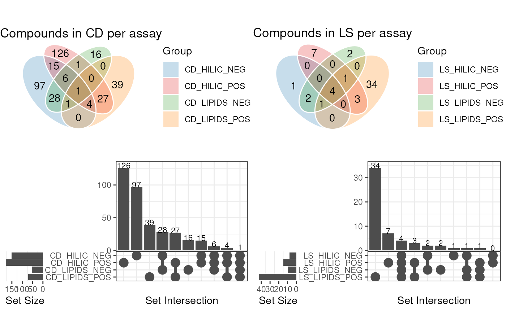

The diagram for CD shows the largest amount of overlap is between assays
with the same ion mode.

For LS the number of annotations is quite small, so the diagram is less
informative. However, we are clearly detecting a larger number of
annotations in the LIPIDS assays, which is to be expected as the LS
software is designed to annotate lipids molecules.

Here the `annotation_venn_chart` and `annotation_upset_chart` objects
were used to compare the same column across several `annotation_tables`.
The same objects can also compare groups from within the same table,
which we will explore later.

First, we need to combine the CD and LS tables.

## Combining Annotation Sources

In this workflow step we combine the imported assay tables from each
assay and annotation source vertically into a single annotation table.

The `combine_tables` object can be used for this step. Combining tables
from the same source (e.g. the CD table for each assay) is straight
forward as all tables have the same columns.

When combining different sources the `combine_tables` object provides
input parameters that allow you to combine and select columns from
different sources into new columns with the same information. For
example the `adduct` column in CD is called “Ion” and in LS it is called
“LipidIon”; we can combine these columns into a new column called
“adduct”.

Here we specify that all columns should be retained from both tables,
padding with NA if not present; columns with the same name are
automatically merged.

\
`# get all the cleaned annotation tables in one list`\
`all_source_tables`` ``<-`` `[`lapply`](https://rdrr.io/r/base/lapply.html)`(`[`c`](https://rdrr.io/r/base/c.html)`(``CD``, ``LS``)``, ``predicted``)`\
\
`# prepare to merge`\
`combine_workflow`` ``<-`\
`    `[`combine_sources`](https://computational-metabolomics.github.io/MetMashR/dev/reference/combine_sources.md)`(`\
`        source_list ``=`` ``all_source_tables``,`\
`        matching_columns ``=`` `[`c`](https://rdrr.io/r/base/c.html)`(`\
`            name ``=`` ``"LipidName"``,`\
`            name ``=`` ``"compound"``,`\
`            adduct ``=`` ``"ion"``,`\
`            adduct ``=`` ``"LipidIon"`\
`        ``)``,`\
`        keep_cols ``=`` ``".all"``,`\
`        source_col ``=`` ``"annotation_table"``,`\
`        exclude_cols ``=`` ``NULL``,`\
`        tag ``=`` ``"combined"`\
`    ``)`\
\
`# merge`\
`combine_workflow`` ``<-`` `[`model_apply`](https://computational-metabolomics.github.io/MetMashR/dev/reference/model_apply.md)`(``combine_workflow``, `[`lcms_table`](https://computational-metabolomics.github.io/MetMashR/dev/reference/lcms_table.md)`(``)``)`\
\
`# show`\
[`predicted`](https://rdrr.io/pkg/struct/man/predicted.html)`(``combine_workflow``)`\
`#> A "annotation_source" object`\
`#> ----------------------------`\
`#> name:          combined`\
`#> description:   A source created by combining two or more sources`\
`#> input params:  tag, data, source `\
`#> annotations:   912 rows x 28 columns`

Now that the tables have been combined we can explore the table using
charts. For example, we visualise the number of annotations for each
assay from both sources.

\
`C`` ``<-`` `[`annotation_pie_chart`](https://computational-metabolomics.github.io/MetMashR/dev/reference/annotation_pie_chart.md)`(`\
`    factor_name ``=`` ``"assay"``,`\
`    label_rotation ``=`` ``FALSE``,`\
`    label_location ``=`` ``"outside"``,`\
`    label_type ``=`` ``"percent"``,`\
`    legend ``=`` ``TRUE``,`\
`    centre_radius ``=`` ``0.5``,`\
`    centre_label ``=`` ``".total"`\
`)`\
\
[`chart_plot`](https://computational-metabolomics.github.io/MetMashR/dev/reference/chart_plot.md)`(``C``, `[`predicted`](https://rdrr.io/pkg/struct/man/predicted.html)`(``combine_workflow``)``)`` ``+`\
`    `[`ggtitle`](https://ggplot2.tidyverse.org/reference/labs.html)`(``"Annotations per assay"``)`` ``+`\
`    `[`theme`](https://ggplot2.tidyverse.org/reference/theme.html)`(``plot.margin ``=`` `[`unit`](https://rdrr.io/r/grid/unit.html)`(`[`c`](https://rdrr.io/r/base/c.html)`(``1``, ``1.5``, ``1``, ``1.5``)``, ``"cm"``)``)`` ``+`\
`    `[`guides`](https://ggplot2.tidyverse.org/reference/guides.html)`(``fill ``=`` `[`guide_legend`](https://ggplot2.tidyverse.org/reference/guide_legend.html)`(``title ``=`` ``"Assay"``)``)`

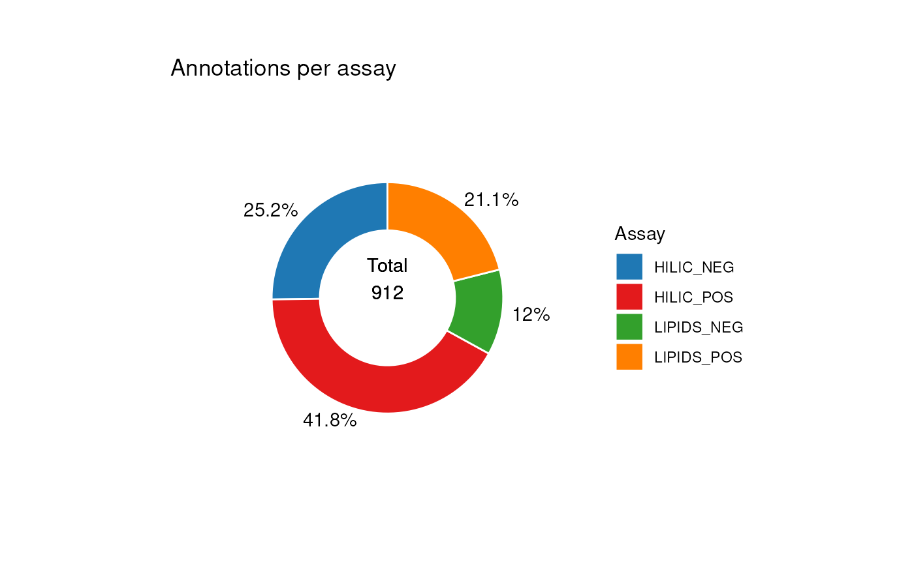

In this next example we compare the number of annotations from each
source.

\
`# change to plot source_name column`\
`C``$``factor_name`` ``<-`` ``"source_name"`\
[`chart_plot`](https://computational-metabolomics.github.io/MetMashR/dev/reference/chart_plot.md)`(``C``, `[`predicted`](https://rdrr.io/pkg/struct/man/predicted.html)`(``combine_workflow``)``)`` ``+`\
`    `[`ggtitle`](https://ggplot2.tidyverse.org/reference/labs.html)`(``"Annotations per source"``)`` ``+`\
`    `[`theme`](https://ggplot2.tidyverse.org/reference/theme.html)`(``plot.margin ``=`` `[`unit`](https://rdrr.io/r/grid/unit.html)`(`[`c`](https://rdrr.io/r/base/c.html)`(``1``, ``1.5``, ``1``, ``1.5``)``, ``"cm"``)``)`` ``+`\
`    `[`guides`](https://ggplot2.tidyverse.org/reference/guides.html)`(``fill ``=`` `[`guide_legend`](https://ggplot2.tidyverse.org/reference/guide_legend.html)`(``title ``=`` ``"Source"``)``)`

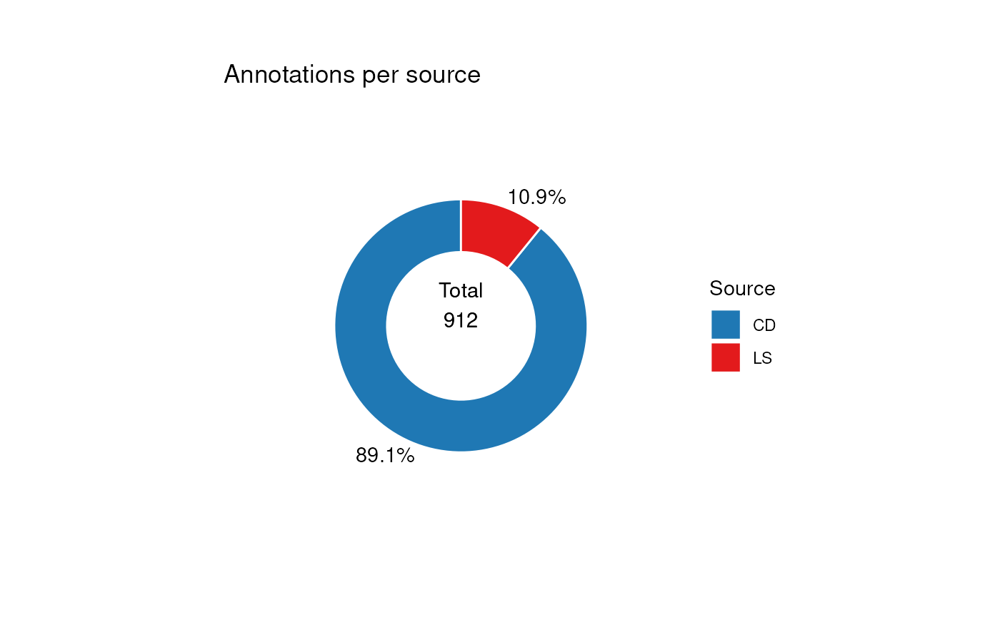

## Adding identifiers

Ultimately we would like to compare the annotations detected using our
software sources to the list of standard we included in the samples.
Comparing the two tables using metabolite names is less than ideal,
because different sources might use different synonyms for the same
molecular structure.

To overcome this it is much better to compare the tables using molecular
identifiers such as InChIKey, which are unique to the molecule.
`MetMashR` includes a number of workflow steps that allow us to look up
identifiers from various databases, either stored locally, or in online
databases such as PubChem by using their REST API.

For this vignette we use cached results so that we don’t overburden the
api; in practice you would create your own (see \[TODO\]).

\
`# import cached results`\
`inchikey_cache`` ``<-`` `[`rds_database`](https://computational-metabolomics.github.io/MetMashR/dev/reference/rds_database.md)`(`\
`    source ``=`` `[`file.path`](https://rdrr.io/r/base/file.path.html)`(`\
`        `[`system.file`](https://rdrr.io/r/base/system.file.html)`(``"cached"``, package ``=`` ``"MetMashR"``)``,`\
`        ``"pubchem_inchikey_mtox_cache.rds"`\
`    ``)`\
`)`\
\
`id_workflow`` ``<-`\
`    `[`pubchem_property_lookup`](https://computational-metabolomics.github.io/MetMashR/dev/reference/pubchem_property_lookup.md)`(`\
`        query_column ``=`` ``"name"``,`\
`        search_by ``=`` ``"name"``,`\
`        suffix ``=`` ``""``,`\
`        property ``=`` ``"InChIKey"``,`\
`        records ``=`` ``"best"``,`\
`        cache ``=`` ``inchikey_cache`\
`    ``)`\
\
`id_workflow`` ``<-`` `[`model_apply`](https://computational-metabolomics.github.io/MetMashR/dev/reference/model_apply.md)`(``id_workflow``, `[`predicted`](https://rdrr.io/pkg/struct/man/predicted.html)`(``combine_workflow``)``)`

\

## Improving ID coverage

The ID’s obtained in the previous section were obtained by queries based
on the molecule name.

Molecule names can contain a number of special characters, and follow
different nomenclatures when constructing the name, as well as
abbreviations and naming conventions.

It useful therefore to apply some kind of “molecule name normalisation”
to account for these properties of molecule names.

We can use the `normalise_strings` MetMashR object to do this. This
object has a `dictionary` parameter that takes the form of a list of
lists.

Each sub-list contains a pattern to be matched and a replacement. In the
example workflow below we include a number of definitions in our
dictionary:

- Update compounds starting with “NP” to start “Compound NP” as this is
  how they are recorded in PubChem.
- Replace any molecule name containing a ? with NA, as this indicates
  ambiguity in the annotation.
- Remove abbreviations from molecule names e.g. “adenosine triphosphate
  (ATP)” should have the “(ATP)” part removed.
- Replace some shorthand names with more formal names that are more
  likely to result in a match to a PubChem compound.
- Remove optical properties from racemic compounds e.g. D-(+)-Glucose
  becomes D-Glucose.
- Replace Greek characters with their Romanised names.

Both the Greek and racemic dictionaries are provided by MetMashR for
convenience.

In steps 2 and 3 of the workflow we submit these normalised names to the
PubChem API and to OPSIN. By utlilising serveral API’s we can maximise
the number of molecules we obtain an InChIKey for.

In the final step we merge the three columns of identifiers, giving
priority to OPSIN, which is based on deconstructing the molecule name
into its component parts. If there is no result from OPSIN then a
PubChem search based on the normalised names is prioritised over a
PubChem search using the non-normalised names.

\
`# prepare cached results for vignette`\
`inchikey_cache2`` ``<-`` `[`rds_database`](https://computational-metabolomics.github.io/MetMashR/dev/reference/rds_database.md)`(`\
`    source ``=`` `[`file.path`](https://rdrr.io/r/base/file.path.html)`(`\
`        `[`system.file`](https://rdrr.io/r/base/system.file.html)`(``"cached"``, package ``=`` ``"MetMashR"``)``,`\
`        ``"pubchem_inchikey_mtox_cache2.rds"`\
`    ``)`\
`)`\
`inchikey_cache3`` ``<-`` `[`rds_database`](https://computational-metabolomics.github.io/MetMashR/dev/reference/rds_database.md)`(`\
`    source ``=`` `[`file.path`](https://rdrr.io/r/base/file.path.html)`(`\
`        `[`system.file`](https://rdrr.io/r/base/system.file.html)`(``"cached"``, package ``=`` ``"MetMashR"``)``,`\
`        ``"pubchem_inchikey_mtox_cache3.rds"`\
`    ``)`\
`)`\
\
`N`` ``<-`` `[`normalise_strings`](https://computational-metabolomics.github.io/MetMashR/dev/reference/normalise_strings.md)`(`\
`    search_column ``=`` ``"name"``,`\
`    output_column ``=`` ``"normalised_name"``,`\
`    dictionary ``=`` `[`c`](https://rdrr.io/r/base/c.html)`(`\
`        ``# custom dictionary`\
`        `[`list`](https://rdrr.io/r/base/list.html)`(`\
`            ``# replace "NP" with "Compound NP"`\
`            `[`list`](https://rdrr.io/r/base/list.html)`(``pattern ``=`` ``"^NP-"``, replace ``=`` ``"Compound NP-"``)``,`\
`            ``# replace ? with NA, since this is ambiguous`\
`            `[`list`](https://rdrr.io/r/base/list.html)`(``pattern ``=`` ``"?"``, replace ``=`` ``NA``, fixed ``=`` ``TRUE``)``,`\
`            ``# remove terms in trailing brackets e.g." (ATP)"`\
`            `[`list`](https://rdrr.io/r/base/list.html)`(``pattern ``=`` ``"\\ \\([^\\)]*\\)$"``, replace ``=`` ``""``)``,`\
`            ``# replace known abbreviations`\
`            `[`list`](https://rdrr.io/r/base/list.html)`(`\
`                pattern ``=`` ``"(+/-)9-HpODE"``,`\
`                replace ``=`` ``"9-hydroperoxy-10E,12Z-octadecadienoic acid"``,`\
`                fixed ``=`` ``TRUE`\
`            ``)``,`\
`            `[`list`](https://rdrr.io/r/base/list.html)`(`\
`                pattern ``=`` ``"(+/-)19(20)-DiHDPA"``,`\
`                replace ``=`\
`                    ``"19,20-dihydroxy-4Z,7Z,10Z,13Z,16Z-docosapentaenoic acid"``,`\
`                fixed ``=`` ``TRUE`\
`            ``)`\
`        ``)``,`\
`        ``# replace greek characters`\
`        ``greek_dictionary``,`\
`        ``# remove racemic properties`\
`        ``racemic_dictionary`\
`    ``)`\
`)`` ``+`\
`    `[`pubchem_property_lookup`](https://computational-metabolomics.github.io/MetMashR/dev/reference/pubchem_property_lookup.md)`(`\
`        query_column ``=`` ``"normalised_name"``,`\
`        search_by ``=`` ``"name"``,`\
`        suffix ``=`` ``"_norm"``,`\
`        property ``=`` ``"InChIKey"``,`\
`        records ``=`` ``"best"``,`\
`        cache ``=`` ``inchikey_cache2`\
`    ``)`` ``+`\
`    `[`opsin_lookup`](https://computational-metabolomics.github.io/MetMashR/dev/reference/opsin_lookup.md)`(`\
`        query_column ``=`` ``"normalised_name"``,`\
`        suffix ``=`` ``"_opsin"``,`\
`        output ``=`` ``"stdinchikey"``,`\
`        cache ``=`` ``inchikey_cache3`\
`    ``)`` ``+`\
`    `[`prioritise_columns`](https://computational-metabolomics.github.io/MetMashR/dev/reference/prioritise_columns.md)`(`\
`        column_names ``=`` `[`c`](https://rdrr.io/r/base/c.html)`(``"stdinchikey_opsin"``, ``"InChIKey_norm"``, ``"InChIKey"``)``,`\
`        output_name ``=`` ``"inchikey"``,`\
`        source_name ``=`` ``"inchikey_source"``,`\
`        clean ``=`` ``TRUE`\
`    ``)`\
\
`N`` ``<-`` `[`model_apply`](https://computational-metabolomics.github.io/MetMashR/dev/reference/model_apply.md)`(``N``, `[`predicted`](https://rdrr.io/pkg/struct/man/predicted.html)`(``id_workflow``)``)`

We can explore the impact of these workflow steps using Venn and Pie
charts to compare the results before/after the workflow.

In this Venn diagram we show the overlap between the InChIKey
identifiers obtained from the three queries. It can be seen that
normalising the names resulted in 37 identifiers that we were unable to
obtain without normalisation.

The use of OPSIN then added a further 31 identifiers. The column of
combined identifers therefore contains

\
`# venn inchikey columns`\
`C`` ``<-`` `[`annotation_venn_chart`](https://computational-metabolomics.github.io/MetMashR/dev/reference/annotation_venn_chart.md)`(`\
`    factor_name ``=`` `[`c`](https://rdrr.io/r/base/c.html)`(``"InChIKey"``, ``"InChIKey_norm"``, ``"stdinchikey_opsin"``)``,`\
`    line_colour ``=`` ``"white"``,`\
`    fill_colour ``=`` ``".group"``,`\
`    legend ``=`` ``TRUE``,`\
`    labels ``=`` ``FALSE`\
`)`\
[`chart_plot`](https://computational-metabolomics.github.io/MetMashR/dev/reference/chart_plot.md)`(``C``, `[`predicted`](https://rdrr.io/pkg/struct/man/predicted.html)`(``N``[``3``]``)``)`` ``+`\
`    `[`guides`](https://ggplot2.tidyverse.org/reference/guides.html)`(`\
`        fill ``=`` `[`guide_legend`](https://ggplot2.tidyverse.org/reference/guide_legend.html)`(``title ``=`` ``"Source"``)``,`\
`        colour ``=`` `[`guide_legend`](https://ggplot2.tidyverse.org/reference/guide_legend.html)`(``title ``=`` ``"Source"``)`\
`    ``)`` ``+`\
`    `[`theme`](https://ggplot2.tidyverse.org/reference/theme.html)`(``plot.margin ``=`` `[`unit`](https://rdrr.io/r/grid/unit.html)`(`[`c`](https://rdrr.io/r/base/c.html)`(``1``, ``1.5``, ``1``, ``1.5``)``, ``"cm"``)``)`

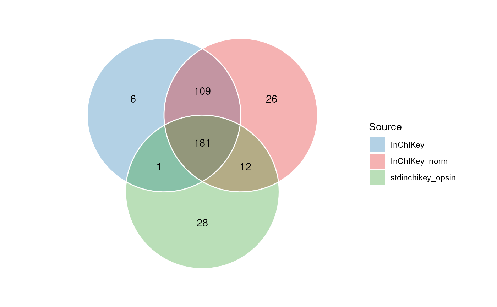

Due to complexity, Venn charts are limited to 7 sets. UpSet plots are an
alternative chart than can accomodate many more sets. Each veritcal bar
in the UpSet plot corresponds to a region in the venn diagram.

\
`# upset inchikey columns`\
`C`` ``<-`` `[`annotation_upset_chart`](https://computational-metabolomics.github.io/MetMashR/dev/reference/annotation_upset_chart.md)`(`\
`    factor_name ``=`` `[`c`](https://rdrr.io/r/base/c.html)`(``"InChIKey"``, ``"InChIKey_norm"``, ``"stdinchikey_opsin"``)``,`\
`    nintersects ``=`` ``10`\
`)`\
[`chart_plot`](https://computational-metabolomics.github.io/MetMashR/dev/reference/chart_plot.md)`(``C``, `[`predicted`](https://rdrr.io/pkg/struct/man/predicted.html)`(``N``[``3``]``)``)`

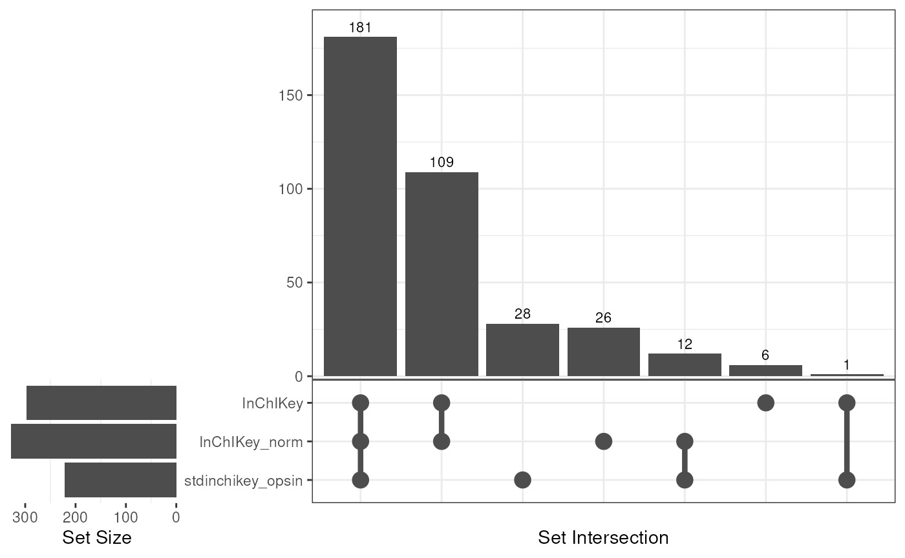

In the next chart we visualise the proportion of annotations from each
query, after prioritisation and merging has taken place.

Note that in this case some of the identifiers might be the same if
e.g. the same molecule is present in multiple rows. You can see that in
the end only a small proportion (12.1%) of the identifiers are from the
least reliable query based on the non-normalised name.

\
`# pie source of inchikey`\
`C`` ``<-`` `[`annotation_pie_chart`](https://computational-metabolomics.github.io/MetMashR/dev/reference/annotation_pie_chart.md)`(`\
`    factor_name ``=`` ``"inchikey_source"``,`\
`    label_rotation ``=`` ``FALSE``,`\
`    label_location ``=`` ``"outside"``,`\
`    label_type ``=`` ``"percent"``,`\
`    legend ``=`` ``TRUE``,`\
`    centre_radius ``=`` ``0.5``,`\
`    centre_label ``=`` ``".total"``,`\
`    count_na ``=`` ``TRUE`\
`)`\
[`chart_plot`](https://computational-metabolomics.github.io/MetMashR/dev/reference/chart_plot.md)`(``C``, `[`predicted`](https://rdrr.io/pkg/struct/man/predicted.html)`(``N``)``)`` ``+`\
`    `[`guides`](https://ggplot2.tidyverse.org/reference/guides.html)`(`\
`        fill ``=`` `[`guide_legend`](https://ggplot2.tidyverse.org/reference/guide_legend.html)`(``title ``=`` ``"Source"``)``,`\
`        colour ``=`` `[`guide_legend`](https://ggplot2.tidyverse.org/reference/guide_legend.html)`(``title ``=`` ``"Source"``)`\
`    ``)`` ``+`\
`    `[`theme`](https://ggplot2.tidyverse.org/reference/theme.html)`(``plot.margin ``=`` `[`unit`](https://rdrr.io/r/grid/unit.html)`(`[`c`](https://rdrr.io/r/base/c.html)`(``1``, ``1.5``, ``1``, ``1.5``)``, ``"cm"``)``)`

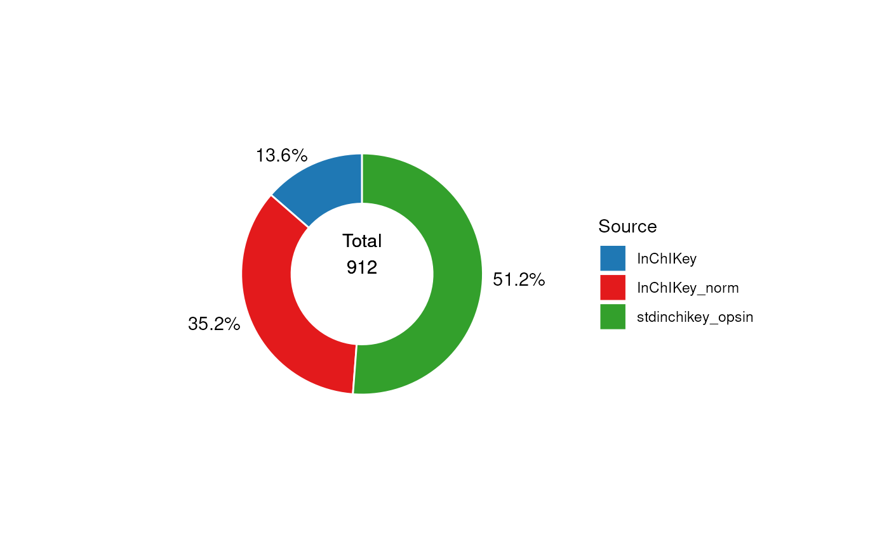

To keep the records with the highest confidence identifiers We can
remove the annotations based on the `name` query using the
`filter_labels` object.

\
`# prepare workflow`\
`FL`` ``<-`` `[`filter_labels`](https://computational-metabolomics.github.io/MetMashR/dev/reference/filter_labels.md)`(`\
`    column_name ``=`` ``"inchikey_source"``,`\
`    labels ``=`` ``"InChIKey"``,`\
`    mode ``=`` ``"exclude"`\
`)`\
`# apply`\
`FF`` ``<-`` `[`model_apply`](https://computational-metabolomics.github.io/MetMashR/dev/reference/model_apply.md)`(``FL``, `[`predicted`](https://rdrr.io/pkg/struct/man/predicted.html)`(``N``)``)`\
\
`# print summary`\
[`predicted`](https://rdrr.io/pkg/struct/man/predicted.html)`(``FF``)`\
`#> A "annotation_source" object`\
`#> ----------------------------`\
`#> name:          combined`\
`#> description:   A source created by combining two or more sources`\
`#> input params:  tag, data, source `\
`#> annotations:   467 rows x 33 columns`

\

## Comparison with the true mixtures

In this section we compare the annotated features with the table of
standards known to be included in each of the mixtures.

\

### Importing the standard mixture tables

The first step is to import the tables of standards for each mixture.
The data has ready been saved as an RDS file so we can use
`rds_database` to import it.

\
`# prepare object`\
`R`` ``<-`` `[`rds_database`](https://computational-metabolomics.github.io/MetMashR/dev/reference/rds_database.md)`(`\
`    source ``=`` `[`file.path`](https://rdrr.io/r/base/file.path.html)`(`\
`        `[`system.file`](https://rdrr.io/r/base/system.file.html)`(``"extdata"``, package ``=`` ``"MetMashR"``)``,`\
`        ``"standard_mixtures.rds"`\
`    ``)``,`\
`    .writable ``=`` ``FALSE`\
`)`\
\
`# read`\
`R`` ``<-`` `[`read_source`](https://computational-metabolomics.github.io/MetMashR/dev/reference/read_source.md)`(``R``)`

The standards table contains a list of metabolites and the the mixture
they were included in. It also contains some manually curated data
providing m/z and retention time of the metabolite, which assay it was
observed in and the adduct.

\

### Identifiers for the standards

The standards table provides HMDB identifiers for each metabolite, but
our preference is to work with InChIkey. So our first task is to obtain
InChiKey for the standards.

The standards are based on the MTox700+ database (see \[TODO\]), so we
can import MTox700+ and use it to obtain InChIKey identifiers by
matching the the HMBD identifiers. An alternative might be to use
`hmdb_lookup` and/or `pubchem_property_lookup`.

\
`# convert standard mixtures to source, then get inchikey from MTox700+`\
`SM`` ``<-`` `[`import_source`](https://computational-metabolomics.github.io/MetMashR/dev/reference/import_source.md)`(``)`` ``+`\
`    `[`filter_na`](https://computational-metabolomics.github.io/MetMashR/dev/reference/filter_na.md)`(`\
`        column_name ``=`` ``"rt"`\
`    ``)`` ``+`\
`    `[`filter_na`](https://computational-metabolomics.github.io/MetMashR/dev/reference/filter_na.md)`(`\
`        column_name ``=`` ``"median_ms2_scans"`\
`    ``)`` ``+`\
`    `[`filter_na`](https://computational-metabolomics.github.io/MetMashR/dev/reference/filter_na.md)`(`\
`        column_name ``=`` ``"mzcloud_id"`\
`    ``)`` ``+`\
`    `[`filter_range`](https://computational-metabolomics.github.io/MetMashR/dev/reference/filter_range.md)`(`\
`        column_name ``=`` ``"median_ms2_scans"``,`\
`        upper_limit ``=`` ``Inf``,`\
`        lower_limit ``=`` ``0``,`\
`        equal_to ``=`` ``TRUE`\
`    ``)`` ``+`\
`    `[`database_lookup`](https://computational-metabolomics.github.io/MetMashR/dev/reference/database_lookup.md)`(`\
`        query_column ``=`` ``"hmdb_id"``,`\
`        database_column ``=`` ``"hmdb_id"``,`\
`        database ``=`` `[`MTox700plus_database`](https://computational-metabolomics.github.io/MetMashR/dev/reference/MTox700plus_database.md)`(``)``,`\
`        include ``=`` ``"inchikey"``,`\
`        suffix ``=`` ``""``,`\
`        not_found ``=`` ``NA`\
`    ``)`` ``+`\
`    `[`id_counts`](https://computational-metabolomics.github.io/MetMashR/dev/reference/id_counts.md)`(`\
`        id_column ``=`` ``"inchikey"``,`\
`        count_column ``=`` ``"inchikey_count"``,`\
`        count_na ``=`` ``FALSE`\
`    ``)`\
`# apply`\
`SM`` ``<-`` `[`model_apply`](https://computational-metabolomics.github.io/MetMashR/dev/reference/model_apply.md)`(``SM``, ``R``)`

In this next plot we show the overlap in standards for each assay
detected by manual observation.

\
`C`` ``<-`` `[`annotation_venn_chart`](https://computational-metabolomics.github.io/MetMashR/dev/reference/annotation_venn_chart.md)`(`\
`    factor_name ``=`` ``"inchikey"``,`\
`    group_column ``=`` ``"ion_mode"``,`\
`    line_colour ``=`` ``"white"``,`\
`    fill_colour ``=`` ``".group"``,`\
`    legend ``=`` ``TRUE``,`\
`    labels ``=`` ``FALSE`\
`)`\
\
`## plot`\
[`chart_plot`](https://computational-metabolomics.github.io/MetMashR/dev/reference/chart_plot.md)`(``C``, `[`predicted`](https://rdrr.io/pkg/struct/man/predicted.html)`(``SM``)``)`

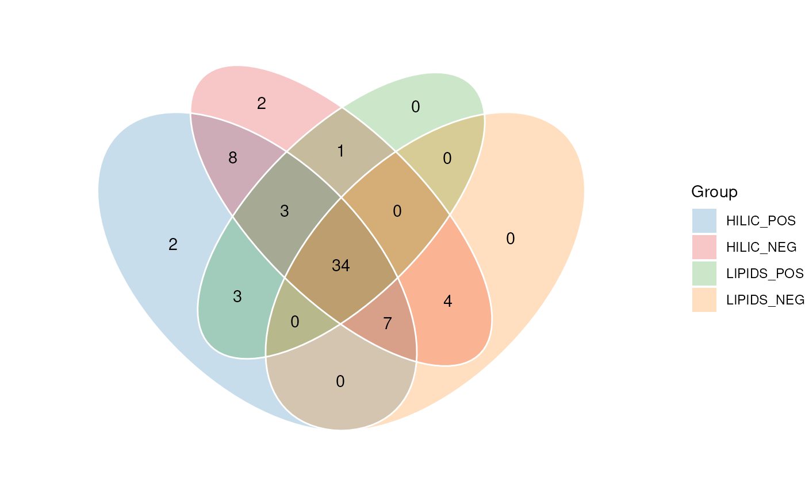

\

## Comparison of standards and annotations

Now that we have both the annotations and the standards we can look at
overlap between the identifiers in both sources, and begin to assess the
ability of the annotation software annotate the standards.

Here we plot a venn diagram showing the overlap in identifiers.

\
`# get processed data`\
`AN`` ``<-`` `[`predicted`](https://rdrr.io/pkg/struct/man/predicted.html)`(``FF``)`\
`AN``$``tag`` ``<-`` ``"Annotations"`\
`sM`` ``<-`` `[`predicted`](https://rdrr.io/pkg/struct/man/predicted.html)`(``SM``)`\
`sM``$``tag`` ``<-`` ``"Standards"`\
\
`# prepare chart`\
`C`` ``<-`` `[`annotation_venn_chart`](https://computational-metabolomics.github.io/MetMashR/dev/reference/annotation_venn_chart.md)`(`\
`    factor_name ``=`` ``"inchikey"``,`\
`    line_colour ``=`` ``"white"``,`\
`    fill_colour ``=`` ``".group"`\
`)`\
\
`# plot`\
[`chart_plot`](https://computational-metabolomics.github.io/MetMashR/dev/reference/chart_plot.md)`(``C``, ``sM``, ``AN``)`` ``+`` `[`ggtitle`](https://ggplot2.tidyverse.org/reference/labs.html)`(``"All assays, all sources"``)`

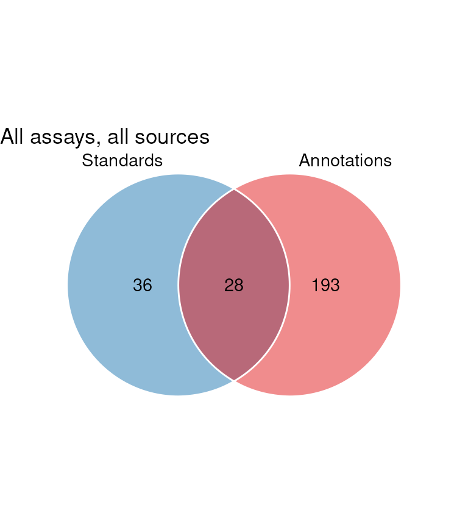

It can been seen that there is a large number of annotations not present
in the standard. These are false positives.

In the next plot we show similar Venn diagrams but for each assay
individually. These are followed by a 4-set Venn diagram that shows the
overlap between annotations from each assay that matched to a standard.

\
`G`` ``<-`` `[`list`](https://rdrr.io/r/base/list.html)`(``)`\
`VV`` ``<-`` `[`list`](https://rdrr.io/r/base/list.html)`(``)`\
`for`` ``(``k`` ``in`` `[`c`](https://rdrr.io/r/base/c.html)`(``"HILIC_NEG"``, ``"HILIC_POS"``, ``"LIPIDS_NEG"``, ``"LIPIDS_POS"``)``)`` ``{`\
`    ``wf`` ``<-`` `[`filter_labels`](https://computational-metabolomics.github.io/MetMashR/dev/reference/filter_labels.md)`(`\
`        column_name ``=`` ``"assay"``,`\
`        labels ``=`` ``k``,`\
`        mode ``=`` ``"include"`\
`    ``)`\
`    ``wf1`` ``<-`` `[`model_apply`](https://computational-metabolomics.github.io/MetMashR/dev/reference/model_apply.md)`(``wf``, ``AN``)`\
`    ``wf``$``column_name`` ``<-`` ``"ion_mode"`\
`    ``wf2`` ``<-`` `[`model_apply`](https://computational-metabolomics.github.io/MetMashR/dev/reference/model_apply.md)`(``wf``, ``sM``)`\
`    ``G``[[``k``]``]`` ``<-`` `[`chart_plot`](https://computational-metabolomics.github.io/MetMashR/dev/reference/chart_plot.md)`(``C``, `[`predicted`](https://rdrr.io/pkg/struct/man/predicted.html)`(``wf2``)``, `[`predicted`](https://rdrr.io/pkg/struct/man/predicted.html)`(``wf1``)``)`\
\
`    ``V`` ``<-`` `[`filter_venn`](https://computational-metabolomics.github.io/MetMashR/dev/reference/filter_venn.md)`(`\
`        factor_name ``=`` ``"inchikey"``,`\
`        tables ``=`` `[`list`](https://rdrr.io/r/base/list.html)`(`[`predicted`](https://rdrr.io/pkg/struct/man/predicted.html)`(``wf1``)``)``,`\
`        mode ``=`` ``'exclude'`\
`    ``)`\
`    ``V`` ``<-`` `[`model_apply`](https://computational-metabolomics.github.io/MetMashR/dev/reference/model_apply.md)`(``V``, `[`predicted`](https://rdrr.io/pkg/struct/man/predicted.html)`(``wf2``)``)`\
`    ``VV``[[``k``]``]`` ``<-`` `[`predicted`](https://rdrr.io/pkg/struct/man/predicted.html)`(``V``)`\
`    ``VV``[[``k``]``]``$``tag`` ``<-`` ``k`\
`}`\
`r1`` ``<-`` ``cowplot``::`[`plot_grid`](https://wilkelab.org/cowplot/reference/plot_grid.html)`(`\
`    plotlist ``=`` ``G``, nrow ``=`` ``2``,`\
`    labels ``=`` `[`c`](https://rdrr.io/r/base/c.html)`(``"HILIC_NEG"``, ``"HILIC_POS"``, ``"LIPIDS_NEG"``, ``"LIPIDS_POS"``)`\
`)`\
\
`cowplot``::`[`plot_grid`](https://wilkelab.org/cowplot/reference/plot_grid.html)`(``r1``, `[`chart_plot`](https://computational-metabolomics.github.io/MetMashR/dev/reference/chart_plot.md)`(``C``, ``VV``)``, nrow ``=`` ``2``, rel_heights ``=`` `[`c`](https://rdrr.io/r/base/c.html)`(``1``, ``0.5``)``)`

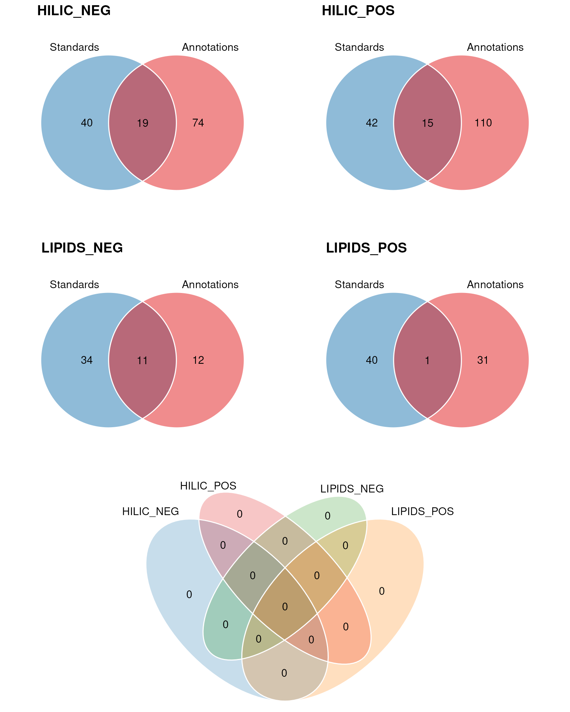

The majority of the standards were correctly annotated in the HILIC_NEG
assay.

In the next plot we compare the overlap in InChIKey for each source.

\
`G`` ``<-`` `[`list`](https://rdrr.io/r/base/list.html)`(``)`\
`for`` ``(``k`` ``in`` `[`c`](https://rdrr.io/r/base/c.html)`(``"CD"``, ``"LS"``)``)`` ``{`\
`    ``wf`` ``<-`` `[`filter_labels`](https://computational-metabolomics.github.io/MetMashR/dev/reference/filter_labels.md)`(`\
`        column_name ``=`` ``"source_name"``,`\
`        labels ``=`` ``k``,`\
`        mode ``=`` ``"include"`\
`    ``)`\
`    ``wf1`` ``<-`` `[`model_apply`](https://computational-metabolomics.github.io/MetMashR/dev/reference/model_apply.md)`(``wf``, ``AN``)`\
\
`    ``G``[[``k``]``]`` ``<-`` `[`chart_plot`](https://computational-metabolomics.github.io/MetMashR/dev/reference/chart_plot.md)`(``C``, ``sM``, `[`predicted`](https://rdrr.io/pkg/struct/man/predicted.html)`(``wf1``)``)`\
`}`\
`cowplot``::`[`plot_grid`](https://wilkelab.org/cowplot/reference/plot_grid.html)`(``plotlist ``=`` ``G``, nrow ``=`` ``1``, labels ``=`` `[`c`](https://rdrr.io/r/base/c.html)`(``"CD"``, ``"LS"``)``)`

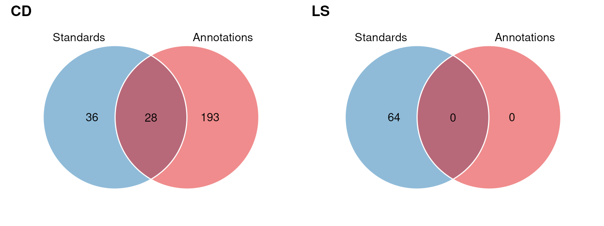

\

## Session Info

\
[`sessionInfo`](https://rdrr.io/r/utils/sessionInfo.html)`(``)`\
`#> R version 4.6.1 (2026-06-24)`\
`#> Platform: x86_64-pc-linux-gnu`\
`#> Running under: Ubuntu 24.04.4 LTS`\
`#> `\
`#> Matrix products: default`\
`#> BLAS:   /usr/lib/x86_64-linux-gnu/openblas-pthread/libblas.so.3 `\
`#> LAPACK: /usr/lib/x86_64-linux-gnu/openblas-pthread/libopenblasp-r0.3.26.so;  LAPACK version 3.12.0`\
`#> `\
`#> locale:`\
`#>  [1] LC_CTYPE=en_US.UTF-8       LC_NUMERIC=C              `\
`#>  [3] LC_TIME=en_US.UTF-8        LC_COLLATE=en_US.UTF-8    `\
`#>  [5] LC_MONETARY=en_US.UTF-8    LC_MESSAGES=en_US.UTF-8   `\
`#>  [7] LC_PAPER=en_US.UTF-8       LC_NAME=C                 `\
`#>  [9] LC_ADDRESS=C               LC_TELEPHONE=C            `\
`#> [11] LC_MEASUREMENT=en_US.UTF-8 LC_IDENTIFICATION=C       `\
`#> `\
`#> time zone: UTC`\
`#> tzcode source: system (glibc)`\
`#> `\
`#> attached base packages:`\
`#> [1] stats     graphics  grDevices utils     datasets  methods   base     `\
`#> `\
`#> other attached packages:`\
`#> [1] ggplotify_0.1.3      DT_0.34.0            dplyr_1.2.1         `\
`#> [4] structToolbox_1.25.0 ggplot2_4.0.3        MetMashR_1.7.2      `\
`#> [7] struct_1.25.0        BiocStyle_2.41.0    `\
`#> `\
`#> loaded via a namespace (and not attached):`\
`#>  [1] tidyselect_1.2.1            blob_1.3.0                 `\
`#>  [3] farver_2.1.2                filelock_1.0.3             `\
`#>  [5] S7_0.2.2                    fastmap_1.2.0              `\
`#>  [7] BiocFileCache_3.3.0         digest_0.6.39              `\
`#>  [9] lifecycle_1.0.5             RSQLite_3.53.3             `\
`#> [11] magrittr_2.0.5              compiler_4.6.1             `\
`#> [13] rlang_1.3.0                 sass_0.4.10                `\
`#> [15] tools_4.6.1                 yaml_2.3.12                `\
`#> [17] knitr_1.52                  S4Arrays_1.13.2            `\
`#> [19] labeling_0.4.3              htmlwidgets_1.6.4          `\
`#> [21] bit_4.6.0                   curl_8.0.0                 `\
`#> [23] sp_2.2-3                    DelayedArray_0.39.8        `\
`#> [25] plyr_1.8.9                  xml2_1.6.0                 `\
`#> [27] RColorBrewer_1.1-3          aplot_0.3.2                `\
`#> [29] abind_1.4-8                 withr_3.0.3                `\
`#> [31] purrr_1.2.2                 BiocGenerics_0.59.12       `\
`#> [33] desc_1.4.3                  grid_4.6.1                 `\
`#> [35] stats4_4.6.1                scales_1.4.0               `\
`#> [37] SummarizedExperiment_1.43.0 cli_3.6.6                  `\
`#> [39] rmarkdown_2.32              ragg_1.5.2                 `\
`#> [41] generics_0.1.4              otel_0.2.0                 `\
`#> [43] httr_1.4.9                  DBI_1.3.0                  `\
`#> [45] cachem_1.1.0                stringr_1.6.0              `\
`#> [47] ggthemes_6.0.0              BiocManager_1.30.27        `\
`#> [49] XVector_0.53.0              matrixStats_1.5.0          `\
`#> [51] vctrs_0.7.3                 yulab.utils_0.2.5          `\
`#> [53] Matrix_1.7-6                jsonlite_2.0.0             `\
`#> [55] bookdown_0.48               patchwork_1.3.2            `\
`#> [57] gridGraphics_0.5-1          IRanges_2.47.5             `\
`#> [59] S4Vectors_0.51.10           bit64_4.8.6                `\
`#> [61] systemfonts_1.3.2           crosstalk_1.2.2            `\
`#> [63] jquerylib_0.1.4             tidyr_1.3.2                `\
`#> [65] glue_1.8.1                  ggVennDiagram_1.5.7        `\
`#> [67] pkgdown_2.2.1.9000          cowplot_1.2.0              `\
`#> [69] stringi_1.8.9               gtable_0.3.6               `\
`#> [71] GenomicRanges_1.65.4        tibble_3.3.1               `\
`#> [73] pillar_1.11.1               rappdirs_0.3.4             `\
`#> [75] htmltools_0.5.9             Seqinfo_1.3.2              `\
`#> [77] dbplyr_2.6.0                R6_2.6.1                   `\
`#> [79] httr2_1.3.0                 textshaping_1.0.5          `\
`#> [81] evaluate_1.0.5              lattice_0.23-1             `\
`#> [83] Biobase_2.73.2              openxlsx_4.2.9             `\
`#> [85] memoise_2.0.1               ggfun_0.2.1                `\
`#> [87] bslib_0.12.0                Rcpp_1.1.2                 `\
`#> [89] zip_3.0.2                   gridExtra_2.3.1            `\
`#> [91] SparseArray_1.13.4          xfun_0.61                  `\
`#> [93] fs_2.1.0                    MatrixGenerics_1.25.0      `\
`#> [95] forcats_1.0.1               pkgconfig_2.0.3`
