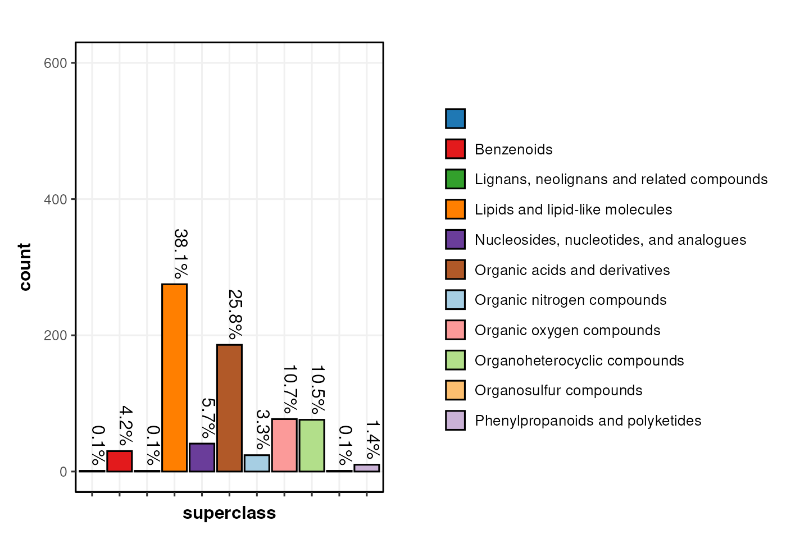
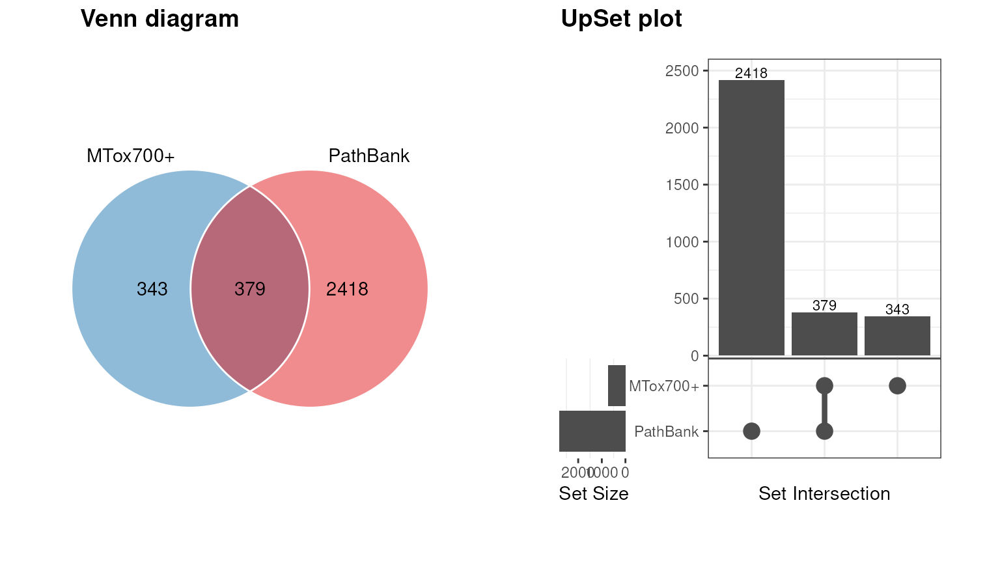
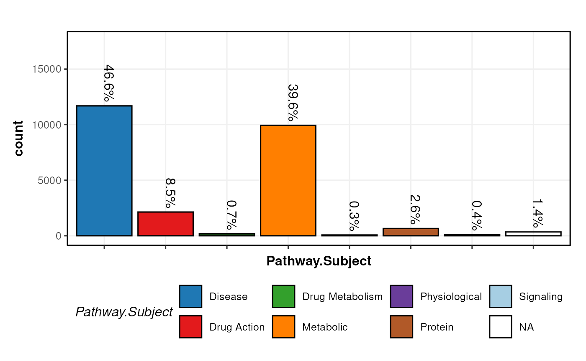

# Exploring the MTox700+ library

\

\# Getting Started The latest versions of
*[struct](https://bioconductor.org/packages/3.24/struct)* and `MetMashR`
that are compatible with your current R version can be installed using
BiocManager.

\
`# install BiocManager if not present`\
`if`` ``(``!`[`requireNamespace`](https://rdrr.io/r/base/ns-load.html)`(``"BiocManager"``, quietly ``=`` ``TRUE``)``)`` ``{`\
`    `[`install.packages`](https://rdrr.io/r/utils/install.packages.html)`(``"BiocManager"``)`\
`}`\
\
`# install MetMashR and dependencies`\
`BiocManager``::`[`install`](https://bioconductor.github.io/BiocManager/reference/install.html)`(``"MetMashR"``)`

Once installed you can activate the packages in the usual way:

\
`# load the packages`\
[`library`](https://rdrr.io/r/base/library.html)`(`[`MetMashR`](https://computational-metabolomics.github.io/MetMashR/)`)`\
[`library`](https://rdrr.io/r/base/library.html)`(`[`ggplot2`](https://ggplot2.tidyverse.org)`)`\
[`library`](https://rdrr.io/r/base/library.html)`(`[`structToolbox`](https://github.com/computational-metabolomics/structToolbox)`)`\
[`library`](https://rdrr.io/r/base/library.html)`(`[`dplyr`](https://dplyr.tidyverse.org)`)`\
[`library`](https://rdrr.io/r/base/library.html)`(`[`DT`](https://github.com/rstudio/DT)`)`\
[`library`](https://rdrr.io/r/base/library.html)`(`[`ggplotify`](https://github.com/GuangchuangYu/ggplotify)`)`

\

## Introduction

> MTox700+ is a list of toxicologically relevant metabolites derived
> from publications, public databases and relevant toxicological assays.

In this vignette we import the MTox700+ database and combine.merge and
“mash” it with other databases to explore its contents and its coverage
of chemical, biological and toxicological space.

\

## Importing the MTox700+ database

The MTox700+ database can be imported using the `MTox700plus_database`
object. It can be imported to a data.frame using the `read_database`
method.

\
`# prep object`\
`MT`` ``<-`` `[`MTox700plus_database`](https://computational-metabolomics.github.io/MetMashR/dev/reference/MTox700plus_database.md)`(`\
`    version ``=`` ``"latest"``,`\
`    tag ``=`` ``"MTox700+"`\
`)`\
\
`# import`\
`df`` ``<-`` `[`read_database`](https://computational-metabolomics.github.io/MetMashR/dev/reference/read_database.md)`(``MT``)`\
\
`# show contents`\
`.DT``(``df``)`

\
`# prepare workflow that uses MTox700+ as a source`\
`M`` ``<-`\
`    `[`import_source`](https://computational-metabolomics.github.io/MetMashR/dev/reference/import_source.md)`(``)`` ``+`\
`    `[`trim_whitespace`](https://computational-metabolomics.github.io/MetMashR/dev/reference/trim_whitespace.md)`(`\
`        column_name ``=`` ``".all"``,`\
`        which ``=`` ``"both"``,`\
`        whitespace ``=`` ``"[\\h\\v]"`\
`    ``)`\
\
`# apply`\
`M`` ``<-`` `[`model_apply`](https://computational-metabolomics.github.io/MetMashR/dev/reference/model_apply.md)`(``M``, ``MT``)`

\

## Exploring the chemical space

The chemical (or “metabolite”) space covered by the MTox700+ database
can be explored in several ways using the data included in the database,
which contains information about the structural classification of the
metabolites based on ChemOnt (a chemical taxonomy) and ClassyFire
(software to compute the taxonomy of a structure)
\[10.1186/s13321-016-0174-y\].

In this plot we show the number of metabolites in the MTox700+ database
that are assigned to a “superclass” of molecules.

\
`# initialise chart object`\
`C`` ``<-`` `[`annotation_bar_chart`](https://computational-metabolomics.github.io/MetMashR/dev/reference/annotation_bar_chart.md)`(`\
`    factor_name ``=`` ``"superclass"``,`\
`    label_rotation ``=`` ``TRUE``,`\
`    label_location ``=`` ``"outside"``,`\
`    label_type ``=`` ``"percent"``,`\
`    legend ``=`` ``TRUE`\
`)`\
\
`# plot`\
`g`` ``<-`` `\
`    `[`chart_plot`](https://computational-metabolomics.github.io/MetMashR/dev/reference/chart_plot.md)`(``C``, `[`predicted`](https://rdrr.io/pkg/struct/man/predicted.html)`(``M``)``)`` ``+`` `\
`    `[`ylim`](https://ggplot2.tidyverse.org/reference/lims.html)`(`[`c`](https://rdrr.io/r/base/c.html)`(``0``, ``600``)``)`` ``+`\
`    `[`guides`](https://ggplot2.tidyverse.org/reference/guides.html)`(`\
`        fill ``=`` `[`guide_legend`](https://ggplot2.tidyverse.org/reference/guide_legend.html)`(``ncol ``=`` ``1``, title ``=`` ``NULL``)``,byrow``=``TRUE``)`` ``+`\
`    `[`theme`](https://ggplot2.tidyverse.org/reference/theme.html)`(`\
`        legend.position ``=`` ``"right"``, `\
`        legend.margin ``=`` `[`margin`](https://ggplot2.tidyverse.org/reference/element.html)`(``)``,`\
`        legend.key.size ``=`` `[`unit`](https://rdrr.io/r/grid/unit.html)`(``0.5``, ``"cm"``)``,   `\
`        legend.text ``=`` `[`element_text`](https://ggplot2.tidyverse.org/reference/element.html)`(``size ``=`` ``10``)`\
`    ``)`\
\
`# layout`\
`leg`` ``<-`` ``cowplot``::`[`get_legend`](https://wilkelab.org/cowplot/reference/get_legend.html)`(``g``)`\
`cowplot``::`[`plot_grid`](https://wilkelab.org/cowplot/reference/plot_grid.html)`(``g`` ``+`` `[`theme`](https://ggplot2.tidyverse.org/reference/theme.html)`(``legend.position ``=`` ``"none"``)``, ``leg``,`\
`    nrow ``=`` ``1``,`\
`    rel_widths ``=`` `[`c`](https://rdrr.io/r/base/c.html)`(``50``, ``50``)`\
`)`

\

## Exploring the biological space

To explore the biological space covered by the metabolites in MTox700+
we need mash the database with additional information about the
biological pathways that the metabolites are part of.

We use the [PathBank](https://pathbank.org/) for this purpose. A
`struct_database` object for PathBank is already included in `MetMashR`.

\

### Importing PathBank

`MetMashR` provides the `PathBank_metabolite_databse` object to import
the PathBank database. You can choose to import:

- The “primary” database. This is a smaller version of the database
  restricted to primary pathways.
- The “complete” database, which includes all pathways in the database.

The “complete” database is a \>50mb download, and unzipped is \>1Gb.
Unzipping and caching of the database is handled by \[BiocFileCache\].

For the vignette we restrict to the “primary” PathBank database to keep
file sizes and downloads to a minimum.

We can use the database in two ways:

1.  convert it to a source and “mash” it with other sources
2.  use it as a lookup table to add information to an existing source.

To explore the biological space covered by MetMashR we will do both.

\

### Comparing PathBank and MTox700+

It is useful to visualise the overlap between PathBank and MTox700+.
MTox700+ is a much smaller database due to it being a curated list of
metabolites with toxicologial relevance, and PathBank is more general.

In th example below we import PathBank as a source, and use a venn
diagram to compare the overlap between inchikey identifiers in PathBank
and MTox700+.

\
`# object M already contains the MTox700+ database as a source`\
\
`# prepare PathBank as a source`\
`P`` ``<-`` `[`PathBank_metabolite_database`](https://computational-metabolomics.github.io/MetMashR/dev/reference/PathBank_metabolite_database.md)`(`\
`    version ``=`` ``"primary"``,`\
`    tag ``=`` ``"PathBank"`\
`)`\
\
`# import`\
`P`` ``<-`` `[`read_source`](https://computational-metabolomics.github.io/MetMashR/dev/reference/read_source.md)`(``P``)`\
\
`# prepare chart`\
`C`` ``<-`` `[`annotation_venn_chart`](https://computational-metabolomics.github.io/MetMashR/dev/reference/annotation_venn_chart.md)`(`\
`    factor_name ``=`` `[`c`](https://rdrr.io/r/base/c.html)`(``"inchikey"``, ``"InChI.Key"``)``, legend ``=`` ``FALSE``,`\
`    fill_colour ``=`` ``".group"``,`\
`    line_colour ``=`` ``"white"`\
`)`\
\
`# plot`\
`g1`` ``<-`` `[`chart_plot`](https://computational-metabolomics.github.io/MetMashR/dev/reference/chart_plot.md)`(``C``, `[`predicted`](https://rdrr.io/pkg/struct/man/predicted.html)`(``M``)``, ``P``)`\
\
`C`` ``<-`` `[`annotation_upset_chart`](https://computational-metabolomics.github.io/MetMashR/dev/reference/annotation_upset_chart.md)`(`\
`    factor_name ``=`` `[`c`](https://rdrr.io/r/base/c.html)`(``"inchikey"``, ``"InChI.Key"``)``,`\
`)`\
`g2`` ``<-`` `[`as.ggplot`](https://rdrr.io/pkg/ggplotify/man/as.ggplot.html)`(`[`chart_plot`](https://computational-metabolomics.github.io/MetMashR/dev/reference/chart_plot.md)`(``C``, `[`predicted`](https://rdrr.io/pkg/struct/man/predicted.html)`(``M``)``, ``P``)``)`` ``+`\
`  `[`theme`](https://ggplot2.tidyverse.org/reference/theme.html)`(``plot.margin ``=`` `[`unit`](https://rdrr.io/r/grid/unit.html)`(`[`c`](https://rdrr.io/r/base/c.html)`(``1``, ``1``, ``1``, ``1``)``, ``"cm"``)``)`\
`cowplot``::`[`plot_grid`](https://wilkelab.org/cowplot/reference/plot_grid.html)`(``g1``, ``g2``, nrow ``=`` ``1``, labels ``=`` `[`c`](https://rdrr.io/r/base/c.html)`(``"Venn diagram"``, ``"UpSet plot"``)``)`

The charts show that less than half of the metabolites in MTox700+ are
also present in the PathBank database for primary pathways.

\

### Combining MTox700+ with PathBank

To combine the pathway information in PathBank with the MTox700+
database we can use PathBank as a lookup table based on inchikeys. To do
this we use the `database_lookup` object.

Note that PathBank is not downloaded a second time; it is automatically
retrieved from the cache.

We request a number of columns from PathBank, including pathway
information and additional identifiers such as HMBD ID and KEGG ID.

\
`# prepare object`\
`X`` ``<-`` `[`database_lookup`](https://computational-metabolomics.github.io/MetMashR/dev/reference/database_lookup.md)`(`\
`    query_column ``=`` ``"inchikey"``,`\
`    database ``=`` ``P``$``data``,`\
`    database_column ``=`` ``"InChI.Key"``,`\
`    include ``=`` `[`c`](https://rdrr.io/r/base/c.html)`(`\
`        ``"PathBank.ID"``, ``"Pathway.Name"``, ``"Pathway.Subject"``, ``"Species"``,`\
`        ``"HMDB.ID"``, ``"KEGG.ID"``, ``"ChEBI.ID"``, ``"DrugBank.ID"``, ``"SMILES"`\
`    ``)``,`\
`    suffix ``=`` ``""`\
`)`\
\
`# apply`\
`X`` ``<-`` `[`model_apply`](https://computational-metabolomics.github.io/MetMashR/dev/reference/model_apply.md)`(``X``, `[`predicted`](https://rdrr.io/pkg/struct/man/predicted.html)`(``M``)``)`

We can now visualise e.g. the subject of the pathways captured by the
MTox700+ database.

\
`C`` ``<-`` `[`annotation_bar_chart`](https://computational-metabolomics.github.io/MetMashR/dev/reference/annotation_bar_chart.md)`(`\
`    factor_name ``=`` ``"Pathway.Subject"``,`\
`    label_rotation ``=`` ``TRUE``,`\
`    label_location ``=`` ``"outside"``,`\
`    label_type ``=`` ``"percent"``,`\
`    legend ``=`` ``TRUE`\
`)`\
\
[`chart_plot`](https://computational-metabolomics.github.io/MetMashR/dev/reference/chart_plot.md)`(``C``, `[`predicted`](https://rdrr.io/pkg/struct/man/predicted.html)`(``X``)``)`` ``+`` `[`ylim`](https://ggplot2.tidyverse.org/reference/lims.html)`(`[`c`](https://rdrr.io/r/base/c.html)`(``0``, ``17500``)``)`

We can see that MTox700+ largely focuses on metabolites related to
Disease metabolism and general metabolism, which is concomitant with the
database being curated to contain metabolites relevant to toxicology in
humans.

\

### Combining records

Metabolites can appear in multiple pathways. The PathBank database
therefore contains multiple records for the same metabolite, and the
relationship between MTox700+ and PathBank is one-to-many.

After obtaining pathway information from PathBank the new table has many
more rows than the original MTox700+ database, as each MTox700+ record
has been replicated for each match in the PathBank database.

e.g. after importing MTox700+ the number of records was:

\
`# Number in MTox700+`\
[`nrow`](https://rdrr.io/r/base/nrow.html)`(`[`predicted`](https://rdrr.io/pkg/struct/man/predicted.html)`(``M``)``$``data``)`\
`#> [1] 722`

After combing with PathBank the number of records is:

\
`# Number after PathBank lookup`\
[`nrow`](https://rdrr.io/r/base/nrow.html)`(`[`predicted`](https://rdrr.io/pkg/struct/man/predicted.html)`(``X``)``$``data``)`\
`#> [1] 25092`

Sometimes it is useful to collapse this information into a single record
per metabolite. We can use the `combine_records` object and its helper
functions to do this in a `MetMashR` workflow.

\
`# prepare object`\
`X`` ``<-`` `[`database_lookup`](https://computational-metabolomics.github.io/MetMashR/dev/reference/database_lookup.md)`(`\
`    query_column ``=`` ``"inchikey"``,`\
`    database ``=`` ``P``$``data``,`\
`    database_column ``=`` ``"InChI.Key"``,`\
`    include ``=`` `[`c`](https://rdrr.io/r/base/c.html)`(`\
`        ``"PathBank.ID"``, ``"Pathway.Name"``, ``"Pathway.Subject"``, ``"Species"``,`\
`        ``"HMDB.ID"``, ``"KEGG.ID"``, ``"ChEBI.ID"``, ``"DrugBank.ID"``, ``"SMILES"`\
`    ``)``,`\
`    suffix ``=`` ``""`\
`)`` ``+`\
`    `[`combine_records`](https://computational-metabolomics.github.io/MetMashR/dev/reference/combine_records.md)`(`\
`        group_by ``=`` ``"inchikey"``,`\
`        default_fcn ``=`` `[`fuse_unique`](https://computational-metabolomics.github.io/MetMashR/dev/reference/combine_records_helper_functions.md)`(``" || "``)`\
`    ``)`\
\
`# apply`\
`X`` ``<-`` `[`model_apply`](https://computational-metabolomics.github.io/MetMashR/dev/reference/model_apply.md)`(``X``, `[`predicted`](https://rdrr.io/pkg/struct/man/predicted.html)`(``M``)``)`

We have used the `.unique` helper function so that records for each
inchikey are combined into a single record by only retaining unique
values in each field (column). If there are multiple unique values for a
field then they are combined into a single string using the ” \|\| ”
separator.

We can now extract the pathways associated with a particular metabolite.
For example Glycolic acid:

\
`# get index of metabolite`\
`w`` ``<-`` `[`which`](https://rdrr.io/r/base/which.html)`(`[`predicted`](https://rdrr.io/pkg/struct/man/predicted.html)`(``X``)``$``data``$``metabolite_name`` ``==`` ``"Glycolic acid"``)`

The pathways associated with Glycolic acid are:

\
`# print list of pathways`\
[`predicted`](https://rdrr.io/pkg/struct/man/predicted.html)`(``X``)``$``data``$``Pathway.Name``[``w``]`\
`#> [1] "Inner Membrane Transport || Glycolate and Glyoxylate Degradation || D-Arabinose Degradation I || Ethylene Glycol Degradation"`

\

## Session Info

\
[`sessionInfo`](https://rdrr.io/r/utils/sessionInfo.html)`(``)`\
`#> R version 4.6.1 (2026-06-24)`\
`#> Platform: x86_64-pc-linux-gnu`\
`#> Running under: Ubuntu 24.04.4 LTS`\
`#> `\
`#> Matrix products: default`\
`#> BLAS:   /usr/lib/x86_64-linux-gnu/openblas-pthread/libblas.so.3 `\
`#> LAPACK: /usr/lib/x86_64-linux-gnu/openblas-pthread/libopenblasp-r0.3.26.so;  LAPACK version 3.12.0`\
`#> `\
`#> locale:`\
`#>  [1] LC_CTYPE=en_US.UTF-8       LC_NUMERIC=C              `\
`#>  [3] LC_TIME=en_US.UTF-8        LC_COLLATE=en_US.UTF-8    `\
`#>  [5] LC_MONETARY=en_US.UTF-8    LC_MESSAGES=en_US.UTF-8   `\
`#>  [7] LC_PAPER=en_US.UTF-8       LC_NAME=C                 `\
`#>  [9] LC_ADDRESS=C               LC_TELEPHONE=C            `\
`#> [11] LC_MEASUREMENT=en_US.UTF-8 LC_IDENTIFICATION=C       `\
`#> `\
`#> time zone: UTC`\
`#> tzcode source: system (glibc)`\
`#> `\
`#> attached base packages:`\
`#> [1] stats     graphics  grDevices utils     datasets  methods   base     `\
`#> `\
`#> other attached packages:`\
`#> [1] ggplotify_0.1.3      DT_0.34.0            dplyr_1.2.1         `\
`#> [4] structToolbox_1.25.0 ggplot2_4.0.3        MetMashR_1.7.2      `\
`#> [7] struct_1.25.0        BiocStyle_2.41.0    `\
`#> `\
`#> loaded via a namespace (and not attached):`\
`#>  [1] tidyselect_1.2.1            farver_2.1.2               `\
`#>  [3] blob_1.3.0                  filelock_1.0.3             `\
`#>  [5] S7_0.2.2                    fastmap_1.2.0              `\
`#>  [7] BiocFileCache_3.3.0         digest_0.6.39              `\
`#>  [9] lifecycle_1.0.5             RSQLite_3.53.3             `\
`#> [11] magrittr_2.0.5              compiler_4.6.1             `\
`#> [13] rlang_1.3.0                 sass_0.4.10                `\
`#> [15] tools_4.6.1                 yaml_2.3.12                `\
`#> [17] knitr_1.52                  labeling_0.4.3             `\
`#> [19] S4Arrays_1.13.2             htmlwidgets_1.6.4          `\
`#> [21] bit_4.6.0                   sp_2.2-3                   `\
`#> [23] curl_8.0.0                  DelayedArray_0.39.8        `\
`#> [25] plyr_1.8.9                  xml2_1.6.0                 `\
`#> [27] RColorBrewer_1.1-3          aplot_0.3.2                `\
`#> [29] abind_1.4-8                 withr_3.0.3                `\
`#> [31] purrr_1.2.2                 BiocGenerics_0.59.12       `\
`#> [33] desc_1.4.3                  grid_4.6.1                 `\
`#> [35] stats4_4.6.1                scales_1.4.0               `\
`#> [37] SummarizedExperiment_1.43.0 cli_3.6.6                  `\
`#> [39] rmarkdown_2.32              ragg_1.5.2                 `\
`#> [41] generics_0.1.4              otel_0.2.0                 `\
`#> [43] httr_1.4.9                  DBI_1.3.0                  `\
`#> [45] cachem_1.1.0                stringr_1.6.0              `\
`#> [47] ggthemes_6.0.0              BiocManager_1.30.27        `\
`#> [49] XVector_0.53.0              matrixStats_1.5.0          `\
`#> [51] vctrs_0.7.3                 yulab.utils_0.2.5          `\
`#> [53] Matrix_1.7-6                jsonlite_2.0.0             `\
`#> [55] bookdown_0.48               patchwork_1.3.2            `\
`#> [57] gridGraphics_0.5-1          IRanges_2.47.5             `\
`#> [59] S4Vectors_0.51.10           bit64_4.8.6                `\
`#> [61] crosstalk_1.2.2             systemfonts_1.3.2          `\
`#> [63] tidyr_1.3.2                 jquerylib_0.1.4            `\
`#> [65] ggVennDiagram_1.5.7         glue_1.8.1                 `\
`#> [67] pkgdown_2.2.1.9000          cowplot_1.2.0              `\
`#> [69] stringi_1.8.9               gtable_0.3.6               `\
`#> [71] GenomicRanges_1.65.4        tibble_3.3.1               `\
`#> [73] pillar_1.11.1               rappdirs_0.3.4             `\
`#> [75] htmltools_0.5.9             Seqinfo_1.3.2              `\
`#> [77] dbplyr_2.6.0                R6_2.6.1                   `\
`#> [79] httr2_1.3.0                 textshaping_1.0.5          `\
`#> [81] evaluate_1.0.5              lattice_0.23-1             `\
`#> [83] Biobase_2.73.2              memoise_2.0.1              `\
`#> [85] ggfun_0.2.1                 bslib_0.12.0               `\
`#> [87] Rcpp_1.1.2                  gridExtra_2.3.1            `\
`#> [89] SparseArray_1.13.4          xfun_0.61                  `\
`#> [91] forcats_1.0.1               fs_2.1.0                   `\
`#> [93] MatrixGenerics_1.25.0       pkgconfig_2.0.3`
