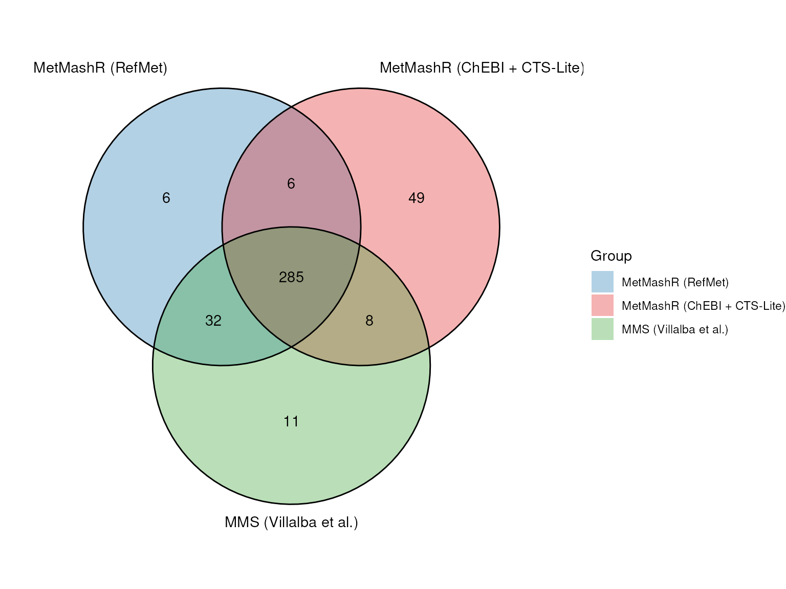

# Case study: reimplementing the Metabolites Merging Strategy with MetMashR

\
[`library`](https://rdrr.io/r/base/library.html)`(``struct``)`\
[`library`](https://rdrr.io/r/base/library.html)`(`[`MetMashR`](https://computational-metabolomics.github.io/MetMashR/)`)`\
[`library`](https://rdrr.io/r/base/library.html)`(`[`ggplot2`](https://ggplot2.tidyverse.org)`)`

## Introduction

Villalba et al. (2023) describe a three-step procedure for harmonising
metabolite annotations reported by different studies, databases and
publications into one consistent, cross-referenced dataset. The main
steps of their “Metabolites Merging Strategy” (MMS) are:

1.  **Translation and merging** - convert identifiers from each source
    (e.g. a name, an InChIKey, or some other identifier) into an
    InChIKey, and merge records with the same key.
2.  **Attribute retrieval** - for each InChIKey, retrieve descriptive
    attributes (such as name, molecular weight, molecular formula),
    identifiers for cross-references to other databases (e.g. PubChem
    CID, SMILES, ChEBI, HMDB, KEGG, LipidMaps, DrugBank, CAS) and
    chemical ontology (kingdom, superclass, class).
3.  **Manual curation** - collapse conjugated acid/base forms of the
    same compound, retrieve missing attributes, and resolve
    duplicate/conflicting synonyms.

The worked example included in the original publication harmonises
urinary asthma metabolites reported across three Metabolomics Workbench
(MWB) studies (ST001039, ST001048, ST001317), the Human Metabolome
Database, and six literature articles.

This vignette reimplements the MWB portion of that case study as a
single MetMashR model sequence i.e. one workflow object built by
chaining MetMashR steps together, and compares the output with the
published supplementary results. It adapts the identifier services and
automates skeleton-level grouping; it does not reproduce every manual
curation decision.

Two variants of the workflow are built from the same steps and compared
at the end:

1.  **RefMet variant.** Names are translated using PubChem and the
    Metabolomics Workbench RefMet service, preferring RefMet’s result
    when available.
2.  **ChEBI + CTS-Lite variant.** The input names come from Metabolomics
    Workbench, and RefMet is also a Metabolomics Workbench service, so
    the RefMet translation is not fully independent of the data it is
    translating: any naming convention or curation quirk shared between
    the two could inflate agreement with the published result. This
    variant substitutes ChEBI, an independently curated database
    unaffiliated with MWB, for RefMet. It also adds CTS-Lite (the Fiehn
    Lab’s successor to the now-closed Chemical Translation Service) as
    an extra attribute source. CTS-Lite cannot translate names, but it
    accepts an InChIKey and returns a matched PubChem entry plus
    literature/patent annotation counts.

For the same reason the ChEBI variant does not query the MWB compound
database for cross-references; it uses the ChEBI identifier it already
has to retrieve KEGG. Normalisation, the PubChem and ClassyFire
attribute lookups and the InChIKey skeleton grouping in Step 3 do not
depend on which service supplied the InChIKey, so they are shared by
both variants.

## Importing the source data

Each study’s reported metabolite list is retrieved directly from
Metabolomics Workbench with
[`mwb_study_source()`](https://computational-metabolomics.github.io/MetMashR/dev/reference/mwb_study_source.md)
and the three tables are combined with
[`combine_sources()`](https://computational-metabolomics.github.io/MetMashR/dev/reference/combine_sources.md).

Only the `metabolite_name` is used as a chemical lookup input; source
and study tags are retained separately. Existing `refmet_name` and
`pubchem_id` annotations, where available, are excluded to test the
name-based translation.

\
`# the studies to import`\
`study_ids`` ``<-`` `[`c`](https://rdrr.io/r/base/c.html)`(``"ST001039"``, ``"ST001048"``, ``"ST001317"``)`\
\
`# read each source`\
`sources`` ``<-`` `[`lapply`](https://rdrr.io/r/base/lapply.html)`(`\
`    ``study_ids``,`\
`    ``function``(``id``)`` `[`read_source`](https://computational-metabolomics.github.io/MetMashR/dev/reference/read_source.md)`(`[`mwb_study_source`](https://computational-metabolomics.github.io/MetMashR/dev/reference/mwb_study_source.md)`(``source ``=`` ``id``, tag ``=`` ``id``)``)`\
`)`\
\
`# use MetMashR to merge all sources`\
`combine_step`` ``<-`` `[`combine_sources`](https://computational-metabolomics.github.io/MetMashR/dev/reference/combine_sources.md)`(`\
`    source_list ``=`` `[`list`](https://rdrr.io/r/base/list.html)`(``)``,`\
`    keep_cols ``=`` ``"metabolite_name"``,`\
`    source_col ``=`` ``"source"`\
`)`\
\
`# apply the merge`\
`combine_step`` ``<-`` `[`model_apply`](https://computational-metabolomics.github.io/MetMashR/dev/reference/model_apply.md)`(``combine_step``, ``sources``)`\
\
`# extract the merged table`\
`combined`` ``<-`` `[`predicted`](https://rdrr.io/pkg/struct/man/predicted.html)`(``combine_step``)`\
\
`# report number of records`\
[`nrow`](https://rdrr.io/r/base/nrow.html)`(``combined``$``data``)`\
`#> [1] 738`

## Building the model sequence

The remaining lookup and processing steps are chained into a single
model sequence. The translation and attribute-retrieval steps use
pre-existing `rds_cache` files with `cache_mode = "offline"`. Cached
responses are reused; query values absent from a cache are left as `NA`.
A live rerun requires a supported online cache mode and a writable cache
location. These lookup caches do not, by themselves, archive the MWB
study downloads or the separately imported Zenodo comparison file.

\
`# Function that returns an rds_cache by name. Caches for steps shared by both`\
`# variants are keyed by name/InChIKey, not by the service that produced the`\
`# InChIKey. The chebi_name and cts_lite caches are specific to the ChEBI variant.`\
`cached`` ``<-`` ``function``(``name``, ``variant`` ``=`` ``FALSE``)`` ``{`\
`    ``prefix`` ``<-`` ``if`` ``(``variant``)`` ``"mms_case_study_chebi_variant_"`` ``else`` ``"mms_case_study_"`\
`    `[`rds_cache`](https://computational-metabolomics.github.io/MetMashR/dev/reference/rds_cache.md)`(``source ``=`` `[`file.path`](https://rdrr.io/r/base/file.path.html)`(`\
`        `[`system.file`](https://rdrr.io/r/base/system.file.html)`(``"cached"``, package ``=`` ``"MetMashR"``)``,`\
`        `[`paste0`](https://rdrr.io/r/base/paste.html)`(``prefix``, ``name``, ``".rds"``)`\
`    ``)``)`\
`}`

### Normalising synonyms

Molecules have many synonyms and resolving them to the same identifier
can be challenging. We apply a small number of normalisation rules,
using MetMashR dictionaries, to increase the chance of a match before
attempting translation. These are largely dataset-specific heuristics;
the original names are retained so that any loss of information can be
reviewed:

- remove record-keeping suffixes that are not part of the chemical name
  (e.g. `"Dihydrobiopterin_R1"` becomes `"Dihydrobiopterin"`)
- remove short trailing markers such as batch or replicate codes
  (e.g. `"D,L Glucosamine (B)"` becomes `"D,L Glucosamine"`)

\
`tidy_dictionary`` ``<-`` `[`list`](https://rdrr.io/r/base/list.html)`(`\
`    ``# trailing replicate/fragment label, e.g. "_R1", "_R2"`\
`    `[`list`](https://rdrr.io/r/base/list.html)`(``pattern ``=`` ``"_[A-Za-z][0-9]+$"``, replace ``=`` ``""``)``,`\
`    ``# remove short (<=3 character) batch/replicate codes`\
`    `[`list`](https://rdrr.io/r/base/list.html)`(``pattern ``=`` ``"\\s\\([A-Za-z0-9]{1,3}\\)\\s*$"``, replace ``=`` ``""``)`\
`)`

- where a closing parenthesis is followed by a slash, the name is
  reporting two candidate identifications rather than one (e.g.
  `"MiBP (Mono-isobutyl phthalate)/MBP (Mono-n-butyl phthalate)"`).
  Silently keeping only the text before the slash would discard the
  second candidate even though nothing established the two names are
  synonyms. Instead we flag the record (`ambiguous_name`) and use
  [`split_records()`](https://computational-metabolomics.github.io/MetMashR/dev/reference/split_records.md)
  to expand it into two full records, one per candidate name, each
  translated independently in the steps that follow. If both candidates
  resolve to the same compound they are simply merged back together by
  [`combine_records()`](https://computational-metabolomics.github.io/MetMashR/dev/reference/combine_records.md)
  below; if they resolve to different compounds, both are kept and are
  visibly flagged as ambiguous rather than one being silently dropped.

\
`# flag names reporting two "/"-joined candidate identifications`\
`ambiguous_name_step`` ``<-`` `[`compute_column`](https://computational-metabolomics.github.io/MetMashR/dev/reference/compute_column.md)`(`\
`    input_columns ``=`` ``"name_tidied"``,`\
`    output_column ``=`` ``"ambiguous_name"``,`\
`    ``# compute_column passes fcn a 1-column data.frame, not a bare vector`\
`    fcn ``=`` ``function``(``x``)`` `[`grepl`](https://rdrr.io/r/base/grep.html)`(``"\\)/"``, ``x``[[``1``]``]``)`\
`)`\
\
`# split into one record per candidate name, at a "/" immediately following a`\
`# closing parenthesis; names without this pattern are left as a single record`\
`split_ambiguous_name_step`` ``<-`` `[`split_records`](https://computational-metabolomics.github.io/MetMashR/dev/reference/split_records.md)`(`\
`    column_name ``=`` ``"name_tidied"``,`\
`    separator ``=`` ``"(?<=\\))/"`\
`)`

- extract trailing parenthetical text when it is intended as an expanded
  name alongside an abbreviation (e.g. `"MEP (Mono-ethyl phthalate)"`
  becomes `"Mono-ethyl phthalate"`)

\
`# matches any trailing "(...)", not just abbrev(expansion). `\
`# e.g. "LysoPC (16:0)" -> "16:0". OK for this dataset; check before reusing `\
`# elsewhere`\
`abbrev_dictionary`` ``<-`` `[`list`](https://rdrr.io/r/base/list.html)`(`\
`    `[`list`](https://rdrr.io/r/base/list.html)`(`\
`        pattern ``=`` ``"\\s\\([^()]+\\)\\s*$"``,`\
`        replace ``=`` ``function``(``inp``)`` ``{`\
`            ``m`` ``<-`` `[`regmatches`](https://rdrr.io/r/base/regmatches.html)`(`\
`                ``inp``$``x``,`\
`                `[`regexec`](https://rdrr.io/r/base/grep.html)`(``"\\s\\(([^()]+)\\)\\s*$"``, ``inp``$``x``)`\
`            ``)`\
`            ``if`` ``(`[`length`](https://rdrr.io/r/base/length.html)`(``m``[[``1``]``]``)`` ``>`` ``1``)`` `[`trimws`](https://rdrr.io/r/base/trimws.html)`(``m``[[``1``]``]``[``2``]``)`` ``else`` ``inp``$``x`\
`        ``}`\
`    ``)`\
`)`

- strip racemic and stereochemical markers covered by MetMashR’s
  built-in `racemic_dictionary` (e.g. `"D/L "`, `"DL-"`, `+/-`, etc).

- expand Lyso-glycerophospholipid class prefixes to LIPID MAPS shorthand
  (`"LysoPC"` becomes `"LPC"`).

\
`# dictionary to convert lyso-lipids to LIPID MAPS shorthand`\
`lyso_dictionary`` ``<-`` `[`list`](https://rdrr.io/r/base/list.html)`(`\
`    `[`list`](https://rdrr.io/r/base/list.html)`(``pattern ``=`` ``"^Lyso-?PC"``, replace ``=`` ``"LPC"``, perl ``=`` ``TRUE``, ignore.case ``=`` ``TRUE``)``,`\
`    `[`list`](https://rdrr.io/r/base/list.html)`(``pattern ``=`` ``"^Lyso-?PE"``, replace ``=`` ``"LPE"``, perl ``=`` ``TRUE``, ignore.case ``=`` ``TRUE``)``,`\
`    `[`list`](https://rdrr.io/r/base/list.html)`(``pattern ``=`` ``"^Lyso-?PI"``, replace ``=`` ``"LPI"``, perl ``=`` ``TRUE``, ignore.case ``=`` ``TRUE``)``,`\
`    `[`list`](https://rdrr.io/r/base/list.html)`(``pattern ``=`` ``"^Lyso-?PG"``, replace ``=`` ``"LPG"``, perl ``=`` ``TRUE``, ignore.case ``=`` ``TRUE``)``,`\
`    `[`list`](https://rdrr.io/r/base/list.html)`(``pattern ``=`` ``"^Lyso-?PS"``, replace ``=`` ``"LPS"``, perl ``=`` ``TRUE``, ignore.case ``=`` ``TRUE``)``,`\
`    `[`list`](https://rdrr.io/r/base/list.html)`(``pattern ``=`` ``"^Lyso-?PA"``, replace ``=`` ``"LPA"``, perl ``=`` ``TRUE``, ignore.case ``=`` ``TRUE``)`\
`)`

The prepared dictionaries are passed to
[`normalise_strings()`](https://computational-metabolomics.github.io/MetMashR/dev/reference/normalise_strings.md)
to clean the text in `search_column` and return the result in
`output_column`. `tidy_dictionary` is applied first, on its own, so
`ambiguous_name_step` and `split_ambiguous_name_step` (above) see the
tidied name before it is split; the remaining dictionaries are then
applied to `name_tidied` (now one row per candidate name) to produce the
final `name_normalised`.

\
`# workflow steps to apply the cleaning steps to the metabolite names`\
`normalise_step`` ``<-`` `[`list`](https://rdrr.io/r/base/list.html)`(`\
`    `[`normalise_strings`](https://computational-metabolomics.github.io/MetMashR/dev/reference/normalise_strings.md)`(`\
`        search_column ``=`` ``"metabolite_name"``,`\
`        output_column ``=`` ``"name_tidied"``,`\
`        dictionary ``=`` ``tidy_dictionary`\
`    ``)``,`\
`    ``ambiguous_name_step``,`\
`    ``split_ambiguous_name_step``,`\
`    `[`normalise_strings`](https://computational-metabolomics.github.io/MetMashR/dev/reference/normalise_strings.md)`(`\
`        search_column ``=`` ``"name_tidied"``,`\
`        output_column ``=`` ``"name_normalised"``,`\
`        dictionary ``=`` `[`c`](https://rdrr.io/r/base/c.html)`(`\
`            ``abbrev_dictionary``,`\
`            ``racemic_dictionary``, ``# included in MetMashR`\
`            ``lyso_dictionary`\
`        ``)`\
`    ``)`\
`)`

### Translation and merging (MMS Step 1)

Villalba et al. used the PubChem Identifier Exchange Service and the
Chemical Translation Service (CTS) for identifier translation. Both
variants here use PubChem; they differ in the second service, which is
either the Metabolomics Workbench RefMet service or ChEBI. Neither
depends on CTS.

[`pubchem_id_exchange()`](https://computational-metabolomics.github.io/MetMashR/dev/reference/pubchem_id_exchange.md)
and either
[`mwb_refmet_lookup()`](https://computational-metabolomics.github.io/MetMashR/dev/reference/mwb_refmet_lookup.md)
or
[`chebi_lookup()`](https://computational-metabolomics.github.io/MetMashR/dev/reference/chebi_lookup.md)
attempt a match for each normalised name using the supplied caches.
[`prioritise_columns()`](https://computational-metabolomics.github.io/MetMashR/dev/reference/prioritise_columns.md)
selects one InChIKey per row, preferring the second service when a
result is available and recording the selected source. RefMet provides a
curated nomenclature built directly from names reported across
metabolomics studies, and is therefore more likely to match the input
data; ChEBI’s name-search endpoint (`search_by = "name"`) returns the
matched entity’s InChIKey directly, so a single lookup is enough.

The steps that follow the service-specific lookup are identical for both
variants, so they are defined once as `translate_common`. They flag
selected disagreements between the returned InChIKeys for review,
exclude records with no selected InChIKey, and merge records with
identical full InChIKeys. The variant-specific steps are built by a
small helper, and the complete sequences are assembled with Reduce() at
the end.

\
`# query pubchem by synonym and return inchikey (shared)`\
`pubchem_translate`` ``<-`` `[`pubchem_id_exchange`](https://computational-metabolomics.github.io/MetMashR/dev/reference/pubchem_id_exchange.md)`(`\
`    query_column ``=`` ``"name_normalised"``,`\
`    input_type ``=`` ``"synonyms"``,`\
`    output_type ``=`` ``"inchikey"``,`\
`    cache ``=`` ``cached``(``"pubchem_id_exchange"``)``,`\
`    cache_mode ``=`` ``"offline"`\
`)`\
\
`# flag disagreement, prioritise the second service, drop records with no`\
`# inchikey and merge duplicates. inchikey_col is the column returned by the`\
`# second service and tag its name in InChIKey_source`\
`translate_common`` ``<-`` ``function``(``inchikey_col``, ``tag``)`` ``{`\
`    `[`list`](https://rdrr.io/r/base/list.html)`(`\
`        ``# flag where the first 14 characters of the inchikey match but the`\
`        ``# first 26 do not (the final protonation character is not compared)`\
`        `[`compute_column`](https://computational-metabolomics.github.io/MetMashR/dev/reference/compute_column.md)`(`\
`            input_columns ``=`` `[`c`](https://rdrr.io/r/base/c.html)`(``inchikey_col``, ``"inchikey_pubchem_id_exchange"``)``,`\
`            output_column ``=`` ``"ambiguous_inchikey"``,`\
`            fcn ``=`` ``function``(``x``)`` ``{`\
`                ``a`` ``<-`` ``x``[[``1``]``]`\
`                ``b`` ``<-`` ``x``[[``2``]``]`\
`                ``ambiguous`` ``<-`` `[`substr`](https://rdrr.io/r/base/substr.html)`(``a``, ``1``, ``14``)`` ``==`` `[`substr`](https://rdrr.io/r/base/substr.html)`(``b``, ``1``, ``14``)`` ``&`\
`                    `[`substr`](https://rdrr.io/r/base/substr.html)`(``a``, ``1``, ``26``)`` ``!=`` `[`substr`](https://rdrr.io/r/base/substr.html)`(``b``, ``1``, ``26``)`\
`                ``ambiguous``[`[`is.na`](https://rdrr.io/r/base/NA.html)`(``ambiguous``)``]`` ``<-`` ``FALSE`\
`                ``ambiguous`\
`            ``}`\
`        ``)``,`\
`        ``# select the second service over pubchem where both exist`\
`        `[`prioritise_columns`](https://computational-metabolomics.github.io/MetMashR/dev/reference/prioritise_columns.md)`(`\
`            column_names ``=`` `[`c`](https://rdrr.io/r/base/c.html)`(``inchikey_col``, ``"inchikey_pubchem_id_exchange"``)``,`\
`            output_name ``=`` ``"InChIKey"``,`\
`            source_name ``=`` ``"InChIKey_source"``,`\
`            source_tags ``=`` `[`c`](https://rdrr.io/r/base/c.html)`(``tag``, ``"pubchem"``)`\
`        ``)``,`\
`        ``# exclude any results without an inchikey`\
`        `[`filter_na`](https://computational-metabolomics.github.io/MetMashR/dev/reference/filter_na.md)`(``column_name ``=`` ``"InChIKey"``, mode ``=`` ``"exclude"``)``,`\
`        ``# merge duplicate records`\
`        `[`combine_records`](https://computational-metabolomics.github.io/MetMashR/dev/reference/combine_records.md)`(`\
`            group_by ``=`` ``"InChIKey"``,`\
`            default_fcn ``=`` `[`fuse_unique`](https://computational-metabolomics.github.io/MetMashR/dev/reference/combine_records_helper_functions.md)`(``separator ``=`` ``" || "``)``,`\
`            fcns ``=`` `[`list`](https://rdrr.io/r/base/list.html)`(`\
`                metabolite_name ``=`` `[`fuse_unique`](https://computational-metabolomics.github.io/MetMashR/dev/reference/combine_records_helper_functions.md)`(``separator ``=`` ``" || "``)``,`\
`                source ``=`` `[`fuse_unique`](https://computational-metabolomics.github.io/MetMashR/dev/reference/combine_records_helper_functions.md)`(``separator ``=`` ``" || "``)``,`\
`                ambiguous_inchikey ``=`` ``function``(``x``)`` `[`any`](https://rdrr.io/r/base/any.html)`(``x``, na.rm ``=`` ``TRUE``)``,`\
`                ambiguous_name ``=`` ``function``(``x``)`` `[`any`](https://rdrr.io/r/base/any.html)`(``x``, na.rm ``=`` ``TRUE``)`\
`            ``)`\
`        ``)`\
`    ``)`\
`}`\
\
`# RefMet variant`\
`translate_refmet`` ``<-`` `[`c`](https://rdrr.io/r/base/c.html)`(`\
`    `[`list`](https://rdrr.io/r/base/list.html)`(`\
`        ``pubchem_translate``,`\
`        ``# query refmet by synonym`\
`        `[`mwb_refmet_lookup`](https://computational-metabolomics.github.io/MetMashR/dev/reference/mwb_refmet_lookup.md)`(`\
`            query_column ``=`` ``"name_normalised"``,`\
`            cache ``=`` ``cached``(``"refmet"``)``,`\
`            cache_mode ``=`` ``"offline"``,`\
`            delay ``=`` ``0.5`\
`        ``)`\
`    ``)``,`\
`    ``translate_common``(``"inchi_key_refmet"``, ``"refmet"``)`\
`)`\
\
`# ChEBI variant`\
`translate_chebi`` ``<-`` `[`c`](https://rdrr.io/r/base/c.html)`(`\
`    `[`list`](https://rdrr.io/r/base/list.html)`(`\
`        ``pubchem_translate``,`\
`        ``# query chebi by name and return a chebi accession, name and inchikey`\
`        `[`chebi_lookup`](https://computational-metabolomics.github.io/MetMashR/dev/reference/chebi_lookup.md)`(`\
`            query_column ``=`` ``"name_normalised"``,`\
`            search_by ``=`` ``"name"``,`\
`            cache ``=`` ``cached``(``"chebi_name"``, variant ``=`` ``TRUE``)``,`\
`            cache_mode ``=`` ``"offline"``,`\
`            delay ``=`` ``1`\
`        ``)`\
`    ``)``,`\
`    ``translate_common``(``"inchikey_chebi"``, ``"chebi"``)`\
`)`

[`combine_records()`](https://computational-metabolomics.github.io/MetMashR/dev/reference/combine_records.md)
is a wrapper around
[`dplyr::reframe()`](https://dplyr.tidyverse.org/reference/reframe.html).
The MetMashR helper
[`fuse_unique()`](https://computational-metabolomics.github.io/MetMashR/dev/reference/combine_records_helper_functions.md)
collapses distinct values into a single entry separated by a double pipe
(`||`). For example, two records with the same InChIKey might have their
`metabolite_name` values combined as `D-glucose || D-glucopyranose`.
Thus, records using different synonyms for the same identifier are
combined into one record.

### Attribute retrieval (MMS Step 2)

For each translated InChIKey, the workflow attempts to retrieve the
following attributes:

- name, molecular weight, molecular formula, InChI and SMILES from
  PubChem
- chemical ontology from ClassyFire, HMDB, ChEBI and LipidMaps
  identifiers from Metabolomics Workbench compound database
- a KEGG identifier using `KEGGREST`, an R package that queries the KEGG
  API.

DrugBank identifiers and CAS numbers were included in the original paper
but are omitted from this implementation.

The ChEBI variant differs in two ways. Metabolomics Workbench is the
source of the input names and RefMet is also an MWB service, so querying
the MWB compound database there would reintroduce the circularity this
variant is designed to avoid.
[`mwb_compound_lookup()`](https://computational-metabolomics.github.io/MetMashR/dev/reference/mwb_compound_lookup.md)
is therefore not used; the ChEBI identifier returned by
[`chebi_lookup()`](https://computational-metabolomics.github.io/MetMashR/dev/reference/chebi_lookup.md)
is used to retrieve the KEGG identifier instead, and the HMDB, LipidMaps
and PubChem CID cross-references (which only that lookup provided) are
omitted from this variant. The variant also queries CTS-Lite with the
InChIKey, returning the compound name, formula and mass plus
literature/patent annotation counts that can serve as a rough confidence
signal.
[`cts_lite_lookup()`](https://computational-metabolomics.github.io/MetMashR/dev/reference/cts_lite_lookup.md)
follows the same `cache`/`cache_mode` convention as the other lookups,
but is not built on the `rest_api` base class because CTS-Lite’s API is
POST/batch-based (one request takes a space-separated list of queries),
which does not fit `rest_api`’s one `GET` per query value.

\
`# PubChem properties and ClassyFire classes, shared by both variants`\
`attribute_core`` ``<-`` `[`list`](https://rdrr.io/r/base/list.html)`(`\
`    ``# query the inchikey with pubchem and return various properties`\
`    `[`pubchem_property_lookup`](https://computational-metabolomics.github.io/MetMashR/dev/reference/pubchem_property_lookup.md)`(`\
`        query_column ``=`` ``"InChIKey"``,`\
`        search_by ``=`` ``"inchikey"``,`\
`        property ``=`` `[`c`](https://rdrr.io/r/base/c.html)`(`\
`            ``"IUPACName"``, ``"MolecularWeight"``, ``"MolecularFormula"``,`\
`            ``"InChI"``, ``"CanonicalSMILES"``, ``"Charge"`\
`        ``)``,`\
`        cache ``=`` ``cached``(``"pubchem_property"``)``,`\
`        cache_mode ``=`` ``"offline"``,`\
`        delay ``=`` ``0.4`\
`    ``)``,`\
`    ``# query the SMILES (from pubchem) with classyfire and return class`\
`    ``# information.`\
`    `[`classyfire_batch_lookup`](https://computational-metabolomics.github.io/MetMashR/dev/reference/classyfire_batch_lookup.md)`(`\
`        query_column ``=`` ``"ConnectivitySMILES_pubchem"``,`\
`        output_items ``=`` `[`c`](https://rdrr.io/r/base/c.html)`(``"kingdom"``, ``"superclass"``, ``"class"``)``,`\
`        output_fields ``=`` ``"name"``,`\
`        cache ``=`` ``cached``(``"classyfire"``)``,`\
`        cache_mode ``=`` ``"offline"``,`\
`        delay ``=`` ``3`\
`    ``)`\
`)`\
\
`# RefMet variant`\
`attribute_step`` ``<-`` `[`c`](https://rdrr.io/r/base/c.html)`(`\
`    ``attribute_core``,`\
`    `[`list`](https://rdrr.io/r/base/list.html)`(`\
`        ``# query the inchikey with MWB and return other cross reference`\
`        ``# identifiers`\
`        `[`mwb_compound_lookup`](https://computational-metabolomics.github.io/MetMashR/dev/reference/mwb_compound_lookup.md)`(`\
`            input_item ``=`` ``"inchi_key"``,`\
`            query_column ``=`` ``"InChIKey"``,`\
`            output_item ``=`` `[`c`](https://rdrr.io/r/base/c.html)`(``"hmdb_id"``, ``"chebi_id"``, ``"lm_id"``, ``"pubchem_cid"``)``,`\
`            cache ``=`` ``cached``(``"mwb_compound"``)``,`\
`            cache_mode ``=`` ``"offline"``,`\
`            delay ``=`` ``0.5`\
`        ``)``,`\
`        ``# query kegg with the ChEBI id and retrieve the kegg compound`\
`        ``# identifier.`\
`        `[`kegg_lookup`](https://computational-metabolomics.github.io/MetMashR/dev/reference/kegg_lookup.md)`(`\
`            get ``=`` ``"compound"``,`\
`            from ``=`` ``"chebi"``,`\
`            query_column ``=`` ``"chebi_id_mwb"``,`\
`            cache ``=`` ``cached``(``"kegg"``)``,`\
`            cache_mode ``=`` ``"offline"`\
`        ``)`\
`    ``)`\
`)`\
\
`# ChEBI variant: no MWB lookup. The ChEBI id comes from chebi_lookup() and`\
`# CTS-Lite is added.`\
`attribute_step_chebi`` ``<-`` `[`c`](https://rdrr.io/r/base/c.html)`(`\
`    ``attribute_core``,`\
`    `[`list`](https://rdrr.io/r/base/list.html)`(`\
`        ``# kegg_lookup() expects the bare ChEBI number, not "CHEBI:nnnn"`\
`        `[`compute_column`](https://computational-metabolomics.github.io/MetMashR/dev/reference/compute_column.md)`(`\
`            input_columns ``=`` ``"chebi_id_chebi"``,`\
`            output_column ``=`` ``"chebi_number"``,`\
`            fcn ``=`` ``function``(``x``)`` `[`gsub`](https://rdrr.io/r/base/grep.html)`(``"CHEBI:"``, ``""``, ``x``[[``1``]``]``, fixed ``=`` ``TRUE``)`\
`        ``)``,`\
`        `[`kegg_lookup`](https://computational-metabolomics.github.io/MetMashR/dev/reference/kegg_lookup.md)`(`\
`            get ``=`` ``"compound"``,`\
`            from ``=`` ``"chebi"``,`\
`            query_column ``=`` ``"chebi_number"``,`\
`            cache ``=`` ``cached``(``"kegg"``)``,`\
`            cache_mode ``=`` ``"offline"`\
`        ``)``,`\
`        `[`cts_lite_lookup`](https://computational-metabolomics.github.io/MetMashR/dev/reference/cts_lite_lookup.md)`(`\
`            query_column ``=`` ``"InChIKey"``,`\
`            cache ``=`` ``cached``(``"cts_lite"``, variant ``=`` ``TRUE``)``,`\
`            cache_mode ``=`` ``"offline"`\
`        ``)`\
`    ``)`\
`)`

### Manual curation (MMS Step 3)

To implement the first-14-character grouping rule described for MMS, we
group records by the InChIKey 14-character skeleton, disregarding
stereochemical distinctions. Because of this, a reported name’s D-/L-
prefix cannot be accepted or rejected on the basis of this workflow
alone.

\
`# create model sequence`\
`curation_step`` ``<-`` `[`list`](https://rdrr.io/r/base/list.html)`(`\
`    ``# extract inchikey connectivity/skeleton only (first 14 characters) -`\
`    ``# stereo-blind grouping, see prose above`\
`    `[`compute_column`](https://computational-metabolomics.github.io/MetMashR/dev/reference/compute_column.md)`(`\
`        input_columns ``=`` ``"InChIKey"``,`\
`        output_column ``=`` ``"inchikey_skeleton"``,`\
`        ``# compute_column passes fcn a 1-column data.frame, not a bare vector`\
`        fcn ``=`` ``function``(``x``)`` `[`substr`](https://rdrr.io/r/base/substr.html)`(``x``[[``1``]``]``, ``1``, ``14``)`\
`    ``)``,`\
`    ``# combine records with the same inchikey skeleton. ambiguous_inchikey`\
`    ``# must also flag skeleton-only merges of records that still have`\
`    ``# different full InChIKeys`\
`    `[`combine_records`](https://computational-metabolomics.github.io/MetMashR/dev/reference/combine_records.md)`(`\
`        group_by ``=`` ``"inchikey_skeleton"``,`\
`        default_fcn ``=`` `[`fuse_unique`](https://computational-metabolomics.github.io/MetMashR/dev/reference/combine_records_helper_functions.md)`(``separator ``=`` ``" || "``)``,`\
`        fcns ``=`` `[`list`](https://rdrr.io/r/base/list.html)`(`\
`            ambiguous_inchikey ``=`` ``function``(``x``)`` ``{`\
`                `[`any`](https://rdrr.io/r/base/any.html)`(``x``, na.rm ``=`` ``TRUE``)`` ``||`\
`                    ``dplyr``::`[`n_distinct`](https://dplyr.tidyverse.org/reference/n_distinct.html)`(``dplyr``::`[`pick`](https://dplyr.tidyverse.org/reference/pick.html)`(``InChIKey``)``[[``1``]``]``, na.rm ``=`` ``TRUE``)`` ``>`` ``1`\
`            ``}``,`\
`            ambiguous_name ``=`` ``function``(``x``)`` `[`any`](https://rdrr.io/r/base/any.html)`(``x``, na.rm ``=`` ``TRUE``)`\
`        ``)`\
`    ``)``,`\
`    ``# remove any duplicate records`\
`    `[`unique_records`](https://computational-metabolomics.github.io/MetMashR/dev/reference/unique_records.md)`(``)`\
`)`

### The complete sequence

Conceptually, each workflow is a continuous chain of steps joined with
the plus (`+`) operator. For readability, they are assembled with
[`Reduce()`](https://rdrr.io/r/base/funprog.html) from the model lists
`normalise_step`, `translate_*`, `attribute_step*` and `curation_step`.
Only the translation list and the attribute list differ between the two
variants.

\
`# create model sequences`\
`workflow_refmet`` ``<-`` `[`Reduce`](https://rdrr.io/r/base/funprog.html)`(`\
`    ``` `+` ```,`\
`    `[`c`](https://rdrr.io/r/base/c.html)`(``normalise_step``,`\
`      ``translate_refmet``,`\
`      ``attribute_step``,`\
`      ``curation_step``)`\
`)`\
\
`workflow_chebi`` ``<-`` `[`Reduce`](https://rdrr.io/r/base/funprog.html)`(`\
`    ``` `+` ```,`\
`    `[`c`](https://rdrr.io/r/base/c.html)`(``normalise_step``,`\
`      ``translate_chebi``,`\
`      ``attribute_step_chebi``,`\
`      ``curation_step``)`\
`)`\
\
`# apply model sequences to merged sources and extract the results`\
`result_refmet`` ``<-`` `[`predicted`](https://rdrr.io/pkg/struct/man/predicted.html)`(`[`model_apply`](https://computational-metabolomics.github.io/MetMashR/dev/reference/model_apply.md)`(``workflow_refmet``, ``combined``)``)`\
`result_chebi`` ``<-`` `[`predicted`](https://rdrr.io/pkg/struct/man/predicted.html)`(`[`model_apply`](https://computational-metabolomics.github.io/MetMashR/dev/reference/model_apply.md)`(``workflow_chebi``, ``combined``)``)`\
\
`# report number of records`\
[`c`](https://rdrr.io/r/base/c.html)`(`\
`    refmet ``=`` `[`nrow`](https://rdrr.io/r/base/nrow.html)`(``result_refmet``$``data``)``,`\
`    chebi ``=`` `[`nrow`](https://rdrr.io/r/base/nrow.html)`(``result_chebi``$``data``)`\
`)`\
`#> refmet  chebi `\
`#>    329    348`

## What the harmonised tables look like

`result_refmet$data` and `result_chebi$data` are flat tables with one
row per InChIKey skeleton. They contain the selected InChIKeys, source
information, available attributes and cross-references. Multiple values
may be combined with `||`, and missing values remain possible.

\
`preview_cols`` ``<-`` `[`c`](https://rdrr.io/r/base/c.html)`(`\
`    ``"metabolite_name"``, ``"InChIKey"``, ``"IUPACName_pubchem"``,`\
`    ``"MolecularFormula_pubchem"``, ``"MolecularWeight_pubchem"``,`\
`    ``"hmdb_id_mwb"``, ``"chebi_id_mwb"``, ``"pubchem_cid_mwb"``, ``"compound_kegg"``, ``"lm_id_mwb"``,`\
`    ``"kingdom.name_cfb"``, ``"superclass.name_cfb"``, ``"class.name_cfb"``,`\
`    ``"ambiguous_inchikey"``, ``"ambiguous_name"``, ``"source"`\
`)`

RefMet variant:

\
`.DT``(`[`head`](https://rdrr.io/r/utils/head.html)`(``result_refmet``$``data``[``, ``preview_cols``]``, ``10``)``)`

ChEBI + CTS-Lite variant. It has no MWB-derived HMDB, LipidMaps or
PubChem CID columns, and includes the CTS-Lite columns:

\
`chebi_cols`` ``<-`` `[`c`](https://rdrr.io/r/base/c.html)`(`\
`    ``"metabolite_name"``, ``"InChIKey"``, ``"IUPACName_pubchem"``,`\
`    ``"MolecularFormula_pubchem"``, ``"MolecularWeight_pubchem"``,`\
`    ``"chebi_id_chebi"``, ``"compound_kegg"``,`\
`    ``"kingdom.name_cfb"``, ``"superclass.name_cfb"``, ``"class.name_cfb"``,`\
`    ``"compound_name_cts"``, ``"annotation_type_count_cts"``,`\
`    ``"ambiguous_inchikey"``, ``"ambiguous_name"``, ``"source"`\
`)`\
`.DT``(`[`head`](https://rdrr.io/r/utils/head.html)`(``result_chebi``$``data``[``, ``chebi_cols``]``, ``10``)``)`

## Comparison against the published result

The published supplementary dataset is available on Zenodo
(<doi:10.5281/zenodo.8226097>). It is imported with
[`BiocFileCache_database()`](https://computational-metabolomics.github.io/MetMashR/dev/reference/BiocFileCache_database.md)
and restricted to compounds attributed to the three MWB studies. The
original publication’s HMDB and literature sources are outside the scope
of this vignette.

This comparison uses the same 14-character InChIKey skeleton as the
grouping in Step 3. A small MetMashR workflow processes the imported
data before comparison. We only evaluate skeleton membership, not
full-key identity or the accuracy or completeness of the attached
attributes.

\
`# url to the content`\
`zenodo_url`` ``<-`` `[`paste0`](https://rdrr.io/r/base/paste.html)`(`\
`    ``"https://zenodo.org/api/records/8226097/files/"``,`\
`    ``"MDM_Suppl_vSubmitted.xlsx/content"`\
`)`\
\
`# prepare BiocFileCache object`\
`gold_db`` ``<-`` `[`BiocFileCache_database`](https://computational-metabolomics.github.io/MetMashR/dev/reference/BiocFileCache_database.md)`(`\
`    source ``=`` ``zenodo_url``,`\
`    resource_name ``=`` ``"MMS_zenodo_suppl"``,`\
`    bfc_fun ``=`` ``cache_as_is``,`\
`    import_fun ``=`` ``function``(``path``)`` ``{`\
`        ``# the Zenodo API URL has no .xlsx extension; openxlsx needs one`\
`        ``tmp`` ``<-`` `[`tempfile`](https://rdrr.io/r/base/tempfile.html)`(``fileext ``=`` ``".xlsx"``)`\
`        `[`file.copy`](https://rdrr.io/r/base/files.html)`(``path``, ``tmp``, overwrite ``=`` ``TRUE``)`\
`        `[`on.exit`](https://rdrr.io/r/base/on.exit.html)`(`[`unlink`](https://rdrr.io/r/base/unlink.html)`(``tmp``)``)`\
`        ``openxlsx``::`[`read.xlsx`](https://rdrr.io/pkg/openxlsx/man/read.xlsx.html)`(``tmp``, sheet ``=`` ``"Table S3"``, colNames ``=`` ``TRUE``)`\
`    ``}`\
`)`\
\
`# import as an annotation_source`\
`gold`` ``<-`` `[`read_source`](https://computational-metabolomics.github.io/MetMashR/dev/reference/read_source.md)`(``gold_db``)`\
\
`# restrict to the three MWB studies, then derive the same`\
`# inchikey skeleton used in Step 3`\
`gold_workflow`` ``<-`` `\
`    `[`filter_labels`](https://computational-metabolomics.github.io/MetMashR/dev/reference/filter_labels.md)`(`\
`        column_name ``=`` ``"Reference"``, `\
`        labels ``=`` ``study_ids``, mode ``=`` ``"include"``)`` ``+`` `\
`    `[`compute_column`](https://computational-metabolomics.github.io/MetMashR/dev/reference/compute_column.md)`(`\
`        input_columns ``=`` ``"InChIKey"``, `\
`        output_column ``=`` ``"inchikey_skeleton"``,`\
`        fcn ``=`` ``function``(``x``)`` `[`substr`](https://rdrr.io/r/base/substr.html)`(``x``[[``1``]``]``, ``1``, ``14``)``)`\
\
`# apply the model to the imported source`\
`gold`` ``<-`` `[`predicted`](https://rdrr.io/pkg/struct/man/predicted.html)`(`[`model_apply`](https://computational-metabolomics.github.io/MetMashR/dev/reference/model_apply.md)`(``gold_workflow``, ``gold``)``)`\
\
`# set labels that get used by the Venn chart`\
`gold``$``name`` ``<-`` ``"MMS (Villalba et al.)"`\
`gold``$``tag`` ``<-`` ``"MMS (Villalba et al.)"`\
\
`# Both workflow results are already annotation_sources with an`\
`# inchikey_skeleton column from Step 3 so they can be used directly`\
`result_refmet``$``name`` ``<-`` ``"MetMashR (RefMet)"`\
`result_refmet``$``tag`` ``<-`` ``"MetMashR (RefMet)"`\
`result_chebi``$``name`` ``<-`` ``"MetMashR (ChEBI + CTS-Lite)"`\
`result_chebi``$``tag`` ``<-`` ``"MetMashR (ChEBI + CTS-Lite)"`\
\
`# compare the inchikey skeleton columns using a venn diagram`\
`C`` ``<-`\
`    `[`annotation_venn_chart`](https://computational-metabolomics.github.io/MetMashR/dev/reference/annotation_venn_chart.md)`(`\
`        factor_name ``=`` ``"inchikey_skeleton"``,`\
`        labels ``=`` ``TRUE``,`\
`        legend ``=`` ``TRUE``,`\
`        fill_colour ``=`` ``".group"`\
`)`\
[`chart_plot`](https://computational-metabolomics.github.io/MetMashR/dev/reference/chart_plot.md)`(``C``, ``result_refmet``, ``result_chebi``, ``gold``)`



## Characterising the mismatch

At the skeleton level, the published MWB subset contains 336 entries.
The table below summarises how each variant overlaps with it.

The two variants share 291 of their combined 386 skeletons, with 38 only
in the RefMet variant and 57 only in the ChEBI + CTS-Lite variant.
Comparing the two rows above indicates how much the choice of
translation service affects the final overlap with the published result,
and how much of that should be attributed to genuine differences rather
than the RefMet/MWB circularity concern described in the introduction.
Overlap indicates agreement in skeleton membership, but does not
establish stereochemical equivalence or validate the attached
identifiers.

The causes of the remaining differences are not established by the
aggregate overlap alone. Unresolved synonyms may contribute, but
attribution requires inspection of the unmatched records, lookup
responses, and the effects of normalisation and grouping.

## Learnings and Benefits of MetMashR

- **Executable workflow**. The reimplementation expresses the MWB
  analysis as an explicit sequence of steps that can be shared,
  inspected and rerun when the required inputs, package versions and
  caches are available.
- **Archived lookup responses**. Caching allows previously retrieved
  responses to be reused rather than requiring a fresh query to each
  service. Note that reproducibility also requires archiving the caches
  and inputs with their dates and software versions; caching alone is
  not version control.
- **Inspectable grouping rules**. The first-14-character grouping rule
  is explicit in the code, making this implementation’s treatment of
  structural detail visible and testable.
- **Targeted ambiguity flag**. The `ambiguous_inchikey` column
  identifies a specific disagreement between RefMet and PubChem results.
  It does not reconstruct the original publication’s curation decisions
  or flag every ambiguity introduced by the workflow.
- **Explicit source preference**.
  [`prioritise_columns()`](https://computational-metabolomics.github.io/MetMashR/dev/reference/prioritise_columns.md)
  specifies that RefMet takes priority over PubChem and records the
  selected source. Source-specific lookup results are also retained as
  columns for inspection.
- **Swappable translation source**. Replacing
  [`mwb_refmet_lookup()`](https://computational-metabolomics.github.io/MetMashR/dev/reference/mwb_refmet_lookup.md)
  with
  [`chebi_lookup()`](https://computational-metabolomics.github.io/MetMashR/dev/reference/chebi_lookup.md)
  required no change to Steps 2 or 3, which are built around the
  resulting `InChIKey` rather than the service that produced it.
  Differences between the two variants are therefore attributable to the
  translation-service swap and the CTS-Lite augmentation.
- **Extending beyond the built-in REST API classes**. CTS-Lite’s
  batch/POST API does not fit the `rest_api` base class, so
  [`cts_lite_lookup()`](https://computational-metabolomics.github.io/MetMashR/dev/reference/cts_lite_lookup.md)
  is its own `model` following the same `cache`/`cache_mode`
  conventions; once written, it slots into the attribute steps like any
  other lookup.
- **Quantitative comparison**. The workflow supports a direct comparison
  with the published supplementary dataset. A Venn diagram summarises
  shared and unmatched 14-character InChIKey skeletons. Further
  record-level inspection is still needed to explain differences and
  assess the accuracy of retrieved attributes.

## References

Villalba H, Llambrich M, Gumà J, Brezmes J, Cumeras R. A Metabolites
Merging Strategy (MMS): Harmonization to Enable Studies’
Intercomparison. Metabolites 2023;13(12):1167.
<https://doi.org/10.3390/metabo13121167>

## Session Info

\
[`sessionInfo`](https://rdrr.io/r/utils/sessionInfo.html)`(``)`\
`#> R version 4.6.1 (2026-06-24)`\
`#> Platform: x86_64-pc-linux-gnu`\
`#> Running under: Ubuntu 24.04.4 LTS`\
`#> `\
`#> Matrix products: default`\
`#> BLAS:   /usr/lib/x86_64-linux-gnu/openblas-pthread/libblas.so.3 `\
`#> LAPACK: /usr/lib/x86_64-linux-gnu/openblas-pthread/libopenblasp-r0.3.26.so;  LAPACK version 3.12.0`\
`#> `\
`#> locale:`\
`#>  [1] LC_CTYPE=en_US.UTF-8       LC_NUMERIC=C              `\
`#>  [3] LC_TIME=en_US.UTF-8        LC_COLLATE=en_US.UTF-8    `\
`#>  [5] LC_MONETARY=en_US.UTF-8    LC_MESSAGES=en_US.UTF-8   `\
`#>  [7] LC_PAPER=en_US.UTF-8       LC_NAME=C                 `\
`#>  [9] LC_ADDRESS=C               LC_TELEPHONE=C            `\
`#> [11] LC_MEASUREMENT=en_US.UTF-8 LC_IDENTIFICATION=C       `\
`#> `\
`#> time zone: UTC`\
`#> tzcode source: system (glibc)`\
`#> `\
`#> attached base packages:`\
`#> [1] stats     graphics  grDevices utils     datasets  methods   base     `\
`#> `\
`#> other attached packages:`\
`#> [1] ggplot2_4.0.3    MetMashR_1.7.2   struct_1.25.0    BiocStyle_2.41.0`\
`#> `\
`#> loaded via a namespace (and not attached):`\
`#>  [1] tidyselect_1.2.1              dplyr_1.2.1                  `\
`#>  [3] metabolomicsWorkbenchR_1.23.0 farver_2.1.2                 `\
`#>  [5] blob_1.3.0                    filelock_1.0.3               `\
`#>  [7] S7_0.2.2                      fastmap_1.2.0                `\
`#>  [9] BiocFileCache_3.3.0           janeaustenr_1.0.0            `\
`#> [11] digest_0.6.39                 lifecycle_1.0.5              `\
`#> [13] tokenizers_0.3.0              RSQLite_3.53.3               `\
`#> [15] magrittr_2.0.5                compiler_4.6.1               `\
`#> [17] rlang_1.3.0                   sass_0.4.10                  `\
`#> [19] tools_4.6.1                   yaml_2.3.12                  `\
`#> [21] tidytext_0.4.3                data.table_1.18.6.1          `\
`#> [23] knitr_1.52                    labeling_0.4.3               `\
`#> [25] S4Arrays_1.13.1               htmlwidgets_1.6.4            `\
`#> [27] bit_4.6.0                     curl_8.0.0                   `\
`#> [29] DelayedArray_0.39.7           plyr_1.8.9                   `\
`#> [31] xml2_1.6.0                    RColorBrewer_1.1-3           `\
`#> [33] abind_1.4-8                   withr_3.0.3                  `\
`#> [35] purrr_1.2.2                   BiocGenerics_0.59.12         `\
`#> [37] desc_1.4.3                    grid_4.6.1                   `\
`#> [39] stats4_4.6.1                  scales_1.4.0                 `\
`#> [41] MultiAssayExperiment_1.39.1   SummarizedExperiment_1.43.0  `\
`#> [43] cli_3.6.6                     rmarkdown_2.32               `\
`#> [45] ragg_1.5.2                    generics_0.1.4               `\
`#> [47] otel_0.2.0                    httr_1.4.9                   `\
`#> [49] DBI_1.3.0                     cachem_1.1.0                 `\
`#> [51] stringr_1.6.0                 ggthemes_6.0.0               `\
`#> [53] BiocManager_1.30.27           XVector_0.53.0               `\
`#> [55] matrixStats_1.5.0             vctrs_0.7.3                  `\
`#> [57] Matrix_1.7-6                  jsonlite_2.0.0               `\
`#> [59] bookdown_0.48                 IRanges_2.47.5               `\
`#> [61] S4Vectors_0.51.10             bit64_4.8.6                  `\
`#> [63] systemfonts_1.3.2             crosstalk_1.2.2              `\
`#> [65] jquerylib_0.1.4               ggVennDiagram_1.5.7          `\
`#> [67] glue_1.8.1                    pkgdown_2.2.1.9000           `\
`#> [69] DT_0.34.0                     stringi_1.8.9                `\
`#> [71] gtable_0.3.6                  GenomicRanges_1.65.4         `\
`#> [73] tibble_3.3.1                  pillar_1.11.1                `\
`#> [75] htmltools_0.5.9               Seqinfo_1.3.2                `\
`#> [77] dbplyr_2.6.0                  R6_2.6.1                     `\
`#> [79] httr2_1.3.0                   textshaping_1.0.5            `\
`#> [81] evaluate_1.0.5                lattice_0.23-1               `\
`#> [83] Biobase_2.73.2                SnowballC_0.7.1              `\
`#> [85] openxlsx_4.2.9                memoise_2.0.1                `\
`#> [87] bslib_0.12.0                  zip_3.0.2                    `\
`#> [89] Rcpp_1.1.2                    SparseArray_1.13.3           `\
`#> [91] xfun_0.61                     fs_2.1.0                     `\
`#> [93] MatrixGenerics_1.25.0         pkgconfig_2.0.3`
