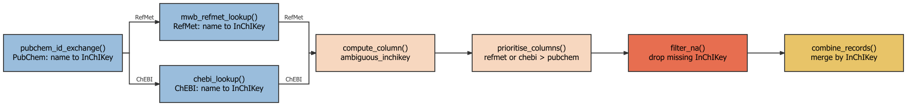
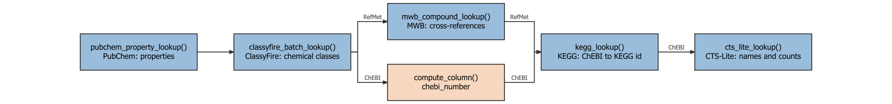

```{r mms-case-study-1, include = FALSE}
knitr::opts_chunk$set(
    collapse = TRUE,
    comment = "#>",
    fig.align = "center"
)

.DT <- function(x) {
    if (knitr::is_html_output()) {
        DT::datatable(
            x,
            options = list(scrollX = TRUE, pageLength = 10, dom = "ftip"),
            rownames = FALSE
        )
    } else {
        knitr::kable(x)
    }
}
```

```{r setup, message = FALSE, warning=FALSE}
library(struct)
library(MetMashR)
library(ggplot2)
```

# Introduction

Villalba et al. (2023) describe a three-step procedure for harmonising
metabolite annotations reported by different studies, databases and
publications into one consistent, cross-referenced dataset. The main steps
of their "Metabolites Merging Strategy" (MMS) are:

1. **Translation and merging** - convert identifiers from each source (e.g.
   a name, an InChIKey, or some other identifier) into an InChIKey, and
   merge records with the same key.
2. **Attribute retrieval** - for each InChIKey, retrieve descriptive
   attributes (such as name, molecular weight, molecular formula),
   identifiers for cross-references to other databases (e.g. PubChem CID,
   SMILES, ChEBI, HMDB, KEGG, LipidMaps, DrugBank, CAS) and chemical
   ontology (kingdom, superclass, class).
3. **Manual curation** - collapse conjugated acid/base forms of the same
   compound, retrieve missing attributes, and resolve duplicate/conflicting
   synonyms.

The worked example included in the original publication harmonises urinary
asthma metabolites reported across three Metabolomics Workbench (MWB)
studies (ST001039, ST001048, ST001317), the Human Metabolome Database, and
six literature articles.

This vignette reimplements the MWB portion of that case study as a single
MetMashR model sequence i.e. one workflow object built by chaining
MetMashR steps together, and compares the output with the published supplementary 
results. It adapts the identifier services and automates skeleton-level grouping; 
it does not reproduce every manual curation decision.

Two variants of the workflow are built from the same steps and compared at the
end:

1. **RefMet variant.** Names are translated using PubChem and the Metabolomics
   Workbench RefMet service, preferring RefMet's result when available.
2. **ChEBI + CTS-Lite variant.** The input names come from Metabolomics
   Workbench, and RefMet is also a Metabolomics Workbench service, so the
   RefMet translation is not fully independent of the data it is translating:
   any naming convention or curation quirk shared between the two could
   inflate agreement with the published result. This variant substitutes ChEBI,
   an independently curated database unaffiliated with MWB, for RefMet. It also
   adds CTS-Lite (the Fiehn Lab's successor to the now-closed Chemical
   Translation Service) as an extra attribute source. CTS-Lite cannot translate
   names, but it accepts an InChIKey and returns a matched PubChem entry plus
   literature/patent annotation counts.

For the same reason the ChEBI variant does not query the MWB compound database
for cross-references; it uses the ChEBI identifier it already has to retrieve
KEGG. Normalisation, the PubChem and ClassyFire attribute lookups and the
InChIKey skeleton grouping in Step 3 do not depend on which service supplied
the InChIKey, so both variants use the same steps. Each variant has its own
lookup caches, however, so no response retrieved for one variant is reused by
the other and the two workflows remain independent.

The workflow for each MMS step is shown as a flow diagram, read from left to
right. Each box names the MetMashR function used for that step of the workflow
and summarises what it does, and its colour indicates the kind of step:

```{r flow-legend, echo = FALSE, fig.wide = TRUE, out.width = "100%", fig.alt = "Legend: blue boxes are external lookups, peach boxes compute a column, red boxes filter records, yellow boxes merge records and green boxes split records."}

```

Steps that use the same function in both variants are drawn once, even where
their settings (such as the input column) differ slightly. Where the variants
use different functions, the path splits into one row per variant (RefMet
above, ChEBI below), with each edge labelled by workflow, and rejoins at the
next step they have in common.

# Importing the source data

Each study's reported metabolite list is retrieved directly from Metabolomics
Workbench with `mwb_study_source()` and the three tables are combined with
`combine_sources()`.

Only the `metabolite_name` is used as a chemical lookup input; source and study 
tags are retained separately. Existing `refmet_name` and `pubchem_id` 
annotations, where available, are excluded to test the name-based translation.

```{r step0}
# the studies to import
study_ids <- c("ST001039", "ST001048", "ST001317")

# read each source
sources <- lapply(
    study_ids,
    function(id) read_source(mwb_study_source(source = id, tag = id))
)

# use MetMashR to merge all sources
combine_step <- combine_sources(
    source_list = list(),
    keep_cols = "metabolite_name",
    source_col = "source"
)

# apply the merge
combine_step <- model_apply(combine_step, sources)

# extract the merged table
combined <- predicted(combine_step)

# report number of records
nrow(combined$data)
```

# Building the model sequence

The remaining lookup and processing steps are chained into a single model 
sequence. The translation and attribute-retrieval steps use pre-existing 
`rds_cache` files with `cache_mode = "offline"`, one per lookup per variant. 
Cached responses are reused; 
query values absent from a cache are left as `NA`. A live rerun requires a 
supported online cache mode and a writable cache location. These lookup 
caches do not, by themselves, archive the MWB study downloads or the 
separately imported Zenodo comparison file.

```{r cache-setup}
# Function that returns the rds_cache for a lookup in one variant
# ("refmet" or "chebi"). Every lookup has a separate cache per variant so that
# the two workflows do not share any retrieved responses.
cached <- function(variant, name) {
    rds_cache(source = file.path(
        system.file("cached", package = "MetMashR"),
        paste0("mms_case_study_", variant, "_", name, ".rds")
    ))
}
```

## Normalising synonyms

Molecules have many synonyms and resolving them to the same identifier can
be challenging. We apply a small number of normalisation rules, using
MetMashR dictionaries, to increase the chance of a match before attempting 
translation. These are largely dataset-specific heuristics; the original names are 
retained so that any loss of information can be reviewed:

- remove record-keeping suffixes that are not part of the
  chemical name (e.g. `"Dihydrobiopterin_R1"` becomes `"Dihydrobiopterin"`)
- remove short trailing markers such as batch or replicate codes
  (e.g. `"D,L Glucosamine (B)"` becomes `"D,L Glucosamine"`)

```{r step0.51}
tidy_dictionary <- list(
    # trailing replicate/fragment label, e.g. "_R1", "_R2"
    list(pattern = "_[A-Za-z][0-9]+$", replace = ""),
    # remove short (<=3 character) batch/replicate codes
    list(pattern = "\\s\\([A-Za-z0-9]{1,3}\\)\\s*$", replace = "")
)
```

- where a closing parenthesis is followed by a slash, the name is reporting two
  candidate identifications rather than one (e.g.
  `"MiBP (Mono-isobutyl phthalate)/MBP (Mono-n-butyl phthalate)"`). Silently
  keeping only the text before the slash would discard the second candidate
  even though nothing established the two names are synonyms. Instead we flag
  the record (`ambiguous_name`) and use `split_records()` to expand it into two
  full records, one per candidate name, each translated independently in the
  steps that follow. If both candidates resolve to the same compound they are
  simply merged back together by `combine_records()` below; if they resolve to
  different compounds, both are kept and are visibly flagged as ambiguous
  rather than one being silently dropped.

```{r step0.515}
# flag names reporting two "/"-joined candidate identifications
ambiguous_name_step <- compute_column(
    input_columns = "name_tidied",
    output_column = "ambiguous_name",
    # compute_column passes fcn a 1-column data.frame, not a bare vector
    fcn = function(x) grepl("\\)/", x[[1]])
)

# split into one record per candidate name, at a "/" immediately following a
# closing parenthesis; names without this pattern are left as a single record
split_ambiguous_name_step <- split_records(
    column_name = "name_tidied",
    separator = "(?<=\\))/"
)
```

- extract trailing parenthetical text when it is intended as an expanded name
  alongside an abbreviation (e.g. `"MEP (Mono-ethyl phthalate)"` becomes
  `"Mono-ethyl phthalate"`)
  
```{r step0.52}
# matches any trailing "(...)", not just abbrev(expansion). 
# e.g. "LysoPC (16:0)" -> "16:0". OK for this dataset; check before reusing 
# elsewhere
abbrev_dictionary <- list(
    list(
        pattern = "\\s\\([^()]+\\)\\s*$",
        replace = function(inp) {
            m <- regmatches(
                inp$x,
                regexec("\\s\\(([^()]+)\\)\\s*$", inp$x)
            )
            if (length(m[[1]]) > 1) trimws(m[[1]][2]) else inp$x
        }
    )
)
```

- strip racemic and stereochemical markers covered by MetMashR's built-in `racemic_dictionary`
 (e.g. `"D/L "`, `"DL-"`, `+/-`, etc).
  
- expand Lyso-glycerophospholipid class prefixes to LIPID MAPS
  shorthand (`"LysoPC"` becomes `"LPC"`).

```{r step0.53}
# dictionary to convert lyso-lipids to LIPID MAPS shorthand
lyso_dictionary <- list(
    list(pattern = "^Lyso-?PC", replace = "LPC", perl = TRUE, ignore.case = TRUE),
    list(pattern = "^Lyso-?PE", replace = "LPE", perl = TRUE, ignore.case = TRUE),
    list(pattern = "^Lyso-?PI", replace = "LPI", perl = TRUE, ignore.case = TRUE),
    list(pattern = "^Lyso-?PG", replace = "LPG", perl = TRUE, ignore.case = TRUE),
    list(pattern = "^Lyso-?PS", replace = "LPS", perl = TRUE, ignore.case = TRUE),
    list(pattern = "^Lyso-?PA", replace = "LPA", perl = TRUE, ignore.case = TRUE)
)
```


The prepared dictionaries are passed to `normalise_strings()` to clean the text
in `search_column` and return the result in `output_column`. `tidy_dictionary`
is applied first, on its own, so `ambiguous_name_step` and
`split_ambiguous_name_step` (above) see the tidied name before it is split; the
remaining dictionaries are then applied to `name_tidied` (now one row per
candidate name) to produce the final `name_normalised`.

```{r flow-normalise, echo = FALSE, fig.wide = TRUE, out.width = "100%", fig.cap = "Normalisation workflow, the same in both variants.", fig.alt = "Normalisation flow diagram: normalise_strings producing name_tidied, compute_column for ambiguous_name, split_records splitting name_tidied, and normalise_strings producing name_normalised."}

```

```{r step0.54}
# workflow steps to apply the cleaning steps to the metabolite names
normalise_step <- list(
    normalise_strings(
        search_column = "metabolite_name",
        output_column = "name_tidied",
        dictionary = tidy_dictionary
    ),
    ambiguous_name_step,
    split_ambiguous_name_step,
    normalise_strings(
        search_column = "name_tidied",
        output_column = "name_normalised",
        dictionary = c(
            abbrev_dictionary,
            racemic_dictionary, # included in MetMashR
            lyso_dictionary
        )
    )
)
```

## Translation and merging (MMS Step 1)

Villalba et al. translated names to InChIKeys with the PubChem Identifier
Exchange Service and the Chemical Translation Service (CTS). CTS has since
closed, and its successor CTS-Lite cannot translate names, so CTS is not used
for translation here. Instead, both variants pair PubChem with a second
name-translation service: RefMet in the RefMet variant, and ChEBI in the ChEBI
variant. CTS-Lite appears only later, in Step 2 of the ChEBI variant, where it
retrieves attributes for an InChIKey that has already been found.

`pubchem_id_exchange()` and either `mwb_refmet_lookup()` or `chebi_lookup()`
attempt a match for each normalised name using the supplied caches.
`prioritise_columns()` selects one InChIKey per row, preferring the second
service when a result is available and recording the selected source. RefMet
provides a curated nomenclature built directly from names reported across
metabolomics studies, and is therefore more likely to match the input data;
ChEBI's name-search endpoint (`search_by = "name"`) returns the matched
entity's InChIKey directly, so a single lookup is enough.

The steps that follow the service-specific lookup are identical for both
variants, so they are defined once as `translate_common`. They flag selected
disagreements between the returned InChIKeys for review, exclude records with
no selected InChIKey, and merge records with identical full InChIKeys. The
variant-specific steps are built by a small helper, and the complete sequences
are assembled with Reduce() at the end.

```{r flow-step1, echo = FALSE, fig.wide = TRUE, out.width = "100%", fig.cap = "MMS Step 1 workflow. The variants differ only in the second name-translation lookup.", fig.alt = "Step 1 flow diagram: pubchem_id_exchange, then a split into mwb_refmet_lookup for the RefMet variant and chebi_lookup for the ChEBI variant, rejoining at compute_column for ambiguous_inchikey, then prioritise_columns, filter_na and combine_records."}

```

```{r step1}
# query pubchem by synonym and return inchikey (same step in both variants,
# each with its own cache)
pubchem_translate <- function(variant) {
    pubchem_id_exchange(
        query_column = "name_normalised",
        input_type = "synonyms",
        output_type = "inchikey",
        cache = cached(variant, "pubchem_id_exchange"),
        cache_mode = "offline"
    )
}

# flag disagreement, prioritise the second service, drop records with no
# inchikey and merge duplicates. inchikey_col is the column returned by the
# second service and tag its name in InChIKey_source
translate_common <- function(inchikey_col, tag) {
    list(
        # flag where the first 14 characters of the inchikey match but the
        # first 26 do not (the final protonation character is not compared)
        compute_column(
            input_columns = c(inchikey_col, "inchikey_pubchem_id_exchange"),
            output_column = "ambiguous_inchikey",
            fcn = function(x) {
                a <- x[[1]]
                b <- x[[2]]
                ambiguous <- substr(a, 1, 14) == substr(b, 1, 14) &
                    substr(a, 1, 26) != substr(b, 1, 26)
                ambiguous[is.na(ambiguous)] <- FALSE
                ambiguous
            }
        ),
        # select the second service over pubchem where both exist
        prioritise_columns(
            column_names = c(inchikey_col, "inchikey_pubchem_id_exchange"),
            output_name = "InChIKey",
            source_name = "InChIKey_source",
            source_tags = c(tag, "pubchem")
        ),
        # exclude any results without an inchikey
        filter_na(column_name = "InChIKey", mode = "exclude"),
        # merge duplicate records
        combine_records(
            group_by = "InChIKey",
            default_fcn = fuse_unique(separator = " || "),
            fcns = list(
                metabolite_name = fuse_unique(separator = " || "),
                source = fuse_unique(separator = " || "),
                ambiguous_inchikey = function(x) any(x, na.rm = TRUE),
                ambiguous_name = function(x) any(x, na.rm = TRUE)
            )
        )
    )
}

# RefMet variant
translate_refmet <- c(
    list(
        pubchem_translate("refmet"),
        # query refmet by synonym
        mwb_refmet_lookup(
            query_column = "name_normalised",
            cache = cached("refmet", "mwb_refmet"),
            cache_mode = "offline",
            delay = 0.5
        )
    ),
    translate_common("inchi_key_refmet", "refmet")
)

# ChEBI variant
translate_chebi <- c(
    list(
        pubchem_translate("chebi"),
        # query chebi by name and return a chebi accession, name and inchikey
        chebi_lookup(
            query_column = "name_normalised",
            search_by = "name",
            cache = cached("chebi", "chebi_name"),
            cache_mode = "offline",
            delay = 1
        )
    ),
    translate_common("inchikey_chebi", "chebi")
)
```

`combine_records()` is a wrapper around `dplyr::reframe()`. The MetMashR helper
`fuse_unique()` collapses distinct values into a single entry separated by a
double pipe (`||`). For example, two records with the same InChIKey might
have their `metabolite_name` values combined as `D-glucose || D-glucopyranose`.
Thus, records using different synonyms for the same identifier are
combined into one record.

## Attribute retrieval (MMS Step 2)

For each translated InChIKey, the workflow attempts to retrieve the following 
attributes:

- name, molecular weight, molecular formula, InChI and SMILES from PubChem
- chemical ontology (kingdom, superclass and class) from ClassyFire
- HMDB, ChEBI, LipidMaps and PubChem CID identifiers from the Metabolomics
  Workbench compound database
- a KEGG identifier using `KEGGREST`, an R package that queries the KEGG API.

DrugBank identifiers and CAS numbers were included in the original paper but
are omitted from this implementation.

The ChEBI variant differs in two ways. Metabolomics Workbench is the source of
the input names and RefMet is also an MWB service, so querying the MWB compound
database there would reintroduce the circularity this variant is designed to
avoid. `mwb_compound_lookup()` is therefore not used; the ChEBI identifier
returned by `chebi_lookup()` is used to retrieve the KEGG identifier instead,
and the HMDB, LipidMaps and PubChem CID cross-references (which only that
lookup provided) are omitted from this variant. The variant also queries
CTS-Lite with the InChIKey, returning the compound name, formula and mass plus
literature/patent annotation counts that can serve as a rough confidence
signal. `cts_lite_lookup()` follows the same `cache`/`cache_mode` convention as
the other lookups, but is not built on the `rest_api` base class because
CTS-Lite's API is POST/batch-based (one request takes a space-separated list
of queries), which does not fit `rest_api`'s one `GET` per query value.

```{r flow-step2, echo = FALSE, fig.wide = TRUE, out.width = "100%", fig.cap = "MMS Step 2 workflow. The variants differ in how the ChEBI identifier for the KEGG lookup is obtained, and only the ChEBI variant queries CTS-Lite.", fig.alt = "Step 2 flow diagram: pubchem_property_lookup and classyfire_batch_lookup, then a split into mwb_compound_lookup for the RefMet variant and compute_column for chebi_number for the ChEBI variant, rejoining at kegg_lookup, followed by cts_lite_lookup for the ChEBI variant only."}

```

```{r step2}
# PubChem properties and ClassyFire classes (same steps in both variants,
# each with its own caches)
attribute_core <- function(variant) list(
    # query the inchikey with pubchem and return various properties
    pubchem_property_lookup(
        query_column = "InChIKey",
        search_by = "inchikey",
        property = c(
            "IUPACName", "MolecularWeight", "MolecularFormula",
            "InChI", "ConnectivitySMILES", "Charge"
        ),
        cache = cached(variant, "pubchem_property"),
        cache_mode = "offline",
        delay = 0.4
    ),
    # query the SMILES (from pubchem) with classyfire and return class
    # information.
    classyfire_batch_lookup(
        query_column = "ConnectivitySMILES_pubchem",
        output_items = c("kingdom", "superclass", "class"),
        output_fields = "name",
        cache = cached(variant, "classyfire"),
        cache_mode = "offline",
        delay = 3
    )
)

# RefMet variant
attribute_step <- c(
    attribute_core("refmet"),
    list(
        # query the inchikey with MWB and return other cross reference
        # identifiers
        mwb_compound_lookup(
            input_item = "inchi_key",
            query_column = "InChIKey",
            output_item = c("hmdb_id", "chebi_id", "lm_id", "pubchem_cid"),
            cache = cached("refmet", "mwb_compound"),
            cache_mode = "offline",
            delay = 0.5
        ),
        # query kegg with the ChEBI id and retrieve the kegg compound
        # identifier.
        kegg_lookup(
            get = "compound",
            from = "chebi",
            query_column = "chebi_id_mwb",
            cache = cached("refmet", "kegg"),
            cache_mode = "offline"
        )
    )
)

# ChEBI variant: no MWB lookup. The ChEBI id comes from chebi_lookup() and
# CTS-Lite is added.
attribute_step_chebi <- c(
    attribute_core("chebi"),
    list(
        # kegg_lookup() expects the bare ChEBI number, not "CHEBI:nnnn"
        compute_column(
            input_columns = "chebi_id_chebi",
            output_column = "chebi_number",
            fcn = function(x) gsub("CHEBI:", "", x[[1]], fixed = TRUE)
        ),
        kegg_lookup(
            get = "compound",
            from = "chebi",
            query_column = "chebi_number",
            cache = cached("chebi", "kegg"),
            cache_mode = "offline"
        ),
        cts_lite_lookup(
            query_column = "InChIKey",
            cache = cached("chebi", "cts_lite"),
            cache_mode = "offline"
        )
    )
)
```

## Manual curation (MMS Step 3)

To implement the first-14-character grouping rule described for MMS, we group 
records by the InChIKey 14-character skeleton, disregarding stereochemical 
distinctions. Because of this, a reported name's D-/L- prefix cannot be accepted 
or rejected on the basis of this workflow alone.

```{r flow-step3, echo = FALSE, fig.wide = TRUE, out.width = "100%", fig.cap = "MMS Step 3 workflow, the same in both variants.", fig.alt = "Step 3 flow diagram: compute_column for inchikey_skeleton, combine_records by inchikey_skeleton and unique_records."}

```

```{r step3}
# create model sequence
curation_step <- list(
    # extract inchikey connectivity/skeleton only (first 14 characters) -
    # stereo-blind grouping, see prose above
    compute_column(
        input_columns = "InChIKey",
        output_column = "inchikey_skeleton",
        # compute_column passes fcn a 1-column data.frame, not a bare vector
        fcn = function(x) substr(x[[1]], 1, 14)
    ),
    # combine records with the same inchikey skeleton. ambiguous_inchikey
    # must also flag skeleton-only merges of records that still have
    # different full InChIKeys
    combine_records(
        group_by = "inchikey_skeleton",
        default_fcn = fuse_unique(separator = " || "),
        fcns = list(
            ambiguous_inchikey = function(x) {
                any(x, na.rm = TRUE) ||
                    dplyr::n_distinct(dplyr::pick(InChIKey)[[1]], na.rm = TRUE) > 1
            },
            ambiguous_name = function(x) any(x, na.rm = TRUE)
        )
    ),
    # remove any duplicate records
    unique_records()
)
```


## The complete sequence

Conceptually, each workflow is a continuous chain of steps joined with the
plus (`+`) operator. For readability, they are assembled with `Reduce()` from
the model lists `normalise_step`, `translate_*`, `attribute_step*` and
`curation_step`. Only the translation list and the attribute list differ
between the two variants.

```{r full-workflow,warning=FALSE}
# create model sequences
workflow_refmet <- Reduce(
    `+`,
    c(normalise_step,
      translate_refmet,
      attribute_step,
      curation_step)
)

workflow_chebi <- Reduce(
    `+`,
    c(normalise_step,
      translate_chebi,
      attribute_step_chebi,
      curation_step)
)

# apply model sequences to merged sources and extract the results
result_refmet <- predicted(model_apply(workflow_refmet, combined))
result_chebi <- predicted(model_apply(workflow_chebi, combined))

# report number of records
c(
    refmet = nrow(result_refmet$data),
    chebi = nrow(result_chebi$data)
)
```

# What the harmonised tables look like

`result_refmet$data` and `result_chebi$data` are flat tables with one row per
InChIKey skeleton. They contain the selected InChIKeys, source information,
available attributes and cross-references. Multiple values may be combined
with `||`, and missing values remain possible.

```{r result-table}
preview_cols <- c(
    "metabolite_name", "InChIKey", "IUPACName_pubchem",
    "MolecularFormula_pubchem", "MolecularWeight_pubchem",
    "hmdb_id_mwb", "chebi_id_mwb", "pubchem_cid_mwb", "compound_kegg", "lm_id_mwb",
    "kingdom.name_cfb", "superclass.name_cfb", "class.name_cfb",
    "ambiguous_inchikey", "ambiguous_name", "source"
)
```

RefMet variant:

```{r result-table-refmet}
.DT(head(result_refmet$data[, preview_cols], 10))
```

ChEBI + CTS-Lite variant. It has no MWB-derived HMDB, LipidMaps or PubChem CID
columns, and includes the CTS-Lite columns:

```{r result-table-chebi}
chebi_cols <- c(
    "metabolite_name", "InChIKey", "IUPACName_pubchem",
    "MolecularFormula_pubchem", "MolecularWeight_pubchem",
    "chebi_id_chebi", "compound_kegg",
    "kingdom.name_cfb", "superclass.name_cfb", "class.name_cfb",
    "compound_name_cts", "annotation_type_count_cts",
    "ambiguous_inchikey", "ambiguous_name", "source"
)
.DT(head(result_chebi$data[, chebi_cols], 10))
```

# Comparison against the published result

The published supplementary dataset is available on Zenodo 
(doi:10.5281/zenodo.8226097). It is imported with `zenodo_file()`, which
downloads the file once and caches it locally using `BiocFileCache`; later
builds reuse the cached copy, so an internet connection is only needed the
first time (or set `offline = TRUE` to skip the check for a newer version).
The table is restricted to compounds attributed to the three MWB studies. The
original publication's HMDB and literature sources are outside the scope of
this vignette.

This comparison uses the same 14-character InChIKey skeleton as the grouping
in Step 3. A small MetMashR workflow processes the imported data before
comparison. We only evaluate skeleton membership, not full-key identity or the
accuracy or completeness of the attached attributes.

```{r comparison, out.width = "70%", fig.width = 8, fig.height = 6}
# supplementary file from the Zenodo record, cached with BiocFileCache
gold_db <- zenodo_file(
    record_id = 8226097,
    file_name = "MDM_Suppl_vSubmitted.xlsx",
    import_fun = function(path) {
        openxlsx::read.xlsx(path, sheet = "Table S3", colNames = TRUE)
    }
)

# import as an annotation_source
gold <- read_source(gold_db)

# restrict to the three MWB studies, then derive the same
# inchikey skeleton used in Step 3
gold_workflow <- 
    filter_labels(
        column_name = "Reference", 
        labels = study_ids, mode = "include") + 
    compute_column(
        input_columns = "InChIKey", 
        output_column = "inchikey_skeleton",
        fcn = function(x) substr(x[[1]], 1, 14))

# apply the model to the imported source
gold <- predicted(model_apply(gold_workflow, gold))

# set labels that get used by the Venn chart
gold$name <- "MMS (Villalba et al.)"
gold$tag <- "MMS (Villalba et al.)"

# Both workflow results are already annotation_sources with an
# inchikey_skeleton column from Step 3 so they can be used directly
result_refmet$name <- "MetMashR (RefMet)"
result_refmet$tag <- "MetMashR (RefMet)"
result_chebi$name <- "MetMashR (ChEBI + CTS-Lite)"
result_chebi$tag <- "MetMashR (ChEBI + CTS-Lite)"

# compare the inchikey skeleton columns using a venn diagram
C <-
    annotation_venn_chart(
        factor_name = "inchikey_skeleton",
        labels = TRUE,
        legend = TRUE,
        fill_colour = ".group"
)
chart_plot(C, result_refmet, result_chebi, gold)
```

# Characterising the mismatch

```{r mismatch-check, echo = FALSE}
gold_keys <- unique(gold$data$inchikey_skeleton)
variant_keys <- list(
    "MetMashR (RefMet)" = unique(result_refmet$data$inchikey_skeleton),
    "MetMashR (ChEBI + CTS-Lite)" = unique(result_chebi$data$inchikey_skeleton)
)

overlap <- do.call(rbind, lapply(names(variant_keys), function(nm) {
    k <- variant_keys[[nm]]
    n_shared <- length(intersect(k, gold_keys))
    data.frame(
        variant = nm,
        n_skeletons = length(k),
        shared_with_published = n_shared,
        pct_of_variant = round(100 * n_shared / length(k), 1),
        pct_of_published = round(100 * n_shared / length(gold_keys), 1),
        only_in_variant = length(setdiff(k, gold_keys)),
        only_in_published = length(setdiff(gold_keys, k))
    )
}))

both <- Reduce(intersect, variant_keys)
either <- Reduce(union, variant_keys)
```

At the skeleton level, the published MWB subset contains `r length(gold_keys)`
entries. The table below summarises how each variant overlaps with it.

```{r mismatch-table, echo = FALSE}
.DT(overlap)
```

The two variants share `r length(both)` of their combined `r length(either)`
skeletons, with `r length(setdiff(variant_keys[[1]], variant_keys[[2]]))` only
in the RefMet variant and `r length(setdiff(variant_keys[[2]], variant_keys[[1]]))`
only in the ChEBI + CTS-Lite variant. Comparing the two rows above shows how
much the choice of translation service changes the overlap with the published
result. It does not, on its own, show how much of the RefMet variant's
agreement is due to the RefMet/MWB circularity described in the introduction: a
lower overlap for the ChEBI variant could reflect that circularity, but could
equally reflect ChEBI recognising fewer of the names used in these studies.
Separating the two requires inspecting the records that only one variant
matched. Overlap indicates agreement in skeleton membership, but does not
establish stereochemical equivalence or validate the attached identifiers.

The causes of the remaining differences are not established by the aggregate
overlap alone. Unresolved synonyms may contribute, but attribution requires
inspection of the unmatched records, lookup responses, and the effects of
normalisation and grouping.

# Learnings and Benefits of MetMashR

- **Executable workflow**. The reimplementation expresses the MWB analysis as an explicit sequence of steps that can be shared, inspected and rerun when the required inputs, package versions and caches are available.
- **Archived lookup responses**. Caching allows previously retrieved responses to be reused rather than requiring a fresh query to each service. Note that reproducibility also requires archiving the caches and inputs with their dates and software versions; caching alone is not version control.
- **Inspectable grouping rules**. The first-14-character grouping rule is explicit in the code, making this implementation's treatment of structural detail visible and testable.
- **Targeted ambiguity flag**. The `ambiguous_inchikey` column flags records where the second translation service (RefMet or ChEBI) and PubChem return InChIKeys with the same skeleton but different stereochemical or isotopic layers, and records that Step 3 merged despite having different full InChIKeys. It does not reconstruct the original publication's curation decisions or flag every ambiguity introduced by the workflow.
- **Explicit source preference**. `prioritise_columns()` specifies that the second service (RefMet or ChEBI) takes priority over PubChem and records the selected source. Source-specific lookup results are also retained as columns for inspection.
- **Swappable translation source**. Replacing `mwb_refmet_lookup()` with `chebi_lookup()` required no change to the PubChem and ClassyFire lookup steps or to Step 3, which are built around the resulting `InChIKey` rather than the service that produced it. Of the steps that differ, only translation affects which records are kept; the Step 2 differences (dropping the MWB compound lookup, adding CTS-Lite) only change which attributes are attached. Differences in the skeletons each variant reports therefore come from the translation-service swap alone.
- **Extending beyond the built-in REST API classes**. CTS-Lite's batch/POST API does not fit the `rest_api` base class, so `cts_lite_lookup()` is its own `model` following the same `cache`/`cache_mode` conventions; once written, it slots into the attribute steps like any other lookup.
- **Quantitative comparison**. The workflow supports a direct comparison with the published supplementary dataset. A Venn diagram summarises shared and unmatched 14-character InChIKey skeletons. Further record-level inspection is still needed to explain differences and assess the accuracy of retrieved attributes.


# References {-}

Villalba H, Llambrich M, Gumà J, Brezmes J, Cumeras R. A Metabolites
Merging Strategy (MMS): Harmonization to Enable Studies' Intercomparison.
Metabolites 2023;13(12):1167. https://doi.org/10.3390/metabo13121167

# Session Info

```{r mms-case-study-5, warning=FALSE}
sessionInfo()
```
