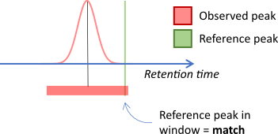

```{r, include = FALSE}
knitr::opts_chunk$set(
    collapse = TRUE,
    comment = "#>",
    fig.align = "center"
)

.DT <- function(x) {
    dt_options <- list(
        scrollX = TRUE,
        pageLength = 6,
        dom = "t",
        initComplete = DT::JS(
            "function(settings, json) {",
            "$(this.api().table().header()).css({'font-size':'10pt'});",
            "}"
        )
    )

    x %>%
        DT::datatable(options = dt_options, rownames = FALSE) %>%
        DT::formatStyle(
            columns = colnames(x),
            fontSize = "10pt"
        )
}

library(BiocStyle)
```

<br>

# Introduction
`r Biocpkg("MetMashR")` is an R package designed to facilitate the cleaning, 
filtering and combining of annotations from different sources. 
`r Biocpkg("MetMashR")` defines an"annotation source" as a piece of software, 
proprietary or otherwise, that
takes the raw input of an analytical instrument and attempts to
assign molecule names to the peaks in the data, usually by comparison to a 
library. `r Biocpkg("MetMashR")` was primarily designed for use with 
metabolomics data measured
by LCMS (hence "metabolite" in the package name) but could be extended to 
include
other platforms (e.g. NMR, DIMS etc.), or other analytical approaches.

In this vignette we describe commonly used annotation workflow steps and show
how to use them in detail.
  
<br>

# Statistics in R using Class Templates (struct)
All of the objects defined in `r Biocpkg("MetMashR")` use or extend the class 
templates 
defined by the `r Biocpkg("struct")` package. Although originally intended for 
statistics
applications, the templates in the `r Biocpkg("struct")` package have proven to 
be adaptable
to many different scenarios and types of analysis/workflow step.

The use of `r Biocpkg("struct")` templates allows workflow steps to be applied 
in sequence 
and intermediate outputs to be retained for further analysis if required. The
templates include ontology definitions for both the object and its input/output
parameters. This makes the workflows more "FAIR" which is critical alongside
FAIR data to making workflows repeatable, transparent and reproducible.

A general summary of extending `r Biocpkg("struct")` templates is provided in 
the [package vignette](https://www.bioconductor.org/packages/release/bioc/vignettes/struct/inst/doc/struct_templates_and_helper_functions.html).
  
<br>

# Getting Started
The latest versions of `r Biocpkg("struct")` and `r Biocpkg("MetMashR")` that 
are compatible 
with your 
current R version can be installed using BiocManager.

```{r,eval = FALSE, include = TRUE}
# install BiocManager if not present
if (!requireNamespace("BiocManager", quietly = TRUE)) {
    install.packages("BiocManager")
}

# install MetMashR and dependencies
BiocManager::install("MetMashR")
```

Once installed you can activate the packages in the usual way:

```{r, eval=TRUE, include=FALSE}
suppressPackageStartupMessages({
    # load the packages
    library(MetMashR)
    library(ggplot2)
    library(structToolbox)
    library(dplyr)
    library(DT)
})
```

```{r, eval=FALSE, include=TRUE}
# load the packages
library(struct)
library(MetMashR)
library(metabolomicsWorkbenchR)
library(ggplot2)
```
  
<br>

# Annotation Sources

`annotation_source` objects are the dataset used by all `r Biocpkg("MetMashR")` 
workflow 
steps. If you have used our `r Biocpkg("structToolbox")` package before, then 
annotation 
sources used equivalently to `DatasetExperiment` objects, except that they hold 
a single `data.frame` of metabolite annotation data.

The `annotation_source` object is not very specific, and not intended for 
general use. Instead we have extended them to two main types of source:

- `annotation_table`
- `annotation_database`

Although all `annotation_sources` contain a single a data.frame, the intended 
use of `annotation_table` and `annotation_database` is different.
  
<br>

## Annotation Tables

A `annotation_table` is defined by us as a `data.frame` of metabolite 
annotations
for experimentally collected data. For example, we have provided `lcms_table`
objects which ensure that both m/z and retention time data is included in the 
data.frame for LCMS data. Usually this table of annotations is acquired after 
the application 
software to generate annotations for an experimental data set.


:::{#Note style="background-color: #ffffcc; border: 1px solid black; padding: 1em; border-radius: 10px"}
**Note:**  
It is not the aim of `r Biocpkg("MetMashR")` to generate these annotations. 
Instead we aim to
provide tools to process, filter, clean and otherwise "mash" this table of annotations
generated elsewhere.
:::

<br>

`annotation_table` objects should have a `read_source` method specific to the
source. For example the `read_source` method for `ls_source` object reads in
the exported data file from LipidSearch by stripping the header and parsing the
rest of the file into a table.

```{r}
# prepare source object
AT <- ls_source(
    source = system.file(
        paste0("extdata/MTox/LS/MTox_2023_HILIC_POS.txt"),
        package = "MetMashR"
    )
)

# read source
AT <- read_source(AT)

# show info
AT
```

The imported `annotation_table` object is compatible with MetMashR workflow steps.

<br>

## Annotation Databases

An `annotation_database` is a table of additional metabolite meta data. For
example it might contain identifiers and/or InChIKeys for different metabolites.
Usually (but not always) this table is used in a read-only fashion and is used
to augment an `annotation_table` with additional information.

Like other sources, `annotation_database` objects have a `read_source` method 
specific to the database.

```{r}
# prepare source object
MT <- MTox700plus_database()

# read
MT <- read_source(MT)

# show
MT
```

`annotation_database` objects also have a `read_database` method to read the 
table directly to a data.frame.

```{r}
# prepare source object
MT <- MTox700plus_database()

# read to data.frame
df <- read_database(MT)

# show
.DT(df)
```
Some `annotation_database` objects also have a `write_database` method, that 
allows you to update the table on disk. For example, in `r Biocpkg("MetMashR")` the 
`rds_database` has a `write_database` method. It is useful in combination with
`rest_api` objects to cache results and reduce the number of requests to 
the api.

<br>

## Cached databases
An `annotation_database` class has been included that uses functionality provided
by `BiocFileCache`. Although not used directly, many of the 
`annotation_database` objects provided 
by `MetMashR` extend the `BiocFileCache_database` object so that the web 
resources they retrieve are cached locally.
  
<br>

# Annotation Mashing
We define annotation mashing as the importing, cleaning, filtering and combining 
of multiple annotation sources. This is useful for metabolomics datasets where
there might be several assays and/or sources of information/annotations.
  
<br>

## Importing sources
Although `annotation_sources` all have a `read_source` method, it is convenient
to be able to read in a source as part of a workflow.

The `import_source` model (workflow step) allows you to do this. Note that using
this object will replace the existing `annotation_source` and is really intended
to be used as the first step in a workflow.

```{r}
# prepare source object
AT <- ls_source(
    source = system.file(
        paste0("extdata/MTox/LS/MTox_2023_HILIC_POS.txt"),
        package = "MetMashR"
    )
)

# prepare workflow
WF <- import_source()

# apply workflow to annotation source
WF <- model_apply(WF, AT)

# show
predicted(WF)
```

<br>

## Filtering / Cleaning

`MetMashR` provides a number of commonly used workflow steps to filter, clean 
and process annotation sources. Some of these steps, such as `filter_range` are 
applicable to any annotation source, while others are specific to a source. For example
`mz_rt_match` is only applicable to an `lcms_table` as it requires that both an 
m/z and a retention time column are present. This property is only enforced 
for `lcms_table` objects.

Workflow steps use the `model` class from `struct`. We can build up a workflow
by "adding" steps together to form a model sequence (`model_seq`). See the 
vignettes for `struct` for more details.

Both models and model sequences can be applied to an `annotation_source` objects
using the `model_apply` method. In this example we import the source, and then 
apply a filtering step to remove records with a lower Grading.

```{r}
# prepare source object
AT <- ls_source(
    source = system.file(
        paste0("extdata/MTox/LS/MTox_2023_HILIC_POS.txt"),
        package = "MetMashR"
    )
)

# prepare workflow
WF <-
    # step 1 import source from file
    import_source() +
    # step 2 filter the "Grade" column to only include "A" and "B"
    filter_labels(
        column_name = "Grade",
        labels = c("A", "B"),
        mode = "include"
    )

# apply workflow to annotation source
WF <- model_apply(WF, AT)

# show
predicted(WF)
```

The `predicted` method returns the processed
`annotation_source` after applying all steps of the workflow.

Indexing can also be used with a model sequence to extract the processed 
annotation source after that step in the workflow.

```{r}
# source after import and before filtering
predicted(WF[1])
```

<br>

## LCMS peak matching

The following methods are restricted to `lcms_table` sources:

- `mz_match`
- `rt_match`
- `mz_rt_match`
- `calc_ppm_diff`
- `calc_rt_diff`

The `_match` objects align features and annotations by comparing m/z and/or
retention time values between two sources. If the values fall within a window 
then this is considered to be a match. 

Often times one of the sources will be a library or database of reference m/z
and/or retention time values, and the other will be a table of peaks from an experiment. 
In this case the reference database might be considered as the gold standard, while the
experimentally determined values will have some degree of uncertainty. In this case you
may want to only consider a window applied to the experimental data. The diagram 
below illustrates this for retention time matching.
<br><br>
<center>

</center>
<br>
In other cases both sources might be obtained experimentally. For example when 
matching MS2 peaks to MS1 peaks. In this case a window can be applied to 
*both* sources, reflecting the uncertainty in the values for both sources.
<br><br>

<center>

</center>
  
<br>

# REST APIs

`MetMashR` provides a `rest_api` object that implements some base methods to
query an api and return a data.frame of results.

The template has been extended to include api lookup objects for the following:

- ClassyFire
- HMDB
- KEGG
- LipidMaps
- Metabolmics Workbench
- OPSIN
- PubChem

Note these are not necessarily a complete wrapper for all functionality provided
by the api; we have only implemented simple wrappers for the most useful parts 
e.g. querying for molecular identifiers.

The `rest_api` template object includes the ability to cache results locally, 
in order to reduce the number of api queries. This means a `rest_api` object can
be included in a workflow and updated as more results are collected over time. 

```{r}
# prepare source object
AT <- ls_source(
    source = system.file(
        paste0("extdata/MTox/LS/MTox_2023_HILIC_POS.txt"),
        package = "MetMashR"
    )
)

# prepare cache
TF <- rds_database(
    source = tempfile()
)

# prepare workflow
WF <-
    # step 1 import source from file
    import_source() +
    # step 2 filter the "Grade" column to only include "A" and "B"
    filter_labels(
        column_name = "Grade",
        labels = c("A", "B"),
        mode = "include"
    ) +
    # step 3 query lipidmaps api for inchikey
    lipidmaps_lookup(
        query_column = "LipidName",
        context = "compound",
        context_item = "abbrev",
        output_item = "inchi_key",
        cache = TF,
        suffix = ""
    )

# apply workflow to annotation source
WF <- model_apply(WF, AT)

# show
predicted(WF)
```

Note that the cache is stored as an `annotation_database` object, and can be 
used in workflows like any other `annotation_source`.

```{r}
# retrieve cache
TF <- read_source(TF)

# filter records with no inchikey
FI <-
    filter_na(
        column_name = "inchi_key"
    )

# apply
FI <- model_apply(FI, TF)

# show
.DT(predicted(FI)$data)
```


An alternative to using `rest_api` objects in every workflow is to create 
separate workflow to generate a local database of relevant data. 
This database can then be used in other workflows without needing to query the api 
every time the workflow is run.
  
<br>

# Dictionaries

The `normalise_strings` object uses a special list format, referred to as a 
"dictionary", to provide conversion between string patterns. In `MetMashR` 
workflows we use it to e.g. convert adducts into a standardised format across
sources, and to tidy/clean strings before using them as search terms in
rest api queries. `MetMashR` currently provides the following dictionaries:

- Greek character dictionary (`greek_dictionary`) to convert greek characters 
to their romanised name.
- Racemic notation dictionary (`racemic_dictionary`) to remove certain types 
of racemic notation from molecule names (e.g. "(+/-)").
- A tripeptide dictionary (`tripeptide_dictionary`) to convert three-letter
tripeptide abbreviations into a format more commonly used as a synonym on PubChem
e.g. "ACD" becomes "Ala-Cys-Asp".

A custom dictionary can be created on the fly as a list where each element has
the following fields:

- `pattern`: used as input to `[grepl()]` to detect matches to the input pattern
- `replace`: a string, or a function that returns a string, to replace the 
pattern with in the matching string. 

Additional fields in the list item can be any of the additional inputs to 
`grepl()`, such as `fixed = TRUE`.

For example here we create a dictionary to convert some of the lipid abbreviations
to the LipidMaps standard, and replace underscores with forward slashes:

```{r}
custom_dict <- list(
    list(
        pattern = "AcCa",
        replace = "CAR",
        fixed = TRUE
    ),
    list(
        pattern = "AEA",
        replace = "NAE",
        fixed = TRUE
    ),
    list(
        pattern = "_",
        replace = "/",
        fixed = TRUE
    )
)
```

We can now use this dictionary in a workflow to create a new column of "normalised"
lipid names and (hopefully) get fewer NA when querying LipidMaps:

```{r}
# prepare workflow
WF <-
    # step 1 import source from file
    import_source() +
    # step 2 filter the "Grade" column to only include "A" and "B"
    filter_labels(
        column_name = "Grade",
        labels = c("A", "B"),
        mode = "include"
    ) +
    # step 3 normalise lipid names using the custom dictionary:
    normalise_strings(
        search_column = "LipidName",
        output_column = "normalised_name",
        dictionary = custom_dict
    ) +
    # step 4 query lipidmaps api for inchikey using the names provided by
    # LipidSearch
    lipidmaps_lookup(
        query_column = "LipidName",
        context = "compound",
        context_item = "abbrev",
        output_item = "inchi_key",
        suffix = "_LipidName",
        cache = TF
    ) +
    # step 5 query lipidmaps api for inchikey using the names provided by
    # LipidSearch
    lipidmaps_lookup(
        query_column = "normalised_name",
        context = "compound",
        context_item = "abbrev",
        output_item = "inchi_key",
        suffix = "_normalised"
    )

# apply workflow to annotation source
WF <- model_apply(WF, AT)

#  show result table for relevant columns
.DT(predicted(WF)$data[, c(
    "LipidName", "normalised_name",
    "inchi_key_LipidName", "inchi_key_normalised"
)])
```

You can see that we obtained inchikey for more of the Lipids after normalising
the lipid names.

`MetMashR` also provides an interface to the `rgoslin` package to assist with
Lipid annotations.

<br>

# Combining Records
In the previous output LipidMaps returned multiple matches to the same lipid.
This is because Lipid names can be ambiguous regarding the location of double 
bonds, for example.

Sometimes it is useful to collapse multiple entries (records) into a single record.
`MetMashR` provides the `combine_records` object and a number of helper functions 
to facilitate this.

The combine records object is a wrapper around `dplyr::reframe` (formally 
`dplyr::summarise`). You can provide a default function to apply to all columns,
and then specify transformations for individual columns by name. 

For the Lipids example above, we collapse multiple records for the same LipidName
into a single record, and collapse e.g. multiple inchikeys into a single string 
separated by semi colons.

```{r}
# prepare workflow
CR <- combine_records(
    group_by = "LipidName",
    default_fcn = fuse_unique(separator = "; "),
    fcns = list(
        count = count_records()
    )
)

# apply to previous output
CR <- model_apply(CR, predicted(WF))

# show output for relevant columns
.DT(predicted(CR)$data[, c(
    "LipidName", "normalised_name",
    "inchi_key_normalised", "count"
)])
```

You can see that there is now a single record (row) for each LipidName, and that 
the multiple inchikeys associated with that LipidName have been collapsed into a single
entry separated by semicolons.

The helper function `fuse_unique` ensures that each inchikey only appears once in 
the collapsed string, and is applied as default to all columns. 

The `add_count`
helper function adds a new column of counts for each LipidName. Note that 
AcCa(20:4) has 8 counts but only 4 inchikey. This means that AcCa(20:4) 
appeared twice in the original table, each time with the same 4 inchikey.

There are a 
number of other helper functions to suit 
different requirements see `?combine_records_helper_functions` for a complete 
list.

# Session Info
```{r}
sessionInfo()
```


